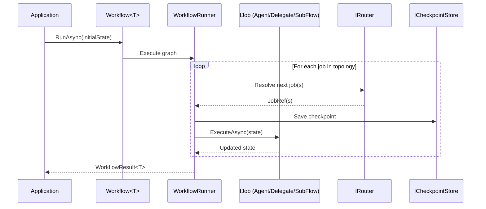
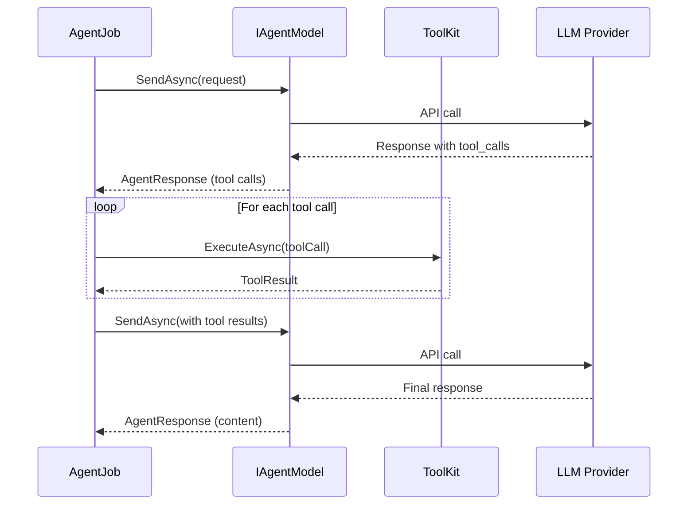
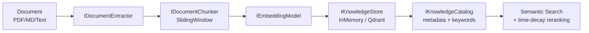
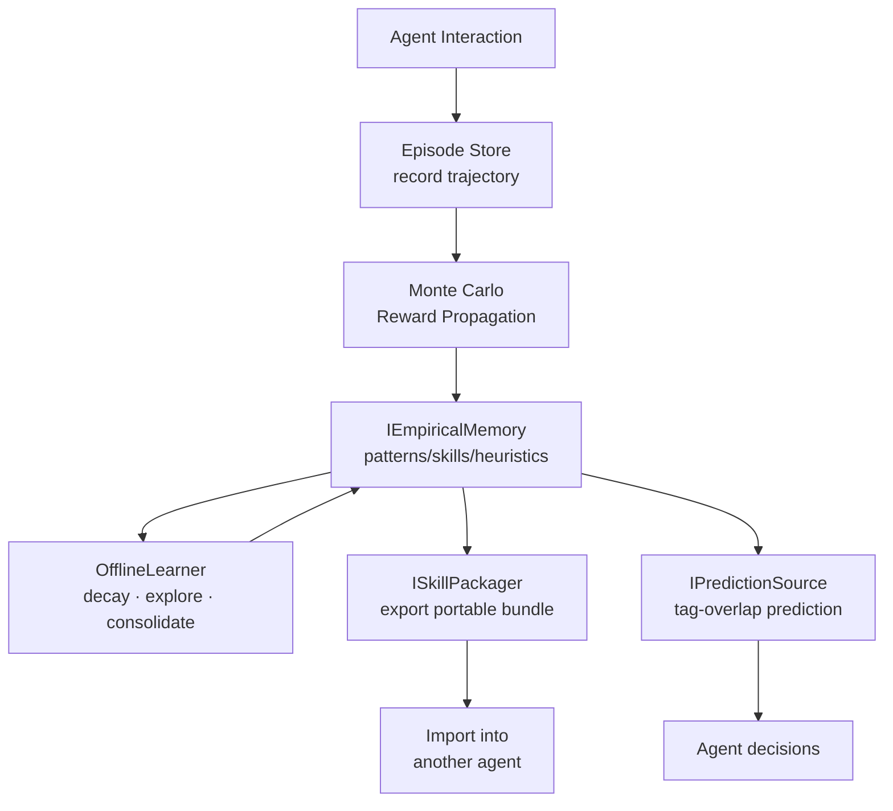
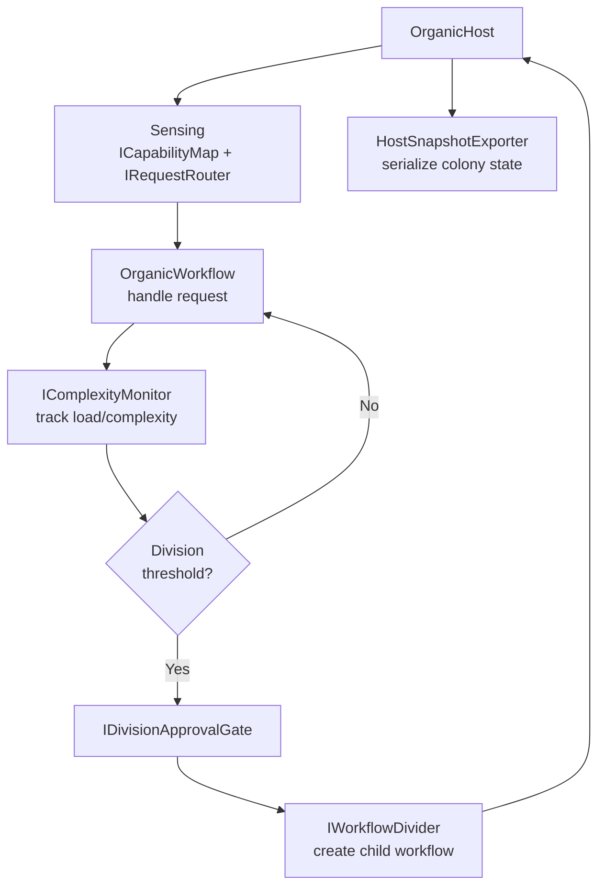

# Ananke — Architecture Guide

> This document is the **single source of truth** for Ananke's architecture.
> Use it when planning redesigns, reviewing PRs, or onboarding AI assistants (Copilot, Claude, etc.).
>
> **Companion documents** (linked below) provide deeper dives into each vertical.

---

## Table of Contents

- [System Overview](#system-overview)
- [Layer Map](#layer-map)
- [Project Dependency Graph](#project-dependency-graph)
- [Vertical Slices](#vertical-slices)
- [Data Flow Diagrams](#data-flow-diagrams)
- [Key Abstractions](#key-abstractions)
- [Build & Packaging](#build--packaging)
- [Testing Strategy](#testing-strategy)
- [Companion Documents](#companion-documents)

---

## System Overview

Ananke is a **.NET 10 framework** for building AI agent systems. It is organized as **~20 focused NuGet packages** around a layered dependency graph. The design principles are:

1. **Zero-dependency core** — `Ananke.Abstractions` has no external dependencies
2. **Layered acyclic graph** — dependencies flow strictly downward
3. **Provider-pluggable** — LLM providers, vector DBs, message brokers are swappable
4. **In-memory-first** — every infrastructure contract ships with an in-memory implementation for testing
5. **Vertical slice organization** — related types live in sub-folders with matching sub-namespaces

```
┌─────────────────────────────────────────────────────────────┐
│                      Applications                           │
│   demos, CLI (nnke), ASP.NET Core hosts                     │
├─────────────────────────────────────────────────────────────┤
│                  High-Level Capabilities                    │
│   Federation · Organics · Platforms · Skills · MCP · A2A    │
├─────────────────────────────────────────────────────────────┤
│                    Core Engine Layer                         │
│   Orchestration · Learning · StateMachine · Knowledge       │
│   Design · Documents                                        │
├─────────────────────────────────────────────────────────────┤
│                  Provider Adapters                           │
│   Orchestration.OpenAI · Orchestration.Anthropic            │
│   Orchestration.Google · Federation.* · Qdrant              │
├─────────────────────────────────────────────────────────────┤
│                    Infrastructure                            │
│   Redis · MQTT · OpenTelemetry                              │
├─────────────────────────────────────────────────────────────┤
│                    Abstractions                              │
│   Ananke.Abstractions (zero external deps)                  │
└─────────────────────────────────────────────────────────────┘
```

---

## Layer Map

| Layer | Projects | Role |
|---|---|---|
| **Abstractions** | `Ananke.Abstractions` | Interfaces & shared types: `IAgentModel`, `IDistributedLock`, `IChannelReader/Writer`, `IConversationMemory`, `IEmbeddingModel`, `IWorkflowTracer` |
| **Knowledge** | `Ananke.Orchestration.Knowledge` | Vector stores, document processing, chunking, catalog, embeddings, document linking. Depends only on Abstractions. |
| **Orchestration** | `Ananke.Orchestration` | Workflow engine, agents, tools, checkpointing, routing, streaming, agentic patterns. Depends on Abstractions + Knowledge. Bundles `Ananke.Analyzers` (Roslyn). |
| **StateMachine** | `Ananke.StateMachine` | Distributed FSM with middleware, guards, circuit breaking. Depends on Abstractions. |
| **Learning** | `Ananke.Learning` | Empirical memory, episodes, offline learning, skill packaging, exploration strategies. Depends on Orchestration. |
| **Design** | `Ananke.Design` | YAML manifest import, Mermaid export. Depends on Orchestration. |
| **Documents** | `Ananke.Documents` | PDF/Markdown extractors (`IDocumentExtractor`). Depends on Knowledge. |
| **Providers** | `Ananke.Orchestration.OpenAI`, `.Anthropic`, `.Google` | LLM provider implementations of `IAgentModel`/`IStreamingAgentModel`. Depend on Abstractions only. |
| **Interop** | `Ananke.MCP`, `Ananke.A2A` | Protocol bridges (MCP server, A2A agent-to-agent). Depend on Orchestration. |
| **Skills** | `Ananke.Skills` | External skill catalog (OpenClaw). Depends on Orchestration. |
| **Platforms** | `Ananke.Platforms`, `.Platforms.Slack`, `.Platforms.Discord` | Messaging platform adapters. Depend on Orchestration. |
| **Organics** | `Ananke.Organics` | Self-organizing colony architecture (cell division, sensing, routing). Depends on Learning + Design. |
| **Federation** | `Ananke.Federation`, `.Federation.Anthropic`, `.Federation.Google`, `.Federation.Azure` | Cross-cloud deployment, monitoring, hybrid routing. Depends on Organics + Design. |
| **Infrastructure** | `Ananke.Redis`, `Ananke.MQTT`, `Ananke.OpenTelemetry`, `Ananke.Qdrant` | External service adapters implementing Abstractions interfaces. |
| **Web** | `Ananke.AspNetCore` | SSE streaming, session management. Depends on Orchestration + StateMachine. |
| **Tooling** | `nnke` (design CLI), `nnke-platform` (federation CLI), `nnke-platform-azure`, `nnke-platform-google`, `nnke-platform-anthropic`, `nnke-platform-all` (adapter companions), `Ananke.Analyzers` | Design-time and federation CLIs; independently published adapter companion tools; Roslyn analyzers. |
| **Meta** | `Ananke` | Meta-package that bundles everything. |

---

## Project Dependency Graph

```mermaid
graph TD
    ABS["Ananke.Abstractions<br/><i>zero deps</i>"]

    KNOW["Ananke.Orchestration.Knowledge"]
    ORCH["Ananke.Orchestration"]
    SM["Ananke.StateMachine"]
    LEARN["Ananke.Learning"]
    DESIGN["Ananke.Design"]
    DOCS["Ananke.Documents"]

    OPENAI["Ananke.Orchestration.OpenAI"]
    ANTHRO["Ananke.Orchestration.Anthropic"]
    GOOGLE["Ananke.Orchestration.Google"]

    MCP["Ananke.MCP"]
    A2A["Ananke.A2A"]
    SKILLS["Ananke.Skills"]
    PLAT["Ananke.Platforms"]

    ORG["Ananke.Organics"]
    FED["Ananke.Federation"]

    REDIS["Ananke.Redis"]
    MQTT["Ananke.MQTT"]
    OTEL["Ananke.OpenTelemetry"]
    QDRANT["Ananke.Qdrant"]

    ASP["Ananke.AspNetCore"]

    %% Foundation
    KNOW --> ABS
    ORCH --> ABS
    ORCH --> KNOW
    SM --> ABS

    %% Core engine
    LEARN --> ORCH
    DESIGN --> ORCH
    DOCS --> KNOW

    %% Providers (thin adapters)
    OPENAI --> ABS
    ANTHRO --> ABS
    GOOGLE --> ABS

    %% Interop & extensions
    MCP --> ORCH
    A2A --> ORCH
    SKILLS --> ORCH
    PLAT --> ORCH

    %% Higher-order
    ORG --> LEARN
    ORG --> DESIGN
    FED --> ORG
    FED --> DESIGN

    %% Infrastructure
    REDIS --> ABS
    REDIS --> ORCH
    MQTT --> ABS
    OTEL --> ABS
    QDRANT --> KNOW
    QDRANT --> LEARN

    %% Web
    ASP --> ORCH
    ASP --> SM

    %% Styling
    classDef abs fill:#e8daef,stroke:#7d3c98
    classDef core fill:#d5f5e3,stroke:#1e8449
    classDef provider fill:#fdebd0,stroke:#ca6f1e
    classDef infra fill:#d6eaf8,stroke:#2471a3
    classDef high fill:#fadbd8,stroke:#cb4335

    class ABS abs
    class KNOW,ORCH,SM,LEARN,DESIGN,DOCS core
    class OPENAI,ANTHRO,GOOGLE provider
    class REDIS,MQTT,OTEL,QDRANT infra
    class ORG,FED,MCP,A2A,SKILLS,PLAT,ASP high
```



### Critical Dependency Rule

> **Abstractions → Orchestration → Learning**. Check this chain before adding cross-project references. Never create cycles.

---

## Vertical Slices

Each project is organized by vertical slices (sub-folders = sub-namespaces). Here are the key ones:

### Ananke.Abstractions

| Folder | Namespace | Purpose |
|---|---|---|
| `Agents/` | `Ananke.Abstractions.Agents` | `IAgentModel`, `IEmbeddingModel`, `AgentRequest/Response`, `ContentPart`, `TokenUsage` |
| `Channels/` | `Ananke.Abstractions.Channels` | `IChannelReader/Writer`, `IHandoffChannel`, `BackgroundProcessor` |
| `Distributed/` | `Ananke.Abstractions.Distributed` | `IDistributedLock`, `IKeyValueDataAdapter` |
| `Memory/` | `Ananke.Abstractions.Memory` | `IConversationMemory` |
| `Tracing/` | `Ananke.Abstractions.Tracing` | `IWorkflowTracer` |
| `Config/` | `Ananke.Abstractions.Config` | `ChannelConfig`, `CacheConfig` |

### Ananke.Orchestration

| Folder | Namespace | Purpose |
|---|---|---|
| `Agents/` | `...Agents` | `AgentJob`, `TextAgentJob`, `StreamingChatWorkflow`, `ChatSessionEvent` |
| `Agents/Routing/` | `...Agents.Routing` | `IModelRouter`, `CapabilityModelRouter`, `ModelProfile`, `ModelCapability` |
| `Agents/Middleware/` | `...Agents.Middleware` | `ResilientAgentModel`, `CachingAgentModel`, `LoggingAgentModelMiddleware`, `GuardrailAgentModelMiddleware` |
| `Agents/Context/` | `...Agents.Context` | `IContextStrategy`, `SlidingWindowContextStrategy`, `SummarizingContextStrategy` |
| `Tools/` | `...Tools` | `ToolKit`, `ToolDefinition`, `ToolBuilder`, `ToolArgs` |
| `Jobs/` | `...Jobs` | `IJob`, `DelegateJob`, `SubFlowJob`, `HandoffJob`, `JobDescriptor` |
| `Routing/` | `...Routing` | `IRouter`, `AgentRouter`, `DelegateRouter`, `ForkMode`, `JoinDescriptor` |
| `Execution/` | `...Execution` | `IWorkflowRunner`, `WorkflowRunner` |
| `Checkpointing/` | `...Checkpointing` | `ICheckpointStore`, `InMemoryCheckpointStore`, `FileCheckpointStore` |
| `Streaming/` | `...Streaming` | `WorkflowEvent`, `WorkflowStreamOptions` |
| `Patterns/` | `...Patterns` | `ReviewCritiqueBuilder`, `IterativeRefinementBuilder` |
| `Knowledge/` | `...Knowledge` | `KnowledgeSearchTool`, `KnowledgeCatalogTools` |
| `Memory/` | `...Memory` | `InMemoryConversationMemory`, `ConversationMemoryCleanupTimer` |
| `Middleware/` | `...Middleware` | `IJobMiddleware` |

### Ananke.Learning

| Folder | Namespace | Purpose |
|---|---|---|
| `Episodes/` | `...Episodes` | `IEpisodeStore`, `InMemoryEpisodeStore`, `MonteCarloRewardPropagator` |
| `Offline/` | `...Offline` | `IOfflineLearner`, `OfflineLearner`, `ISimulationSource`, `IConsolidationSummarizer` |
| `Skills/` | `...Skills` | `ISkillPackager`, `SkillPackager`, `ISkillPackageFormat` |
| `Features/` | `...Features` | `ITagImportanceTracker`, `TagImportanceTracker`, `TagImportanceMap` |
| `Exploration/` | `...Exploration` | `IExplorationStrategy`, `EpsilonGreedyExplorationStrategy`, `UcbExplorationStrategy` |
| `EntityMemory/` | `...EntityMemory` | `IEntityMemory`, `IEntityMemoryProvider`, `EntityScopedEmpiricalMemory` |
| `Ingestion/` | `...Ingestion` | `IExternalKnowledgeSource`, `ExternalKnowledgeSyncer` |

### Ananke.Organics

| Folder | Namespace | Purpose |
|---|---|---|
| `Colony/` | `...Colony` | `OrganicHost`, `OrganicWorkflow`, `IWorkflowHost`, `IWorkflowReplicator` |
| `Colony/Snapshots/` | `...Colony.Snapshots` | `HostSnapshot`, `WorkflowSnapshotBuilder`, `PromptWorkflowDesigner`, `WorkflowActivator` |
| `Division/` | `...Division` | `IDivisionPolicy`, `IWorkflowDivider`, `IComplexityMonitor`, `ThresholdDivisionPolicy` |
| `Division/Approval/` | `...Division.Approval` | `IDivisionApprovalGate`, `LlmApprovalGate`, `AutoApprovalGate` |
| `Sensing/` | `...Sensing` | `ICapabilityMap`, `IRequestRouter`, `KeywordRequestRouter` |

### Ananke.Federation

| Folder | Namespace | Purpose |
|---|---|---|
| `Deployment/` | `...Deployment` | `IFederationDeployer`, `IDeploymentRegistry`, `DeploymentRecord` |
| `Validation/` | `...Validation` | `IDeployabilityValidator`, `IPlatformValidator`, `IModelMapper` |
| `Monitoring/` | `...Monitoring` | `IRemoteCellMonitor`, `RemoteMetricsTracker`, `RemoteCellHealth` |
| `Hosting/` | `...Hosting` | `FederatedWorkflowHost`, `HybridRouter`, `FederatedComplexityMonitor` |
| `Prompts/` | `...Prompts` | `ISystemPromptCompiler`, `ManifestSystemPromptCompiler` |
| `Division/` | `...Division` | `FederatedDivisionPolicy`, `PlatformDivisionApprovalGate` |
| `Credentials/` | `...Credentials` | `IFederationCredentialProvider` |

---

## Data Flow Diagrams

### Workflow Execution



### Agent Tool-Calling Loop



### Knowledge Ingestion Pipeline



### Empirical Learning Cycle



### Organic Colony Lifecycle



---

## Key Abstractions

These are the **interface boundaries** that define the system. Any redesign should preserve or explicitly evolve these contracts.

| Interface | Assembly | Purpose | Default Implementation |
|---|---|---|---|
| `IAgentModel` | Abstractions | Send messages to an LLM, get responses | OpenAI/Anthropic/Google providers |
| `IEmbeddingModel` | Abstractions | Generate vector embeddings | `InMemoryEmbedder`, provider impls |
| `IDistributedLock` | Abstractions | Distributed mutual exclusion | `InMemoryDistributedLock`, Redis |
| `IKeyValueDataAdapter` | Abstractions | Key-value persistence | Redis impl |
| `IChannelReader<T>` / `IChannelWriter<T>` | Abstractions | Pub/sub messaging | `InMemoryChannelReader/Writer`, MQTT |
| `IConversationMemory` | Abstractions | Chat history storage | `InMemoryConversationMemory` |
| `IWorkflowTracer` | Abstractions | Distributed tracing | `NullTracer`, OpenTelemetry |
| `IKnowledgeStore` | Knowledge | Vector-indexed chunk storage | `InMemoryKnowledgeStore`, Qdrant |
| `IKnowledgeCatalog` | Knowledge | Enriched document metadata | `InMemoryKnowledgeCatalog`, Qdrant |
| `IDocumentExtractor` | Knowledge | Extract text from documents | PDF, Markdown (Documents pkg) |
| `IDocumentChunker` | Knowledge | Split text into chunks | `SlidingWindowChunker` |
| `ICheckpointStore` | Orchestration | Workflow state persistence | `InMemoryCheckpointStore`, `FileCheckpointStore` |
| `IRouter` | Orchestration | Workflow step routing | `DelegateRouter`, `AgentRouter` |
| `IModelRouter` | Orchestration | Capability-based model selection | `CapabilityModelRouter` |
| `IJob` | Orchestration | Workflow step execution | `DelegateJob`, `AgentJob`, `SubFlowJob` |
| `IContextStrategy` | Orchestration | Conversation window management | `SlidingWindowContextStrategy`, `SummarizingContextStrategy` |
| `IStateMachine<S,T>` | StateMachine | Finite state machine | `StateMachine<S,T>`, `AbstractStateMachine` |
| `IEmpiricalMemory` | Learning | Pattern/skill/heuristic store | `InMemoryEmpiricalMemory`, Qdrant |
| `IEpisodeStore` | Learning | Temporal trajectory storage | `InMemoryEpisodeStore`, Qdrant |
| `IOfflineLearner` | Learning | Background learning sweeps | `OfflineLearner` |
| `ISkillPackager` | Learning | Export/import learned knowledge | `SkillPackager` |
| `IExplorationStrategy` | Learning | Explore vs exploit decisions | `EpsilonGreedyExplorationStrategy`, `UcbExplorationStrategy` |
| `IDivisionPolicy` | Organics | When to split a workflow | `ThresholdDivisionPolicy`, `ExperienceDrivenDivisionPolicy` |
| `IWorkflowDivider` | Organics | How to split a workflow | ToolKit cluster strategy |
| `ICapabilityMap` | Organics | Track workflow capabilities | `InMemoryCapabilityMap` |
| `IFederationDeployer` | Federation | Deploy to cloud platforms | Anthropic/Google/Azure impls |
| `ISkillCatalog` | Skills | External tool discovery | `OpenClawCatalog` |

---

## Build & Packaging

- **Solution**: `src/Ananke.slnx`
- **Shared settings**: `src/Directory.Build.props` — owns `TargetFramework` (net10.0), `Nullable`, `ImplicitUsings`, `VersionPrefix`, `TreatWarningsAsErrors`
- **Individual csproj files** only set: `IsPackable`, `PackageId`, `Description`, optionally `PackageTags`
- **Version**: Single source of truth in `Directory.Build.props` → `<VersionPrefix>0.8.0</VersionPrefix>`
- **Analyzers**: `Ananke.Analyzers` targets `netstandard2.0` and is bundled into `Ananke.Orchestration`'s NuGet package
- **Meta-package**: `Ananke` (the root package) references all other packages

---

## Testing Strategy

- **Framework**: NUnit + Shouldly
- **Naming**: Test project = `Ananke.<Feature>.Tests`, test class = `<ClassUnderTest>Tests`
- **In-memory everything**: Every infrastructure interface has an in-memory default — tests run in milliseconds with zero external services
- **Run**: `dotnet test src/Ananke.slnx`

| Test Project | Covers |
|---|---|
| `Ananke.Orchestration.Tests` | Workflows, agents, tools, routing, checkpointing, patterns |
| `Ananke.StateMachine.Tests` | FSM transitions, middleware, guards |
| `Ananke.Learning.Tests` | Empirical memory, episodes, offline learning, skill packaging |
| `Ananke.Design.Tests` | YAML import, Mermaid export |
| `Ananke.Documents.Tests` | PDF/Markdown extraction |
| `Ananke.Organics.Tests` | Colony, division, sensing |
| `Ananke.Platforms.Tests` | Platform adapter bridging |
| `Ananke.Federation.Tests` | Deployment, validation, monitoring |
| `Ananke.Federation.Google.Tests` | Google/Vertex AI federation |
| `Ananke.Federation.Anthropic.Tests` | Anthropic/Claude federation |
| `Ananke.Federation.Azure.Tests` | Azure federation |
| `Ananke.Integration.Tests` | Cross-cutting integration scenarios |

---

## Companion Documents

For deeper architectural detail on each vertical, see:

| Document | Scope |
|---|---|
| [architecture/orchestration.md](architecture/orchestration.md) | Workflow engine, job execution model, routing, streaming, checkpointing |
| [architecture/agents.md](architecture/agents.md) | Agent model abstraction, provider adapters, middleware pipeline, model routing |
| [architecture/knowledge.md](architecture/knowledge.md) | Knowledge pipeline, vector stores, catalog, document processing, linking |
| [architecture/learning.md](architecture/learning.md) | Empirical memory, episodes, offline learning, skill packaging, exploration |
| [architecture/organics-federation.md](architecture/organics-federation.md) | Organic colony, cell division, federation, cross-cloud deployment |
| [architecture/infrastructure.md](architecture/infrastructure.md) | Redis, MQTT, Qdrant, OpenTelemetry, ASP.NET Core integration |
| [architecture/interop.md](architecture/interop.md) | MCP server, A2A protocol, external skill catalog, platform adapters |

---

*Last updated: auto-generated from project structure. Keep in sync with csproj changes.*
