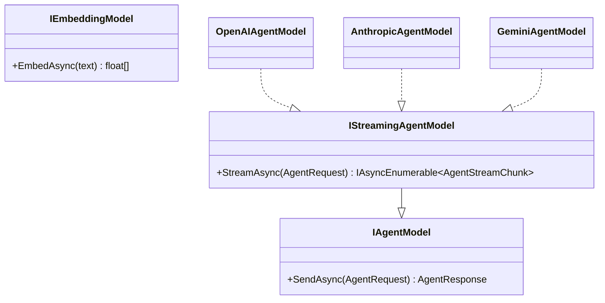
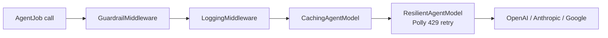
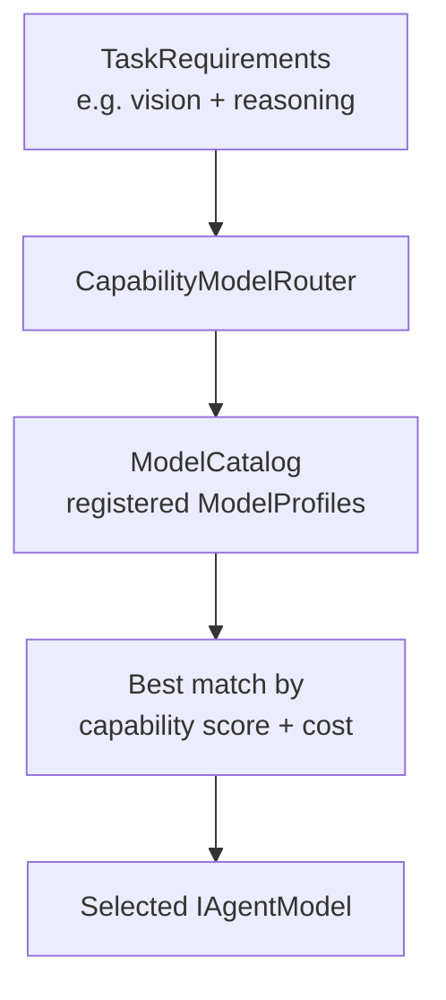

# Architecture: Agents & LLM Providers

> Part of the [Architecture Guide](../ARCHITECTURE.md). Covers the agent model abstraction, provider adapters, middleware pipeline, and model routing.

---

## Agent Model Abstraction

### Key Design Decision

Ananke defines its own `IAgentModel` rather than using `Microsoft.Extensions.AI.IChatClient`. This keeps the abstraction minimal, vendor-neutral, and tightly aligned with agent-specific concerns (tool calls, structured output, token budgets). See [design-decisions.md](../docs/reference/design-decisions.md).

## Message Types

| Type | Role |
|---|---|
| `AgentRequest` | System prompt + message history + tools + config |
| `AgentResponse` | Content + tool calls + token usage + stop reason |
| `AgentMessage` | Single message (role + content parts) |
| `ContentPart` | Text, image, or audio segment |
| `AgentToolCall` | Tool name + JSON arguments from LLM |
| `AgentStreamChunk` | Incremental token during streaming |
| `TokenUsage` | Prompt/completion/total token counts |

## Provider Adapters

Each provider package is a **thin adapter** that depends only on `Ananke.Abstractions`:

| Package | LLM SDK | Notes |
|---|---|---|
| `Ananke.Orchestration.OpenAI` | `OpenAI` NuGet | Also works with Azure OpenAI, Ollama, LM Studio, Groq, etc. via base URL override |
| `Ananke.Orchestration.Anthropic` | `Anthropic` NuGet | Claude models |
| `Ananke.Orchestration.Google` | `Google.GenAI` NuGet | Gemini Developer API + Vertex AI |

## Middleware Pipeline

Middleware is composed via `MiddlewareAgentModel` which wraps an inner `IAgentModel` with a chain of `IAgentModelMiddleware`.

## Model Routing

`IModelRouter` selects the best model for a task based on declared capabilities:

- `ModelProfile` — declares model name, capabilities, cost rates
- `ModelCapability` — enum: `TextGeneration`, `Vision`, `Reasoning`, `ToolCalling`, `StructuredOutput`, etc.
- `TaskRequirements` — what the job needs
- `ModelCostRates` — input/output token pricing for budget-aware routing

## Context Management

`IContextStrategy` controls how conversation history is managed within token budgets:

| Strategy | Behavior |
|---|---|
| `SlidingWindowContextStrategy` | Keep last N messages within token limit |
| `SummarizingContextStrategy` | Summarize older messages via LLM when window overflows |
