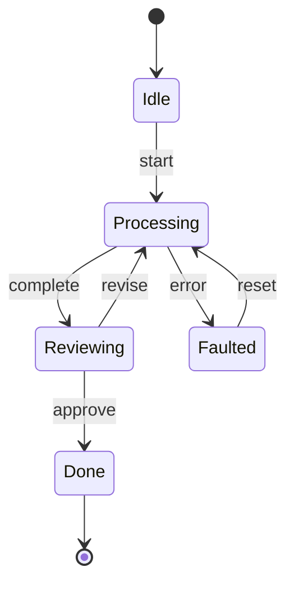

# Architecture: Infrastructure

> Part of the [Architecture Guide](../ARCHITECTURE.md). Covers Redis, MQTT, Qdrant, OpenTelemetry, StateMachine, and ASP.NET Core integration.

---

## State Machine

`Ananke.StateMachine` provides a distributed FSM engine. Depends only on `Ananke.Abstractions`.

### Key Types

| Type | Purpose |
|---|---|
| `IStateMachine<S, T>` | Core interface — state + trigger + context |
| `StateMachine<S, T>` | In-process implementation |
| `AbstractStateMachine` | Production base class with RedLock coordination |
| `ITransitionBuilder` / `TransitionBuilder` | Fluent transition configuration |
| `ITransitionMiddleware` | Intercept transitions (logging, validation, audit) |
| `TransitionResult` | Success/failure + new state |
| `StateMachineOptions` | Guard conditions, circuit breaking config |
| `StateMachineChannelWorker` | Process transitions from `IChannelReader` events |
| `AbstractServiceWorker` | Background service host for state machines |

---

## Redis

`Ananke.Redis` implements distributed infrastructure via Redis:

| Interface | Implementation | Backend |
|---|---|---|
| `IDistributedLock` | `RedisDistributedLock` (RedLock-based) | Redis via RedLock.net |
| `IKeyValueDataAdapter` | `RedisDataAdapter` | Redis key-value via StackExchange.Redis |
| `ICheckpointStore` | `RedisCheckpointStore` | Workflow checkpoint persistence; TTL via `EXPIREAT` |
| `IConversationMemory` | `RedisConversationMemory` | Multi-turn conversation history per session; optional TTL |

Registration: `services.AddRedis(options)`

---

## MQTT

`Ananke.MQTT` implements pub/sub channels via MQTTnet:

| Interface | Implementation |
|---|---|
| `IChannelReader<T>` | MQTT subscription |
| `IChannelWriter<T>` | MQTT publish |

Serialization: MessagePack for efficient binary encoding.

Registration: `services.AddMqtt<TContext, TAction>(configure)`

---

## Qdrant

`Ananke.Qdrant` provides vector database persistence:

| Interface | Implementation |
|---|---|
| `IKnowledgeStore` | Qdrant collection with dense vectors |
| `IKnowledgeCatalog` | Qdrant collection for document metadata |
| `IEmpiricalMemory` | Qdrant collection for empirical entries |

Depends on `Ananke.Orchestration.Knowledge` + `Ananke.Learning`.

---

## OpenTelemetry

`Ananke.OpenTelemetry` provides one-liner OTLP tracing export:

- Hooks into `IWorkflowTracer` from Abstractions
- `StateMachineActivitySource` for state machine transitions
- `WorkflowTraceContext` for workflow execution spans
- Compatible with Jaeger, Grafana Tempo, BetterStack, any OTLP backend

---

## ASP.NET Core

`Ananke.AspNetCore` bridges Ananke to web scenarios:

- **SSE streaming** — `ChatSessionEvent` → Server-Sent Events
- **Session management** — in-memory chat session tracking
- **Provider configuration** — DI helpers for configuring LLM providers
- **State machine endpoints** — expose FSM transitions via HTTP

Depends on `Ananke.Orchestration` + `Ananke.StateMachine`.
