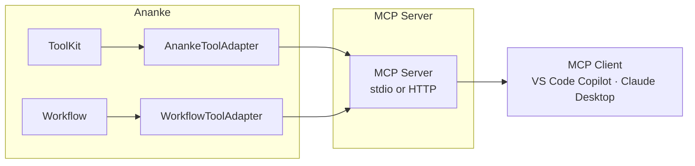
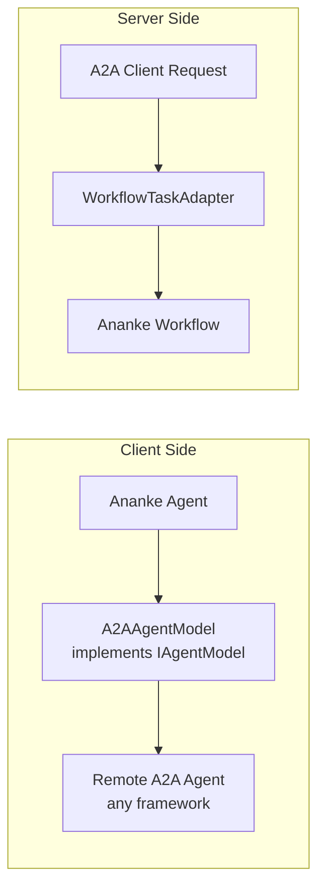
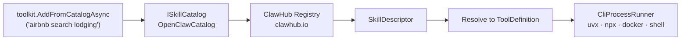
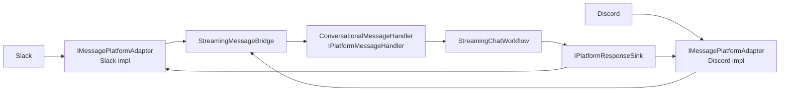

# Architecture: Interop — MCP, A2A, Skills, Platforms

> Part of the [Architecture Guide](../ARCHITECTURE.md). Covers protocol bridges, external skill catalog, and messaging platform adapters.

---

## MCP (Model Context Protocol)

`Ananke.MCP` exposes Ananke capabilities as an MCP server. Depends on `Ananke.Orchestration`.

| Type | Purpose |
|---|---|
| `AnankeToolAdapter` | Wraps `ToolKit` tools as MCP tool capabilities |
| `WorkflowToolAdapter` | Wraps a `Workflow<T>` as an MCP tool |
| `McpServerBuilderExtensions` | DI integration for MCP server setup |
| `McpToolInvoker` | Invokes tools on external MCP servers and returns typed results — used when importing tools from a remote MCP server into a `ToolKit` |
| `ToolKitMcpExtensions` | Import tools from external MCP servers into `ToolKit` |

---

## A2A (Agent-to-Agent Protocol)

`Ananke.A2A` enables cross-framework agent interoperability. Depends on `Ananke.Orchestration`.

| Type | Purpose |
|---|---|
| `A2AAgentModel` | Call remote A2A agents as drop-in `IAgentModel` |
| `A2AAgentModelOptions` | Endpoint URL, auth config |
| `A2AAgentDiscovery` | Discover remote agents via A2A protocol |
| `WorkflowTaskAdapter` | Expose Ananke workflows as A2A endpoints |
| `AgentCardBuilder` | Build A2A agent card metadata |
| `A2AHandoffChannel` | Cross-agent handoff via A2A |

---

## External Skill Catalog

`Ananke.Skills` connects to external tool registries. Depends on `Ananke.Orchestration`.

| Type | Purpose |
|---|---|
| `ISkillCatalog` | Search for external tools by natural language |
| `OpenClawCatalog` | ClawHub registry implementation with local JSON cache |
| `SkillDescriptor` | Tool metadata (name, description, install method, params) |
| `SkillInstallMethod` | How to run: `uvx`, `npx`, `docker`, `shell` |
| `CliProcessRunner` | Execute CLI tools as child processes |
| `ISkillScoreStore` / `JsonFileScoreStore` | Local voting and reliability scoring |
| `SkillScore` | Success rate, vote count, last used |
| `ToolKitSkillExtensions` | `toolkit.AddFromCatalogAsync()` convenience methods |
| `SkillCatalogMemorySync` | Synchronises discovered skill catalog entries into `IToolMemory` so the smart router can recall and score them across sessions |

---

## Messaging Platforms

`Ananke.Platforms` provides abstractions for bridging agents to messaging platforms. Depends on `Ananke.Orchestration`.

| Type | Assembly | Purpose |
|---|---|---|
| `IMessagePlatformAdapter` | Platforms | Receive messages from a platform |
| `IPlatformResponseSink` | Platforms | Send responses back to the platform |
| `IPlatformMessageHandler` | Platforms | Process incoming platform messages |
| `ConversationalMessageHandler` | Platforms | Default handler with session management |
| `PlatformMessage` | Platforms | Normalized incoming message |
| `StreamingMessageBridge` | Platforms | Bridge streaming agent output to platform sink |
| `SessionKeyBuilder` | Platforms | Build session keys from platform context |
| `Ananke.Platforms.Slack` | Platforms.Slack | Slack-specific adapter |
| `Ananke.Platforms.Discord` | Platforms.Discord | Discord-specific adapter |
