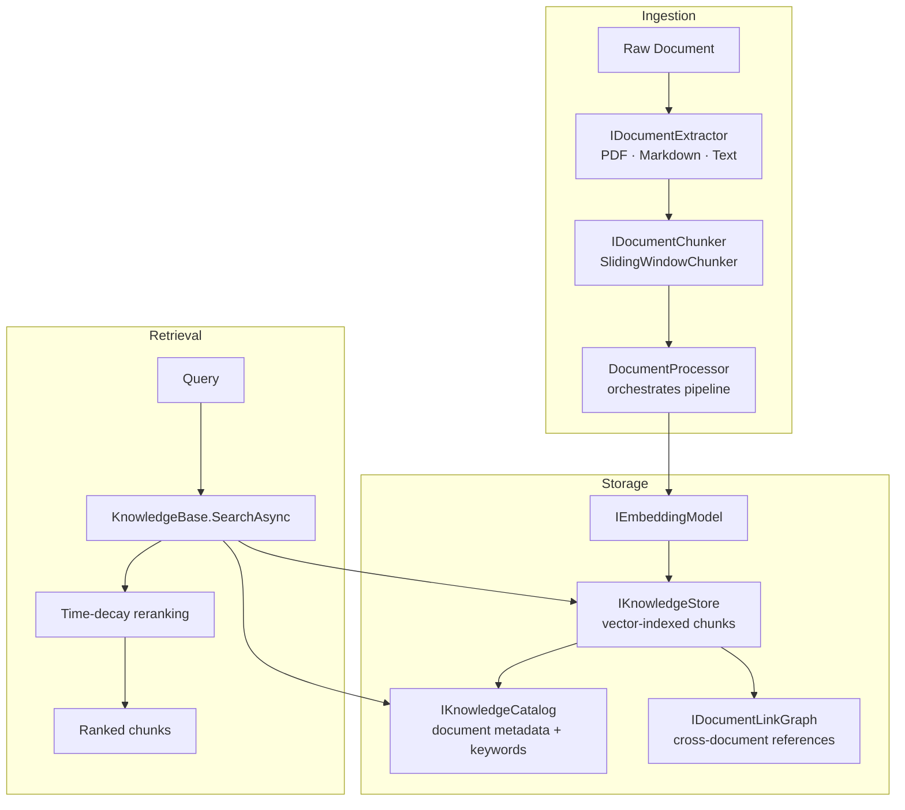

# Architecture: Knowledge Pipeline

> Part of the [Architecture Guide](../ARCHITECTURE.md). Covers vector stores, document processing, catalog, and document linking.

---

## Overview

The knowledge subsystem lives in `Ananke.Orchestration.Knowledge` (core abstractions) and `Ananke.Documents` (extractors). It provides a full RAG pipeline from raw documents to semantic search.

## Core Types

### Document Processing

| Type | Assembly | Purpose |
|---|---|---|
| `IDocumentExtractor` | Knowledge | Extract raw text from a document format |
| `IDocumentChunker` | Knowledge | Split text into overlapping chunks |
| `SlidingWindowChunker` | Knowledge | Default chunker with configurable window/overlap |
| `DocumentProcessor` | Knowledge | Orchestrates extract → chunk → embed → store |
| `DocumentSummarizer` | Knowledge | LLM-powered document summaries for catalog |

### Storage

| Type | Assembly | Purpose |
|---|---|---|
| `IKnowledgeStore` | Knowledge | Store and search vector-indexed chunks |
| `InMemoryKnowledgeStore` | Knowledge | In-memory impl (cosine similarity) |
| `IKnowledgeCatalog` | Knowledge | Document-level metadata, keywords, summaries |
| `InMemoryKnowledgeCatalog` | Knowledge | In-memory impl |
| `CatalogAwareKnowledgeStore` | Knowledge | Decorator that auto-updates catalog on ingest |
| `CatalogKeywordExtractor` | Knowledge | Extract keywords from chunks for catalog |

### Document Linking

| Type | Purpose |
|---|---|
| `IDocumentLinkGraph` | Track cross-document references |
| `InMemoryDocumentLinkGraph` | In-memory graph |
| `DocumentLinkExtractor` | Discover links between documents |
| `LinkedKnowledgeStore` | Decorator that follows links during search |
| `KnowledgeLinkingExtensions` | DI helpers: `services.AddKnowledgeLinking()` — registers `LinkedKnowledgeStore` and `DocumentLinkExtractor` |
| `KnowledgeLinkingOptions` | Configuration: traversal depth, score-blend weight, min link strength |
| `LinkedSearchOptions` | Per-query controls for graph traversal depth and score blending, passed to `LinkedKnowledgeStore.SearchAsync` |

### External Providers

| Package | Implements | Backend |
|---|---|---|
| `Ananke.Qdrant` | `IKnowledgeStore`, `IKnowledgeCatalog`, `IEmpiricalMemory` | Qdrant vector DB |

## `KnowledgeBase` Facade

`KnowledgeBase` is a read-side facade over one or more already-built `KnowledgeSection`s
plus a shared `IKnowledgeCatalog` — it does not run the ingestion pipeline itself
(that's `DocumentProcessor.ProcessAsync`, see above):
- `SearchAsync(query, options?)` — searches all sections in parallel, merges results by
  descending score (`options.TopK` applies per section)
- `this[name]` / `TryGetSection(name, out section)` — look up a named section directly
- Integrates with `KnowledgeSearchTool` for agent tool calling

## Time-Decay Reranking

`TimeDecay` applies a configurable decay function to search scores based on document age. Newer knowledge ranks higher, preventing stale information from dominating results.

## Agent Integration

`KnowledgeSearchTool` and `KnowledgeCatalogTools` are pre-built `ToolDefinition` entries that agents can use to search the knowledge base during conversations.
