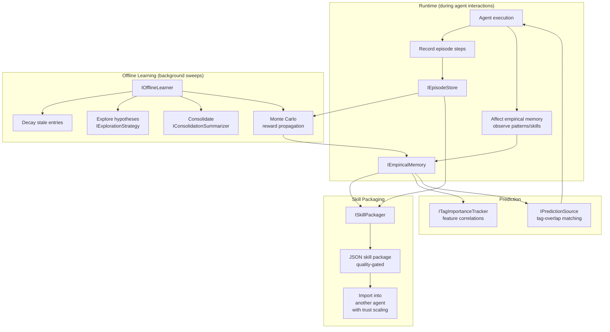

# Architecture: Empirical Learning

> Part of the [Architecture Guide](../ARCHITECTURE.md). Covers empirical memory, episodes, offline learning, skill packaging, and exploration strategies.

---

## Overview

`Ananke.Learning` makes agents **smarter over time** by accumulating structured knowledge from interactions. It depends on `Ananke.Orchestration`.

## Empirical Memory

### Entry Types

`IEmpiricalMemory` stores three kinds of entries (all with confidence, strength, observation count, tags):

| Type | Purpose | Example |
|---|---|---|
| **Pattern** | Observed regularity | "Users asking about refunds usually also need shipping status" |
| **Skill** | Learned capability | "Use tool X with parameter Y for this class of problem" |
| **Heuristic** | Decision rule | "Prefer concise answers for mobile users" |

### `IEmpiricalMemory` Interface

- `CommitAsync(entry)` — store a new entry (semantic dedup merges into existing if similar)
- `RecallAsync(situation, options)` — retrieve entries ranked by relevance × confidence × recency
- `ReinforceAsync(entryId, reinforcement)` — strengthen an entry (prediction-error path when `AffectOptions` configured)
- `ContradictAsync(entryId, reason)` — weaken an entry that proved incorrect
- `GetAsync(entryId)` — retrieve a specific entry by ID
- `BrowseAsync(offset, limit, ...)` — paginated iteration with filters (kind, entity, tags, confidence)
- `CountAsync(options)` — count entries matching filters
- `MarkConsolidatedAsync(entryId, docId)` — mark entry as promoted to knowledge store

### Implementations

- `InMemoryEmpiricalMemory` — in-process, for tests and single-agent scenarios
- `Ananke.Qdrant` provides a Qdrant-backed implementation for production

## Episode Store

Episodes are **temporal trajectories** — ordered sequences of steps taken during an interaction.

| Type | Purpose |
|---|---|
| `Episode` | Container: ID, tags, steps, outcome, reward |
| `EpisodeStep` | Single action within an episode |
| `IEpisodeStore` | CRUD + query for episodes |
| `InMemoryEpisodeStore` | In-memory impl |

## Reward Propagation

`MonteCarloRewardPropagator` / `IRewardPropagator`:
- Takes episode outcomes (success/failure + reward signal)
- Propagates rewards backward through episode steps
- Updates empirical memory entries that contributed to each step

## Offline Learning

`OfflineLearner` / `IOfflineLearner` runs periodic background sweeps:

1. **Decay** — reduce confidence of entries not recently observed
2. **Explore** — generate hypotheses via `IExplorationStrategy` and test via `ISimulationSource`
3. **Consolidate** — merge similar entries via `IConsolidationSummarizer` (LLM-powered)
4. **Propagate** — run Monte Carlo reward propagation on recent episodes

## Exploration Strategies

| Strategy | Algorithm |
|---|---|
| `EpsilonGreedyExplorationStrategy` | Random exploration with probability ε |
| `UcbExplorationStrategy` | Upper Confidence Bound — balances exploration/exploitation |

## Tag Importance

`ITagImportanceTracker` / `TagImportanceTracker`:
- Tracks which tags (features) correlate with positive outcomes
- `TagImportanceMap` — serializable weight map
- Bundled into skill packages for transfer

## Skill Packaging

`ISkillPackager` / `SkillPackager`:
- **Export**: Select entries passing quality gates (min confidence, min strength, min observations) + linked episodes + tag importance map → JSON bundle
- **Import**: Load bundle into another agent's memory with configurable trust scaling (e.g., imported entries start at 70% confidence)
- Format: `ISkillPackageFormat` → `JsonSkillPackageFormat`

## Entity Memory

`IEntityMemory` / `IEntityMemoryProvider` provides **per-entity scoping** — each entity (user, customer, device) gets its own isolated view of:
- Conversation memory
- Empirical memory
- Episode store
- Knowledge store

Implementations: `EntityScopedConversationMemory`, `EntityScopedEmpiricalMemory`, `EntityScopedEpisodeStore`, `EntityScopedKnowledgeStore`.

## External Knowledge Ingestion

`IExternalKnowledgeSource` + `ExternalKnowledgeSyncer<TEvent>` (in `Ananke.Learning.Ingestion`):
- Domain-specific external data sources implement `IExternalKnowledgeSource` to resolve batches of `KnowledgeDocument` from external events (GitHub, supplier APIs, device registries, etc.)
- `ExternalKnowledgeSyncer<TEvent>` orchestrates the write pattern: subscribe to events → call `ResolveAsync` → upsert into `IKnowledgeStore`
- Recommended integration point for products that need to pre-materialise domain context without live API calls at inference time

## Knowledge Graph Analytics

`Ananke.Learning` includes a set of graph-projection and analytics types (in `Ananke.Learning.Knowledge.*`) that populate and analyse an `IKnowledgeGraph` from learning data:

### Graph Builders

| Type | Namespace | Purpose |
|---|---|---|
| `DocumentStructureBuilder` | `Knowledge.Builders` | Projects document section relationships into the knowledge graph |
| `EpisodeTrajectoryBuilder` | `Knowledge.Builders` | Projects episode step sequences as directed graph paths |
| `TagCoOccurrenceBuilder` | `Knowledge.Builders` | Projects empirical tag co-occurrence frequencies as weighted edges |

### Analytics

| Type | Namespace | Purpose |
|---|---|---|
| `CommunityConsolidator` | `Knowledge.Analytics` | Detects tag/concept communities in the graph and merges empirical entries within each community |
| `GraphTagImportanceTracker` | `Knowledge.Analytics` | Centrality-weighted variant of `ITagImportanceTracker` — ranks tags by their structural influence in the knowledge graph |

### Reporting & Retrieval

| Type | Namespace | Purpose |
|---|---|---|
| `KnowledgeReportExporter` | `Knowledge.Reporting` | Serialises knowledge graph analytics (community summaries, tag importance maps, trajectory stats) to portable report formats |
| `GraphExpandedPredictionSource` | `Knowledge.Retrieval` | `IPredictionSource` implementation that expands recall by traversing graph neighbourhood — returns semantically adjacent patterns beyond direct tag matches |
