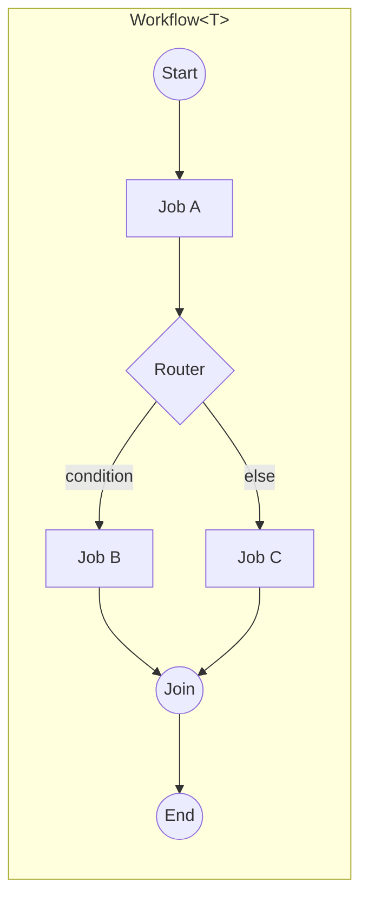

# Architecture: Orchestration Engine

> Part of the [Architecture Guide](../ARCHITECTURE.md). Covers the workflow engine, job execution, routing, streaming, and checkpointing.

---

## Overview

`Ananke.Orchestration` is the **central engine** of the framework. It provides a fluent, typed workflow builder that compiles to a directed graph of jobs connected by routers.

## Core Types

### `Workflow<T>`

The top-level builder. `T` is the **state record** that flows through the pipeline. Immutable — each job returns `state with { ... }`.

Key methods:
- `.Job(name, delegate)` — register a compute step
- `.AgentJob(name, agentConfig)` — register an LLM agent step
- `.Chain(a, b)` — sequential connection
- `.Then(a, End)` — terminal connection
- `.Fork(source, targets, mode)` — parallel fan-out
- `.Join(sources, target)` — fan-in synchronization
- `.SubFlow(name, childWorkflow)` — nested workflow
- `.Interrupt(name, mode)` — human-in-the-loop pause point
- `.RunAsync(initialState)` — execute and return `WorkflowResult<T>`

### `WorkflowRunner` / `IWorkflowRunner`

Executes the compiled graph. Responsibilities:
1. Topological traversal of the job graph
2. Router evaluation at each branching point
3. Parallel execution for fork nodes
4. Checkpoint save/restore via `ICheckpointStore`
5. Interrupt handling (pause + resume)
6. Event emission for streaming consumers

### Job Types

| Type | Purpose |
|---|---|
| `DelegateJob` | Wraps a `Func<T, CancellationToken, Task<T>>` |
| `AgentJob` | Sends state to an `IAgentModel` with tool calling loop |
| `TextAgentJob` | Simplified agent job for text-in/text-out |
| `SubFlowJob` | Delegates to a child `Workflow<T>` |
| `HandoffJob` | Transfers execution to another process via `IHandoffChannel` |

### Routing

| Type | Purpose |
|---|---|
| `DelegateRouter` | User-provided `Func<T, string>` picks next job |
| `AgentRouter` | LLM decides next job based on state |
| `Connections` | Static chain/then/fork/join topology |

### Checkpointing

`ICheckpointStore` persists workflow state at each step boundary:
- `InMemoryCheckpointStore` — tests
- `FileCheckpointStore` — local dev
- (External stores via Redis, etc.)

### Streaming

`WorkflowEvent<T>` is emitted as `IAsyncEnumerable` during execution:
- `JobStarted` / `JobCompleted`
- `StateChanged`
- `InterruptRequested`
- Token-level streaming from agents via `ChatSessionEvent`

## Agentic Patterns

Pre-wired builders on `AgenticPattern`:
- `ReviewCritique<T>()` — generator → critic → approval loop
- `IterativeRefinement<T>()` — single-agent refinement loop

Both compile to standard `Workflow<T>` graphs with routers.

## Middleware

`IJobMiddleware` wraps job execution (logging, timing, validation). Registered on the workflow builder.

`IAgentModelMiddleware` wraps `IAgentModel` calls:
- `ResilientAgentModel` — Polly retry with 429 backoff + OTel events
- `CachingAgentModel` — LRU response cache
- `LoggingAgentModelMiddleware` — structured logging
- `GuardrailAgentModelMiddleware` — content filtering
