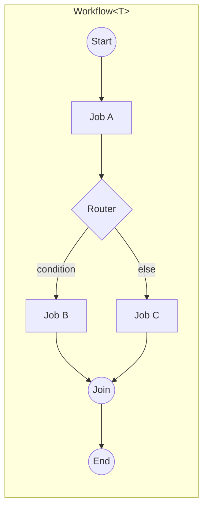

# Architecture: Orchestration Engine

> Part of the [Architecture Guide](../ARCHITECTURE.md). Covers the workflow engine, job execution, routing, streaming, and checkpointing.

---

## Overview

`Ananke.Orchestration` is the **central engine** of the framework. It provides a fluent, typed workflow builder that compiles to a directed graph of jobs connected by routers.

## Core Types

### `Workflow<T>`

The top-level builder. `T` is the **state record** that flows through the pipeline. Immutable — each job returns `state with { ... }`.

Key methods:
- `.Job(name, delegate)` — register a compute step
- `.AgentJob(name, agentConfig)` — register an LLM agent step (returns `AgentJob<TState, TResponse>`)
- `.Then(a, b)` — sequential connection
- `.Then(a, End)` — terminal connection
- `.Fork(source, targets, mode)` — parallel fan-out
- `.Join(sources, target, merge)` — fan-in synchronization with merge function
- `.Loop(from, loopTarget, exitTarget, until, maxIterations)` — iteration loop with predicate exit condition
- `.SubFlow(name, childWorkflow, mapIn, mapOut)` — nested workflow
- `.InterruptBefore(name)` / `.InterruptAfter(name)` — human-in-the-loop pause points
- `.AwaitInput(name)` — pauses before `name` like `InterruptBefore`, plus marks it in `WorkflowDefinition.InputJobs` so a host knows the resume should carry a free-text reply, not an approval (see `WorkflowInputExtensions.ResumeWithInputAsync`)
- `.WithBudget(maxCost)` — cost budget cap (terminates with `BudgetExceeded` if exceeded)
- `.UseCheckpointing(store)` — attach checkpoint store
- `.UseTracing(tracer)` — attach `IWorkflowTracer`
- `.WithMetadata(dict)` — attach correlation metadata
- `.Validate()` — eager validation at startup
- `.Build()` — freeze and return `WorkflowDefinition<T>`
- `.RunAsync(initialState)` — execute and return `WorkflowExecution<T>`
- `.ResumeAsync(executionId)` — resume from checkpoint
- `.ResumeAsync(executionId, stateTransform)` — resume with human-injected state
- `.StreamAsync(initialState)` — stream `IAsyncEnumerable<WorkflowEvent<T>>`

All string-based connection methods have type-safe `JobRef` overloads.

### `WorkflowRunner` / `IWorkflowRunner`

Executes the compiled graph. Responsibilities:
1. Topological traversal of the job graph
2. Router evaluation at each branching point
3. Parallel execution for fork nodes (with configurable `ForkMode` cancellation behaviour)
4. Loop iteration with predicate and cap enforcement
5. Cost budget tracking and `BudgetExceeded` termination
6. Checkpoint save/restore via `ICheckpointStore`
7. Interrupt handling (pause + resume via `ResumeAsync`)
8. Event emission for streaming consumers via `StreamAsync`

### Job Types

| Type | Purpose |
|---|---|
| `DelegateJob` | Wraps a `Func<T, CancellationToken, Task<T>>` |
| `AgentJob` | Sends state to an `IAgentModel` with tool calling loop |
| `TextAgentJob` | Simplified agent job for text-in/text-out |
| `SubFlowJob` | Delegates to a child `Workflow<T>` |
| `SubFlowContext` | Carries the child workflow state and result during a sub-flow execution |
| `SubFlowInterruptedException` | Thrown when a sub-flow is interrupted mid-execution; allows the parent to checkpoint before propagating |
| `HandoffJob` | Transfers execution to another process via `IHandoffChannel` |
| `HandoffProxy` | Creates an `IHandoffChannel` pair for in-process or cross-boundary handoff scenarios |
| `InMemoryHandoffChannel` | Default in-process `IHandoffChannel` for tests and single-host setups |

### Routing

| Type | Purpose |
|---|---|
| `DelegateRouter` | User-provided `Func<T, string>` picks next job |
| `AgentRouter` | LLM decides next job based on state |
| `AgentRoutingException` | Thrown when `AgentRouter` produces an unresolvable target; includes the raw LLM response for diagnosis |
| `Connection` (abstract) — `DirectConnection`, `RouterConnection<TState>`, `ForkConnection`, `LoopConnection<TState>` | Chain/then/fork/join topology edge types |
| `LoopExitReason` | Enum indicating why a loop terminated: `ConditionMet` or `MaxIterationsReached` |

### Checkpointing

`ICheckpointStore` persists workflow state at each step boundary:
- `InMemoryCheckpointStore` — tests and single-process scenarios (state lost on restart)
- `RedisCheckpointStore` (in `Ananke.Redis`) — distributed, TTL-based expiry via `EXPIREAT`
- Any custom implementation backed by SQL, blob storage, etc.

### Streaming

`WorkflowEvent<T>` is emitted as `IAsyncEnumerable` via `workflow.StreamAsync()` or `IWorkflowRunner.StreamAsync()`:

| Event | When emitted |
|---|---|
| `JobStarted<T>` | Job is about to execute |
| `JobCompleted<T>` | Job completed successfully (includes `Duration` + final `State`) |
| `StateUpdated<T>` | State updated after job completion or join merge |
| `Interrupted<T>` | Workflow paused at an interrupt point |
| `ForkStarted<T>` | Parallel branches begin |
| `JoinCompleted<T>` | Parallel branches merged |
| `LoopExited<T>` | Loop terminated (condition met or iteration cap hit) |
| `BudgetExceeded<T>` | Workflow stopped due to cost budget exhaustion |
| `WorkflowCompleted<T>` | Workflow finished successfully |
| `WorkflowFaulted<T>` | Workflow failed with unhandled exception |

Token-level streaming from agents is emitted via `ChatSessionEvent` (separate channel).

## Agentic Patterns

Pre-wired builders on `AgenticPattern`:
- `ReviewCritique<T>()` — generator → critic → approval loop
- `IterativeRefinement<T>()` — single-agent refinement loop
- `Interview<T>()` — conversational pattern: welcome → icebreaker → a turn loop over a question
  agenda held in state, pausing each turn via `AwaitInput`. The reply only exists at resume time,
  so `GetQuestion`/`FoldAnswer` are host-side hooks on the returned `Interview<T>`, not workflow
  jobs. Optional `WithMemory` writes each turn to `IConversationMemory`; `WithTurnTimeout` exposes
  a `PauseMessage` for a host to show on a quiet turn (the framework runs no timer itself).

All three compile to standard `Workflow<T>` graphs — the first two with routers/self-loops, the
last with `AwaitInput` + a self-loop.

## Middleware

`IWorkflowJobMiddleware<TState>` wraps job execution (logging, timing, validation). Registered on the workflow runner via `OrchestrationOptions`. Invoked in registration order; each middleware calls `next()` to continue.

`IAgentModelMiddleware` wraps `IAgentModel` calls:
- `ResilientAgentModel` — Polly retry with 429 backoff + OTel events
- `CachingAgentModel` — LRU response cache
- `LoggingAgentModelMiddleware` — structured logging
- `GuardrailAgentModelMiddleware` — content filtering

## Credentials

`ICredentialProvider` (in `Ananke.Orchestration.Credentials`) is the provider-agnostic runtime credential contract shared by orchestration and federation packages. Each provider package (`Ananke.Orchestration.OpenAI`, `Ananke.Orchestration.Anthropic`, `Ananke.Orchestration.Google`) ships a concrete implementation that is registered automatically via its DI extension method.

- `Platform` — identifies the target provider (e.g. `"openai"`, `"anthropic"`)
- `GetCredentialAsync(ct)` — resolves the opaque credential object at runtime; secrets are never stored in manifests

## Provider Translation Layer

`Ananke.Orchestration.Translators` houses the contracts that provider adapters implement to bridge Ananke's internal representations to each vendor's SDK expectations:

| Type | Purpose |
|---|---|
| `IJsonSchemaTranslator` | Translates Ananke JSON Schema dictionaries to the provider-specific schema dialect (e.g. Vertex AI proto-derived schema) |
| `IModelMapper` | Maps logical model IDs (e.g. `"google/gemini-2.5-pro"`) to the provider-native model string; also exposes capability flags |
| `ISystemPromptCompiler` | Compiles a structured system prompt from workflow/manifest metadata into the string the provider expects |
| `IToolSchemaTranslator` | Translates `ToolDefinition` parameter schemas to the provider's tool declaration format |
| `SystemPromptBuilder` | Fluent builder for constructing system prompts from manifest sections, job descriptions, and context overrides |

Provider packages register pass-through or custom implementations of these interfaces via their `AddOrchestration{Provider}()` DI extension.
