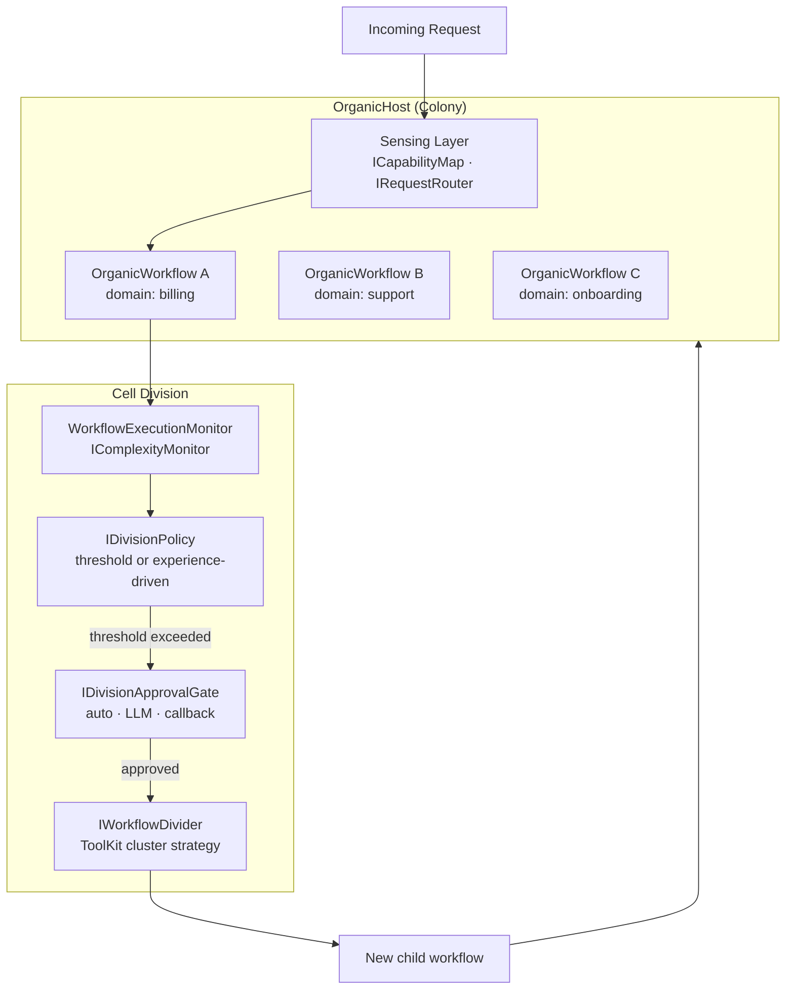
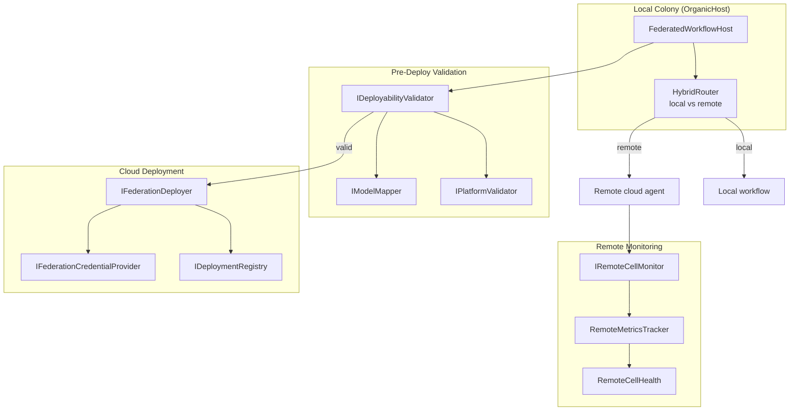

# Architecture: Organics & Federation

> Part of the [Architecture Guide](../ARCHITECTURE.md). Covers organic colony self-organization and cross-cloud federation.

---

## Organic Colony Architecture

`Ananke.Organics` implements a **biological cell division metaphor** for self-organizing workflow ecosystems. Depends on `Ananke.Learning` + `Ananke.Design`.

### Key Types

| Type | Purpose |
|---|---|
| `OrganicHost` | Colony manager — hosts workflows, routes requests, triggers division |
| `OrganicWorkflow` | Workflow wrapper with complexity monitoring and domain affinity |
| `IWorkflowHost` / `InProcessWorkflowHost` | Host abstraction for workflow lifecycle |
| `IWorkflowReplicator` | Create new workflow instances during division |

### Sensing

| Type | Purpose |
|---|---|
| `ICapabilityMap` / `InMemoryCapabilityMap` | Registry of what each workflow can handle |
| `IRequestRouter` / `KeywordRequestRouter` | Route requests to best-matching workflow |
| `SensedCapability` | Capability descriptor with confidence score |
| `WorkflowSignal` | Heartbeat/load signal from a running workflow |

### Division

| Type | Purpose |
|---|---|
| `IDivisionPolicy` | Decide when to divide |
| `ThresholdDivisionPolicy` | Divide when complexity exceeds threshold |
| `ExperienceDrivenDivisionPolicy` | Use empirical memory to decide |
| `IComplexityMonitor` / `WorkflowExecutionMonitor` | Track workflow load/complexity |
| `IWorkflowDivider` / `ToolKitClusterStrategy` | Determine how to split tools across children |
| `IDivisionApprovalGate` | Human/LLM/auto approval before division |
| `IDivisionOutcomeTracker` | Track division success for learning |
| `DomainAffinityMemory` | Remember which domains map to which workflows |
| `StructuralProfile` / `StructuralProfileFactory` | Analyze workflow structure for division |

### Snapshots

| Type | Purpose |
|---|---|
| `HostSnapshot` / `HostSnapshotExporter` | Serialize colony state |
| `WorkflowSnapshotBuilder` | Capture workflow topology + tools |
| `PromptWorkflowDesigner` | LLM-powered workflow design for new children |
| `WorkflowActivator` | Instantiate workflow from snapshot |

---

## Federation

`Ananke.Federation` extends Organics to **cross-cloud deployment**. Depends on `Ananke.Organics` + `Ananke.Design`.

### Platform-Specific Packages

| Package | Target Platform |
|---|---|
| `Ananke.Federation.Google` | Google Vertex AI |
| `Ananke.Federation.Anthropic` | Anthropic Claude Managed Agents |
| `Ananke.Federation.Azure` | Azure AI |

### Key Types

| Type | Purpose |
|---|---|
| `FederatedWorkflowHost` | Hosts workflows with federation awareness |
| `HybridRouter` | Routes requests to local or remote workflows |
| `FederatedComplexityMonitor` | Includes remote cell metrics in complexity assessment |
| `IDeployabilityValidator` | Pre-flight checks before deployment |
| `DeployabilityReport` / `DeployDiagnostic` | Validation results |
| `IFederationDeployer` | Deploy workflow to cloud platform |
| `IDeploymentRegistry` / `InMemoryDeploymentRegistry` | Track deployed workflows |
| `DeploymentRecord` / `DeploymentProfile` | Deployment metadata |
| `IRemoteCellMonitor` / `RemoteMetricsTracker` | Health + performance monitoring |
| `ISystemPromptCompiler` / `ManifestSystemPromptCompiler` | Generate system prompts for remote agents |
| `FederatedDivisionPolicy` | Division policy aware of remote capacity |
| `PlatformDivisionApprovalGate` | Platform-specific approval for division |
