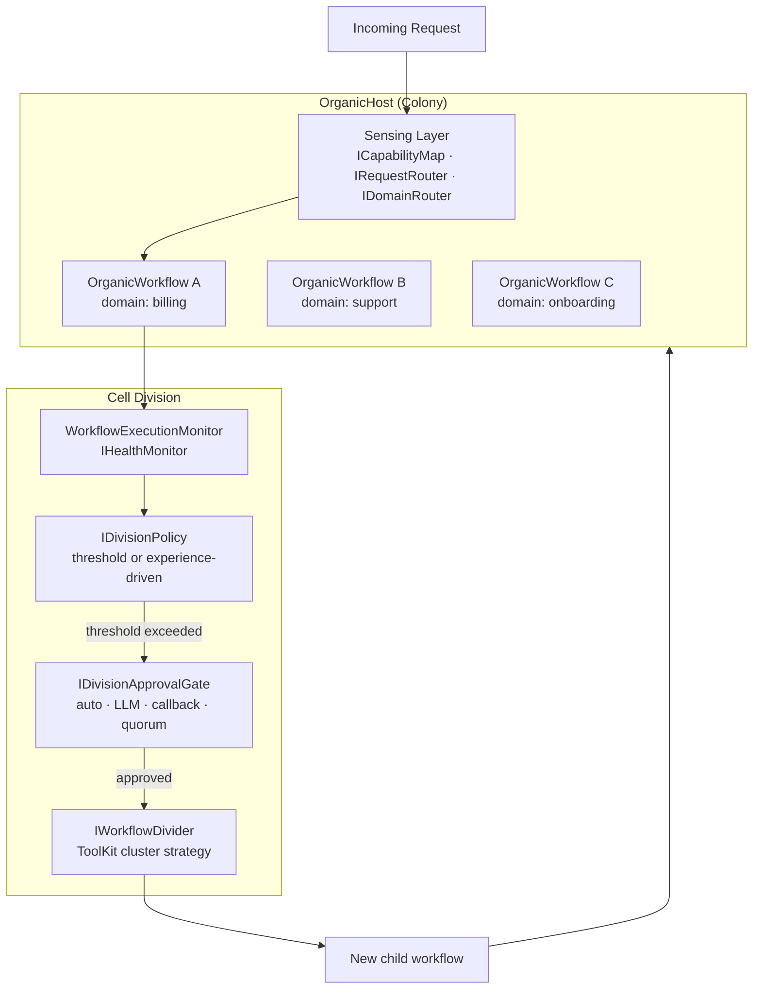
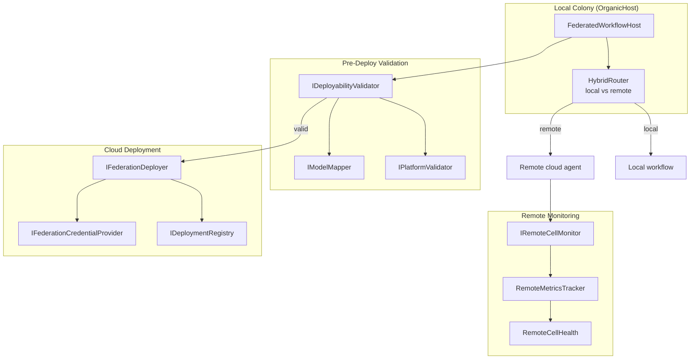

# Architecture: Organics & Federation

> Part of the [Architecture Guide](../ARCHITECTURE.md). Covers organic colony self-organization and cross-cloud federation.

---

## Organic Colony Architecture

`Ananke.Organics` implements a **biological cell division metaphor** for self-organizing workflow ecosystems. Depends on `Ananke.Learning` + `Ananke.Design`.

### Key Types

| Type | Purpose |
|---|---|
| `OrganicHost` | Colony manager — hosts workflows, routes requests, triggers division |
| `OrganicWorkflow<TState>` | Workflow wrapper with complexity monitoring and domain affinity. Created via `OrganicWorkflowExtensions.JoinHost()` |
| `IWorkflowHost` / `InProcessWorkflowHost` | Host abstraction for cell lifecycle (spawn/kill). Production adapters implement Docker, K8s, etc. |
| `IWorkflowReplicator` / `WorkflowReplicator` | Clone a running cell for horizontal scaling (replication, not specialization) |

### Sensing

| Type | Purpose |
|---|---|
| `ICapabilityMap` / `InMemoryCapabilityMap` | Registry of what each workflow can handle |
| `IRequestRouter` / `KeywordRequestRouter` | Load-balance requests across replica cells serving the same domain |
| `IDomainRouter` | Post-division prompt classifier — routes across domains to the correct child cell |
| `IMeshAggregator` / `InMemoryMeshAggregator` | Aggregates per-cell `MetabolicSignal` reports into a mesh-wide `MeshSignal` |
| `RoutingAffinityTracker` | Adaptive routing table refinement after division events |
| `SensedCapability` | Capability descriptor with confidence score |
| `WorkflowSignal` | Heartbeat/load signal from a running workflow |

### Division

| Type | Purpose |
|---|---|
| `IDivisionPolicy` | Decide when to divide |
| `ThresholdDivisionPolicy` | Divide when complexity exceeds threshold |
| `ExperienceDrivenDivisionPolicy` | Use empirical memory to decide |
| `IHealthMonitor` / `WorkflowExecutionMonitor` | Track workflow load/complexity and health. Combines structural metrics (tool count, tag clusters) with execution telemetry (routing entropy, error rate) |
| `IWorkflowDivider` / `WorkflowDivider` | Execute cell division — derives child manifests, seeds children, spawns them, kills parent |
| `ToolKitClusterStrategy` | Cluster toolkit tools into child groups during division |
| `IDivisionApprovalGate` | Human/LLM/auto/quorum approval before division |
| `AutoApprovalGate` / `LlmApprovalGate` / `CallbackApprovalGate` / `QuorumApprovalGate` | Concrete gate implementations |
| `IDivisionOutcomeTracker` | Track division success for learning |
| `DomainAffinityMemory` | Remember which domains map to which workflows |
| `StructuralProfile` / `StructuralProfileFactory` | Analyze workflow structure for division |

### Snapshots

| Type | Purpose |
|---|---|
| `HostSnapshot` / `HostSnapshotExporter` | Serialize colony state |
| `WorkflowSnapshotBuilder` | Capture workflow topology + tools |
| `PromptWorkflowDesigner` | LLM-powered workflow design for new children |
| `WorkflowActivator<TState>` | Hydrate a `WorkflowSnapshot` into a runnable `Workflow<TState>` |
| `IWorkflowActivatorFactory` / `TypedWorkflowActivatorFactory` | Untyped factory used by `IWorkflowDivider` to spawn child cells without knowing `TState` |
| `ILineageStore` / `InMemoryLineageStore` | Track cell lineage (which cells were split from which parents) |

---

## Federation

`Ananke.Federation` extends Organics to **cross-cloud deployment**. Depends on `Ananke.Organics` + `Ananke.Design`.

### Platform-Specific Packages

| Package | Target Platform |
|---|---|
| `Ananke.Federation.Google` | Google Vertex AI |
| `Ananke.Federation.Anthropic` | Anthropic Claude Managed Agents |
| `Ananke.Federation.Azure` | Azure AI |

### Key Types

| Type | Purpose |
|---|---|
| `FederatedWorkflowHost` | Hosts workflows with federation awareness |
| `HybridRouter` | Routes requests to local or remote workflows |
| `FederatedComplexityMonitor` | `IHealthMonitor` implementation that aggregates both local telemetry and remote cell metrics via `IRemoteCellMonitor` |
| `PlatformWorkflowHostBase` | Abstract base class for platform-specific `IWorkflowHost` implementations — handles deployment lifecycle, health polling, and `IRemoteCellMonitor` integration |
| `IDeployabilityValidator` / `DeployabilityValidator` | Pre-flight checks before deployment |
| `DeployabilityReport` / `DeployDiagnostic` | Validation results |
| `IFederationDeployer` | Deploy workflow to cloud platform |
| `IDeploymentRegistry` / `InMemoryDeploymentRegistry` / `JsonFileDeploymentRegistry` | Track deployed workflows |
| `DeploymentRecord` / `DeploymentProfile` | Deployment metadata |
| `LocalFederationDeployer` | `IFederationDeployer` implementation that runs cells in the local process — enables dev/test without cloud credentials |
| `FederationDeployerRegistry` | Service-locator for resolving `IFederationDeployer` implementations by platform identifier |
| `IRemoteCellMonitor` / `RemoteMetricsTracker` | Health + performance monitoring of remote cells |
| `ISystemPromptCompiler` / `ManifestSystemPromptCompiler` | Compile workflow manifest + job into a system prompt for a remote platform agent |
| `FederatedDivisionPolicy` | Division policy aware of remote capacity |
| `PlatformDivisionApprovalGate` | Platform-specific approval for division |
| `IPlatformRecommender` / `PlatformRecommender` | Score and recommend target platforms for deployment |
| `PlatformFitScore` / `PlatformFitReport` | Recommendation output — per-platform score with breakdown |
| `FitReason` / `FitReasonKind` | Individual scoring signals (e.g. model availability, tool count, quota) |
| `PlatformProfiles` | Static registry of known platform capability profiles used by the recommender |
| `RecommendationWeights` | Configurable weight vector for the recommender scoring function |

### Adapter System

| Type | Purpose |
|---|---|
| `AdapterManifest` | JSON sidecar (`<id>.adapter.json`) written alongside adapter DLLs. Read by `PlatformHost` to validate API version compatibility before loading the assembly |
| `AdapterDiagnostics` | Helpers for generating and reporting adapter validation diagnostics |

### Managed Agent Client

`IManagedAgentClient` is the CRUD abstraction over platform managed-agent resources, implemented by each provider package (`Ananke.Federation.Azure`, `Ananke.Federation.Google`, `Ananke.Federation.Anthropic`). Consumed by `PlatformWorkflowHostBase` and conformance tests.

| Operation | Purpose |
|---|---|
| `GetAsync(deploymentId)` | Retrieve a deployment record from the platform |
| `CreateAsync(manifest, options)` | Create or update a platform agent resource |
| `DeleteAsync(deploymentId)` | Remove a platform agent resource |

### Native Execution

| Type | Purpose |
|---|---|
| `IPlatformNativeExecutor` | Executes a workflow step using the platform's own native execution API instead of the local runner |
| `PlatformNativeExecutorRegistry` | Resolves `IPlatformNativeExecutor` implementations by platform identifier at runtime |

### Paths

`AnankePaths` (in `Ananke.Federation.Paths`) provides well-known file and directory path constants for federation artefacts:
- Adapter manifest sidecar locations
- Default credential store paths
- Deployment registry file path for `JsonFileDeploymentRegistry`
