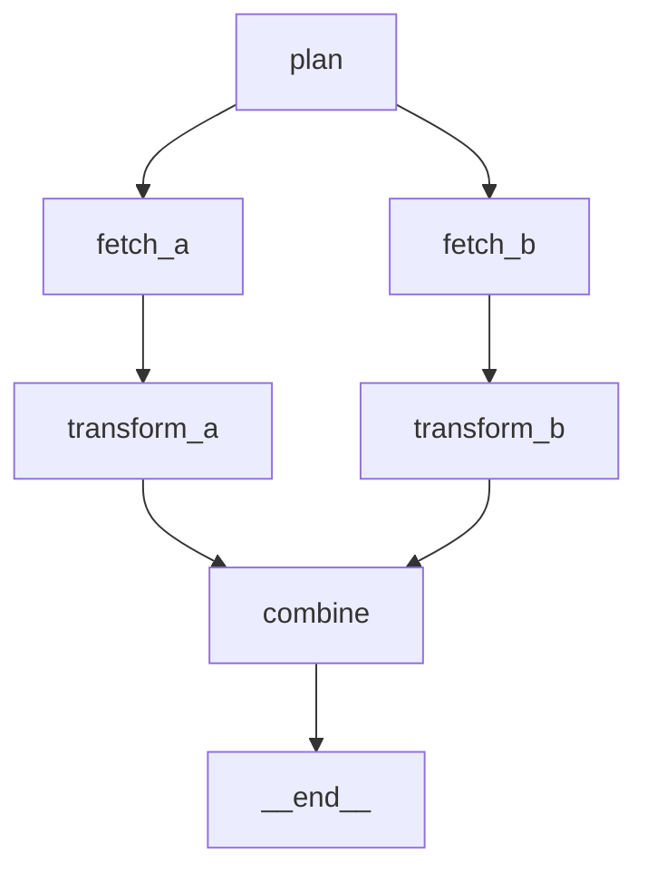

<!-- topic: design-tooling, tags: dsl, manifest, yaml, topology, mermaid, scaffold, design, nnke -->
# 13 — Design Tooling

Define workflow topologies in a text DSL or YAML manifest, bind code at runtime,
and export validated graphs as Mermaid diagrams.

**Demo:** [DesignPipelineDemo](https://github.com/sevensamurai/Ananke/tree/main/src/demos/02-workflow-patterns/DesignPipelineDemo)

→ **Full DSL reference:** [Workflow DSL Reference](reference/workflow-dsl.md)

---

## Why Separate Topology from Behavior?

| Concern | DSL / YAML | Code (C#) |
|---|---|---|
| Graph structure | `plan -> fork(a, b)` | — |
| Job logic | — | `Func<TState, CancellationToken, Task<TState>>` |
| Merge functions | — | `Func<TState[], TState>` |
| Routers | — | `IRouter<TState>` |

This separation enables:
- **Design-first workflows** — architects define the graph, developers implement jobs
- **LLM-generated topologies** — an agent produces the DSL, the system binds implementations
- **External configuration** — embed DSL lines in YAML/JSON config files
- **Test fixtures** — parse a graph, plug in mock jobs

---

## Text DSL

### Syntax

```
# Direct connection
a -> b

# Terminal
a -> End

# Fork (parallel)
plan -> fork(fetch_a, fetch_b)

# Join (fan-in)
join(transform_a, transform_b) -> combine

# Router (dynamic decision)
analyze -> router(enrich, validate, End)
```

### Parse and Bind

```csharp
using Ananke.Design;

var scaffold = WorkflowScaffold.Parse<MyState>("pipeline", """
    ingest -> transform
    transform -> publish
    publish -> End
    """);

var workflow = scaffold
    .Bind("ingest",    async (state, ct) => state with { Raw = "data" })
    .Bind("transform", async (state, ct) => state with { Clean = "clean" })
    .Bind("publish",   async (state, ct) => state with { Done = true })
    .Build();

var result = await workflow.RunAsync(new MyState());
```

### Fork / Join

```csharp
var scaffold = WorkflowScaffold.Parse<PipelineState>("etl", """
    plan -> fork(fetch_a, fetch_b)
    fetch_a -> transform_a
    fetch_b -> transform_b
    join(transform_a, transform_b) -> combine
    combine -> End
    """);

var workflow = scaffold
    .Bind("plan",        planJob)
    .Bind("fetch_a",     fetchAJob)
    .Bind("fetch_b",     fetchBJob)
    .Bind("transform_a", transformAJob)
    .Bind("transform_b", transformBJob)
    .Bind("combine",     combineJob)
    .BindMerge("combine", branches => MergeResults(branches))
    .Build();
```

### Router

```csharp
var scaffold = WorkflowScaffold.Parse<AnalysisState>("analysis", """
    analyze -> router(enrich, validate, End)
    enrich -> analyze
    validate -> End
    """);

scaffold.BindRouter("analyze", Workflow.Decide<AnalysisState>(s =>
    s.Score > 0.8 ? "validate" :
    s.Score > 0.3 ? "enrich" :
    Workflow.End));
```

---

## Introspection

Check binding state before building:

```csharp
var scaffold = WorkflowScaffold.Parse<MyState>("pipeline", dsl);

IReadOnlySet<string> all     = scaffold.JobNames;       // all discovered jobs
IReadOnlySet<string> jobs    = scaffold.UnboundJobs;     // need Bind()
IReadOnlySet<string> merges  = scaffold.UnboundMerges;   // need BindMerge()
IReadOnlySet<string> routers = scaffold.UnboundRouters;  // need BindRouter()
```

---

## YAML Manifests

Define models, jobs, and topology in a YAML file:

```yaml
# etl-pipeline.yml
name: etl-pipeline

models:
  planner:
    provider: openai
    model: gpt-4.1-mini
    config_key: OpenAI:ApiKey
  analyst:
    provider: anthropic
    model: claude-sonnet-4
    config_key: Anthropic:ApiKey

jobs:
  plan:
    type: agent
    model: planner
    system_prompt: "Plan the ETL pipeline for the given datasets."
    max_tool_rounds: 3
  transform_a:
    type: agent
    model: analyst
    system_prompt: "Transform raw data into a clean summary."
  transform_b:
    type: agent
    model: analyst
    system_prompt: "Transform raw data into a clean summary."
  fetch_a:
    type: code
  fetch_b:
    type: code
  combine:
    type: agent
    model: planner
    system_prompt: "Combine dataset summaries into a final report."

connections:
  - plan -> fork(fetch_a, fetch_b)
  - fetch_a -> transform_a
  - fetch_b -> transform_b
  - join(transform_a, transform_b) -> combine
  - combine -> End
```

### Loading and Binding

```csharp
using Ananke.Design;

var manifest = WorkflowManifest.Load("etl-pipeline.yml");

// Resolve models from secrets
var models = new ModelResolver()
    .Register("openai", "OpenAI", OpenAIChatAgentModel.Create)
    .Register("anthropic", "Anthropic", AnthropicAgentModel.Create)
    .Resolve(manifest, key => config[key]);

// Parse topology
var scaffold = WorkflowScaffold.Parse<PipelineState>(manifest.Name, manifest.Connections);

// Bind agent jobs from YAML config
foreach (var (jobName, jobDef) in manifest.Jobs.Where(j => j.Value.Type == "agent"))
{
    var model = models[jobDef.ModelAlias!];
    var builder = AgentJobFactory.Create<PipelineState, AgentTextResponse>(jobName, model)
        .WithSystemPrompt(jobDef.SystemPrompt!)
        .WithPrompt(state => BuildPrompt(jobName, state))
        .MapResult((state, response) => ApplyResult(jobName, state, response.Text ?? ""))
        .WithMaxToolRounds(jobDef.MaxToolRounds);

    scaffold.Bind(jobName, builder.Build());
}

// Bind code jobs and merges manually
scaffold
    .Bind("fetch_a", fetchAJob)
    .Bind("fetch_b", fetchBJob)
    .BindMerge("combine", MergeResults);

var workflow = scaffold.Build();
```

---

## Tool Binding from Manifests

When a manifest declares `tools:` sections, `WorkflowToolResolver` reads those
declarations and builds per-job `ToolKit` instances automatically, so you don't
have to wire tools by hand:

```csharp
using Ananke.Design.Tools;

// Resolve all manifest-declared tools into a per-job map
var resolver = new WorkflowToolResolver(bindings);
IReadOnlyDictionary<string, ToolKit> toolKits = resolver.Resolve(manifest);

// Bind agent jobs using the resolved kits
foreach (var (jobName, jobDef) in manifest.Jobs.Where(j => j.Value.Type == "agent"))
{
    var kit = toolKits.GetValueOrDefault(jobName) ?? new ToolKit(jobName);
    var builder = AgentJobFactory.Create<PipelineState, AgentTextResponse>(jobName, model)
        .WithSystemPrompt(jobDef.SystemPrompt!)
        .WithTools(kit);

    scaffold.Bind(jobName, builder.Build());
}
```

### Smart-Router Stage Declarations

YAML manifests can describe smart-router pipeline stages. Each stage is described by a
`RouterStageDescriptor` and assembled by `RouterStageFactory` at bind time:

```yaml
# my-workflow.ananke.yml (excerpt)
router_stages:
  - stage: semantic_recall
    options:
      top_k: 5
  - stage: inflammation
    options:
      threshold: 0.4
```

```csharp
var stages = RouterStageFactory.Build(manifest.RouterStages);
scaffold.BindRouter("route", Workflow.DecideWithSmartRouter(stages));
```

### Testing Tool Resolution

For tests, replace the registry with `InMemoryToolBindingResolver` to avoid
external registries:

```csharp
var resolver = new WorkflowToolResolver(new InMemoryToolBindingResolver());
var toolKits = resolver.Resolve(testManifest);
// toolKits returns empty kits for any declared binding — safe for unit tests
```

---

## Mermaid Diagram Export

Export any validated workflow as a Mermaid diagram:

```csharp
// As raw Mermaid syntax
string mermaid = workflow.ToMermaid();

// As a Markdown code block
string markdown = workflow.ToMarkdownMermaid();
```

Output:



---

## What's Next

| Next guide | What you'll learn |
|---|---|
| [14 — Testing](14-testing.md) | In-memory implementations for zero-config testing |

---

← [Back to Learning Path](learning-path.md)
