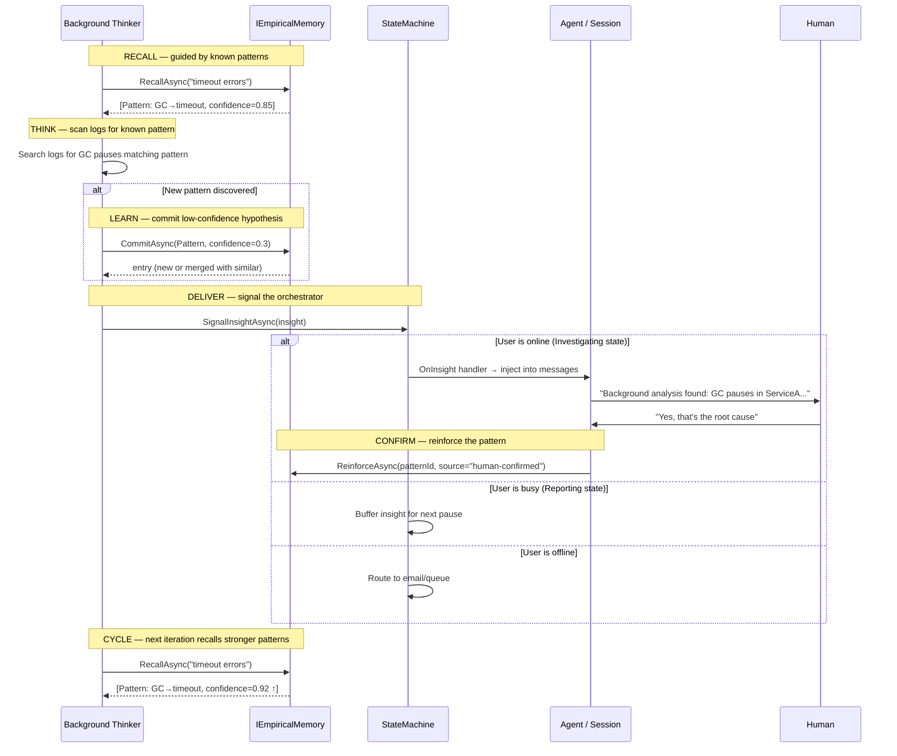

# ADR-007: Background Cognitive Processes — Thinking, Learning, and empirical memory

| Field         | Value                                                              |
|---------------|--------------------------------------------------------------------|
| **Status**    | Proposed                                                           |
| **Date**      | 2025-07-27                                                         |
| **Authors**   | —                                                                  |
| **Deciders**  | Ananke maintainers                                                 |
| **Tags**      | state-machine, background-processing, insights, memory, learning, EMPIRICAL |
| **Relates to**| ADR-005 (layered simplification), `StateMachine<S,T>`, `IActionStateMachine<C,S,T,N>`, `IKnowledgeStore`, `IConversationMemory` |

---

## Context

Ananke's current architecture is **reactive** — the state machine advances in
response to user input (chat turns), tool results, or interrupts. All processing
is synchronous with the conversation loop: the user speaks, the agent thinks,
the agent responds.

Human cognition works differently. The mind runs **parallel background
processes**: consolidating memories, scanning for patterns across past events,
connecting dots between seemingly unrelated observations. These processes run
independently of the active conversation and occasionally surface an insight —
an "aha moment" — that changes the course of reasoning.

We want to explore adding this capability to Ananke: **long-running background
processes that can asynchronously notify the orchestrator or state machine when
they discover something meaningful.**

### What exists today

| Primitive | Location | Relevance |
|---|---|---|
| `FireAsync(T, payload)` | `StateMachine<S,T>` | Async trigger + payload; gate-serialized, thread-safe from any thread |
| `OnEnter(state, ct => ...)` | `StateMachine<S,T>` | Cancellable background work per state — a "thinking slot" |
| `OnInterrupt` + `IInterruptSink<T>` | `StateMachine<S,T>` | Typed delivery of interrupt payloads |
| `N` enum + `NotifyAsync` | `AbstractStateMachine<C,S,T,N>` | Fire-and-forget signals that don't change state (distributed variant only) |
| `ProducerConsumer<T>` + `Channel<T>` | `Ananke.StateMachine.Worker` | Background channel consumption pattern |
| `SemaphoreSlim _gate` | `StateMachine<S,T>` | Serializes `FireAsync` — safe from any thread |
| `RunSseLoopAsync` | `Ananke.AspNetCore.Sse` | Awaits `CurrentWork` in a loop, survives interrupt cancellation |
| `ChatSession.EmitAsync` | `Ananke.AspNetCore.Sessions` | Writes named SSE events to the client |

### The gap

There is no framework-level mechanism for a background process to **offer
information to the state machine without forcing a state transition**. The
interrupt mechanism exists but is semantically wrong for enrichment — it
disrupts the user's flow. The `NotifyAsync` pattern exists on the distributed
`AbstractStateMachine<C,S,T,N>` but is absent from the simplified
`StateMachine<S,T>` that powers conversational sessions.

---

## Reference Scenario: Smart Root-Cause Finder

To ground this design, consider a concrete system built on Ananke:

> **An agentic tool that analyzes logs, alerts, and incidents from a complex
> distributed software system.**

### Capabilities

- **Tools**: search logs (Elasticsearch/Loki), read emails, query a knowledge
  base of past incidents, send emails/notifications
- **Interactive mode**: user asks questions, investigates anomalies, requests
  summaries — standard conversational loop via the state machine
- **Background mode**: independent processes continuously scan historical logs,
  correlate time-windowed events, check for recurring patterns across past
  incidents

### The "aha moment"

A background process has been analyzing 3 days of logs and notices that a
specific microservice's GC pause pattern correlates with downstream timeout
spikes that only appear 40 minutes later. This is the root cause of an incident
the user asked about yesterday.

This insight must reach the user. But:

1. **The user may be in an active chat session** → deliver inline, woven into
   the conversation naturally ("While investigating, I found something
   relevant...")
2. **The user may not be online** → deliver asynchronously (email, stored
   notification, queued for next session)
3. **The user may be in a critical flow** (e.g., composing an incident report)
   → buffer the insight and offer it at the next natural pause, not as a
   disruptive interrupt

### State machine topology (illustrative)

```
Investigating ──[StartReport]──► Reporting ──[Send]──► Done
Investigating ──[Interrupt]──► Interrupted ──[Resume]──► Investigating
{Investigating,Reporting} ──[Query]──► self (re-trigger OnEnter for each turn)
```

### Requirements for the delivery mechanism

| Requirement | Why |
|---|---|
| **Non-disruptive** | Must not force a state transition; the current phase decides when to incorporate |
| **State-aware** | Behavior may differ per state (inline in `Investigating`, buffered in `Reporting`) |
| **Delivery guarantee** | Insight must not be lost if no session is active; persist or forward |
| **Thread-safe** | Background processes run on arbitrary threads |
| **Typed** | Insights have structure (source, confidence, evidence, suggested action) |
| **Decoupled** | Background process should not reference state enums or session types |

---

## Options Evaluated

### Option 1: Background process fires `FireAsync` (interrupt)

```
Background task ──FireAsync(Interrupt, insight)──► StateMachine
```

A background `Task` holds a machine reference and calls
`machine.FireAsync(Action.Interrupt, payload: insight)`.

**Verdict: Rejected for this scenario.**

- ✅ Works today, zero changes
- ✅ Thread-safe (gate-serialized)
- ❌ **Forces a state transition** — interrupts the user's flow
- ❌ No buffering — if user is in `Reporting`, the interrupt either disrupts or
  is rejected (no valid transition)
- ❌ No offline delivery — requires an active session
- ❌ Semantically wrong — an "insight" is not an "interrupt"

Best for: genuine urgency ("the system is on fire, stop what you're doing").

### Option 2: Channel-based `InsightChannel<T>` (producer/consumer)

```
Background task ──Channel.WriteAsync──► InsightChannel ──Reader.TryRead──► OnEnter work
```

A `Channel<Insight>` injected into the session. Background processes write;
state work reads when ready.

**Verdict: Good foundation, but insufficient alone.**

- ✅ Non-disruptive — state decides when to read
- ✅ No framework changes
- ✅ Natural backpressure
- ⚠️ **Passive** — insight sits in channel until state work polls it
- ❌ No notification on arrival — if the state is idle (user hasn't typed),
  the insight waits indefinitely
- ❌ No offline delivery without additional plumbing
- ❌ Tightly coupled to the work loop cadence

Best for: enrichment during active conversation turns.

### Option 3: `SignalInsightAsync` on `StateMachine<S,T>` (async event)

```
Background task ──SignalInsightAsync(insight)──► gate-serialized handlers
                                                  ├── state-aware routing
                                                  ├── inline delivery (SSE)
                                                  └── offline delivery (email/queue)
```

Bring the `NotifyAsync` concept from `AbstractStateMachine<C,S,T,N>` to the
simplified `StateMachine<S,T>` as a **push-based, state-aware signal**:

```csharp
// Framework addition to StateMachine<S,T>
public StateMachine<S, T> OnInsight<TInsight>(Func<TInsight, S, Task> handler);
public Task SignalInsightAsync<TInsight>(TInsight insight);
```

The handler receives the insight **and the current state**, enabling
state-aware routing:

```csharp
machine.OnInsight<RootCauseInsight>(async (insight, currentState) =>
{
    if (currentState == Phase.Investigating)
    {
        // User is actively investigating — weave into conversation
        session.Messages.Add(AgentMessage.System(
            $"Background analysis found: {insight.Summary}"));
        await session.EmitAsync("insight", insight);
    }
    else if (currentState == Phase.Reporting)
    {
        // User is busy — buffer for next natural pause
        insightBuffer.Enqueue(insight);
    }
    else
    {
        // No active session or terminal state — send email
        await emailService.SendAsync(insight.ToEmail());
    }
});
```

**Verdict: Strong fit for this scenario.**

- ✅ **Push-based** — handler fires immediately on insight arrival
- ✅ **State-aware** — handler knows the current phase and routes accordingly
- ✅ **Gate-serialized** — runs under the existing `SemaphoreSlim _gate`,
  safe with concurrent `FireAsync` calls
- ✅ **Typed** — generic `TInsight` avoids `object` boxing
- ✅ **Decoupled** — background process only needs a `Func<TInsight, Task>`
  or a reference to `SignalInsightAsync`; no state enum knowledge required
- ✅ **Mirrors existing pattern** — `NotifyAsync` on `AbstractStateMachine`
  validates the concept; this brings it to the simplified machine
- ⚠️ Small framework change (new method on `StateMachine<S,T>`)
- ⚠️ Handler runs synchronously with the gate — must not block for long
  (same constraint as `OnInterrupt`)
- ⚠️ Offline delivery is the handler's responsibility (not built-in)

### Option 4: `IAsyncEnumerable<Insight>` signal streams

```
Background task ──yield return──► IAsyncEnumerable<Insight>
                                    │
OnEnter work ──await foreach──►─────┘
```

Each background process exposes an `IAsyncEnumerable<Insight>`. The current
state's `OnEnter` work consumes them, auto-cancelled when the state exits:

```csharp
machine.OnEnter(Phase.Investigating, async ct =>
{
    await foreach (var insight in patternDetector.WatchAsync(ct))
    {
        session.Messages.Add(AgentMessage.System(
            $"Pattern detected: {insight.Summary}"));
        await session.EmitAsync("insight", insight);
    }
});
```

Multiple streams can be merged via a `Channel<Insight>`:

```csharp
machine.OnEnter(Phase.Investigating, async ct =>
{
    var merged = Channel.CreateUnbounded<Insight>();

    // Fan-in: multiple background thinkers write to one channel
    _ = Task.Run(() => logCorrelator.PipeIntoAsync(merged.Writer, ct), ct);
    _ = Task.Run(() => memoryScanner.PipeIntoAsync(merged.Writer, ct), ct);
    _ = Task.Run(() => alertWatcher.PipeIntoAsync(merged.Writer, ct), ct);

    await foreach (var insight in merged.Reader.ReadAllAsync(ct))
    {
        await session.EmitAsync("insight", insight);
    }
});
```

**Verdict: Most composable, but insufficient alone for this scenario.**

- ✅ **Naturally composable** — multiple background thinkers, one merge point
- ✅ **Auto-cancellation** — `OnEnter`'s `CancellationToken` stops consumption
  when the state exits
- ✅ **Fits the SSE model** — `IAsyncEnumerable` → SSE is already proven
  with `ChatSessionEvent`
- ✅ **Backpressure** — channel bounds control memory
- ❌ **Pull-based** — only works when a state is actively consuming; if the
  state is idle or has no `OnEnter` work, insights are lost or stuck
- ❌ **State-change blind** — when the user moves from `Investigating` to
  `Reporting`, the stream is cancelled; insights produced during the transition
  gap can be lost
- ❌ **No offline delivery** — streams only work within an active session
- ❌ **Complex orchestration** — fan-in/merge logic in every state that cares

Best for: real-time enrichment during active states with natural streaming fit.

---

## Decision

**Adopt a hybrid of Options 3 and 4**, layered:

### Layer 1 — `SignalInsightAsync` (Option 3) as the framework primitive

This is the **single entry point** for background processes to deliver insights
to the state machine. It is the async event the framework provides.

```
┌─────────────────────────────────────────────────────────┐
│                   StateMachine<S, T>                     │
│                                                         │
│  SignalInsightAsync(insight)                             │
│       │                                                 │
│       ▼                                                 │
│  ┌─────────────────────────────┐                        │
│  │  _gate (SemaphoreSlim)      │  ← serialized with     │
│  │                             │    FireAsync            │
│  │  foreach handler:           │                        │
│  │    handler(insight, state)  │  ← state-aware          │
│  └─────────────────────────────┘                        │
│                                                         │
│  Handlers registered via:                               │
│    machine.OnInsight<T>(async (insight, state) => ...)   │
└─────────────────────────────────────────────────────────┘
```

This gives us the push-based, state-aware, gate-serialized notification that
the root-cause finder needs.

### Layer 2 — `IAsyncEnumerable` streams (Option 4) as a consumption pattern

For states that want real-time streaming of insights (e.g., a monitoring
dashboard state), the `OnEnter` work can consume an `IAsyncEnumerable` or
`ChannelReader`. This is **application-level code**, not a framework primitive
— the framework just provides the cancellation token.

```
┌───────────────────────────────────────────────────────────┐
│              Application / Demo layer                      │
│                                                           │
│  machine.OnEnter(Phase.Monitoring, async ct =>            │
│  {                                                        │
│      await foreach (var i in thinker.StreamAsync(ct))     │
│          await session.EmitAsync("insight", i);           │
│  });                                                      │
│                                                           │
│  // OR: thinker calls SignalInsightAsync directly          │
│  // Both patterns work; choose per use case               │
└───────────────────────────────────────────────────────────┘
```

### Layer 3 — Offline delivery as a handler concern

The `OnInsight` handler is responsible for routing insights that arrive when
no session is active. This keeps the framework transport-agnostic:

```csharp
machine.OnInsight<Insight>(async (insight, state) =>
{
    if (sessionStore.TryGetActiveSession(out var session))
        await session.EmitAsync("background_insight", insight);
    else
        await offlineDelivery.EnqueueAsync(insight); // email, queue, DB
});
```

### How it applies to the root-cause finder

```
                    ┌──────────────────────────┐
                    │   Background Thinkers     │
                    │                          │
                    │  LogCorrelator           │──┐
                    │  MemoryPatternScanner    │──┤
                    │  AlertCrossReferencer    │──┤
                    └──────────────────────────┘  │
                                                  │  SignalInsightAsync(insight)
                                                  ▼
┌──────────────────────────────────────────────────────────────────────┐
│                    StateMachine (Investigating)                       │
│                                                                      │
│  OnInsight handler:                                                  │
│    state == Investigating → inject into conversation + SSE           │
│    state == Reporting     → buffer for "did you know?" sidebar       │
│    state == Done / null   → email the user                           │
│                                                                      │
│  OnEnter(Investigating):                                             │
│    - normal chat loop (user queries, tool calls)                     │
│    - check insightBuffer for anything queued during Reporting        │
│                                                                      │
└──────────────────────────────────────────────────────────────────────┘
```

### Timeline

| Phase | Scope | Changes |
|---|---|---|
| **P0 — Now** | Application-level `Channel<Insight>` in demos | Zero framework changes; validate the pattern |
| **P1 — Next** | `SignalInsightAsync` + `OnInsight<T>` on `StateMachine<S,T>` | Small addition (~30 lines); gate-serialized |
| **P2 — Later** | Typed `InsightRecord` abstraction, persistence, offline routing | Application or new `Ananke.Insights` library |

---

## Consequences

### Positive

- **Non-disruptive delivery**: insights are offered, not forced — the current
  state decides how and when to incorporate them
- **State-aware routing**: handler knows the current phase, enabling nuanced
  behavior (inline vs. buffered vs. email)
- **Consistent with existing patterns**: mirrors `NotifyAsync` on the
  distributed machine; uses the same `_gate` serialization as `FireAsync`
- **Composable**: multiple background thinkers can independently call
  `SignalInsightAsync` — they don't coordinate with each other
- **Transport-agnostic**: the framework delivers to the handler; the handler
  decides SSE, email, queue, etc.
- **Incrementally adoptable**: P0 requires zero framework changes

### Negative

- **Handler must not block**: runs under `_gate`, so long-running handlers
  delay `FireAsync`. Mitigation: handlers should enqueue work, not perform it
- **No built-in persistence**: if the process crashes between insight
  generation and handler execution, the insight is lost. Mitigation: background
  thinkers can persist to durable storage before signaling
- **Single-machine affinity**: `SignalInsightAsync` is in-process. For
  distributed scenarios, the insight must travel via MQTT/Redis/queue to the
  machine instance that owns the session. This aligns with the existing
  distributed split (`StateMachine<S,T>` vs `AbstractStateMachine<C,S,T,N>`)

### Risks

| Risk | Likelihood | Mitigation |
|---|---|---|
| Handler exceptions poison the gate | Medium | Wrap handler invocation in try/catch; log + continue |
| Insight flood from aggressive background processes | Low | Bounded channel or rate limiter before `SignalInsightAsync` |
| Ordering assumptions between insights and user input | Medium | Document that `SignalInsightAsync` and `FireAsync` are serialized but arrival order across threads is non-deterministic |

---

## Part 2: The Learning Gap — From Thinking to Remembering

ADR-007 Part 1 addresses how background processes **deliver** insights to the
orchestrator. But delivery alone is not intelligence. When a human and agent
collaboratively identify a root cause, that discovery must be **remembered** —
stored in a form that future background processes can recognize, match against,
and build upon. This is the learning loop.

### Current knowledge architecture

```
┌─────────────────────────────────────────────────────────────────────┐
│                         Knowledge Today                             │
│                                                                     │
│  IKnowledgeStore          IKnowledgeCatalog      IConversationMemory│
│  ┌───────────────┐        ┌─────────────────┐    ┌────────────────┐ │
│  │ KnowledgeChunk│        │ CatalogEntry    │    │ AgentMessage[] │ │
│  │ ─ Id          │        │ ─ Source        │    │ ─ Role         │ │
│  │ ─ Text        │        │ ─ Summary       │    │ ─ Content      │ │
│  │ ─ Score       │        │ ─ Keywords[]    │    │ ─ ToolCalls    │ │
│  │ ─ Metadata{}  │        │ ─ Category      │    └────────────────┘ │
│  └───────────────┘        │ ─ IndexedAt     │                       │
│                           │ ─ SupersededBy  │    Stores WHAT WAS    │
│  Stores WHAT WAS          └─────────────────┘    SAID (episodic)    │
│  INGESTED (semantic)                                                │
│                           Stores WHAT DOCS                          │
│                           EXIST (catalog)                           │
│                                                                     │
│  ❌ Nothing stores WHAT WAS LEARNED (procedural/pattern memory)     │
└─────────────────────────────────────────────────────────────────────┘
```

Drawing from cognitive science, human memory has four layers (see Part 3
for the full taxonomy):

| Memory type | Human analogy | Ananke equivalent | Status |
|---|---|---|---|
| **Semantic** | Facts, reference material, textbooks | `IKnowledgeStore` + `IKnowledgeCatalog` | ✅ Exists |
| **Episodic** | "What happened in that conversation" | `IConversationMemory` | ✅ Exists |
| **Pattern** | Learned correlations, cause-effect heuristics | `IPatternMemory` (proposed, Part 2) | ❌ Missing |
| **Procedural / Skill** | "How to do things", playbooks, refined strategies | See Part 3 analysis | ❌ Missing |

### What a "learned pattern" looks like — the root-cause finder example

During an investigation, the human asks the agent to check logs. The agent
uses tools, finds a correlation, and the human confirms: *"Yes, that's the
root cause."* The discovered pattern has structure:

```
Pattern: GC-Pause-Timeout Correlation
─────────────────────────────────────
Condition:   ServiceA GC pause duration > 200ms
Effect:      ServiceB downstream timeout rate spikes > 5%
Latency:     35–45 minutes (propagates through message queue)
Evidence:    [log-query-1, log-query-2, incident-INC-4521]
Confidence:  0.85
Observed:    3 times (2025-07-20, 2025-07-24, 2025-07-27)
Source:      Collaborative investigation, session abc-123
Tags:        [gc, timeout, serviceA, serviceB, queue-propagation]
```

This is **not** a document (doesn't belong in `IKnowledgeStore`). It's **not**
a conversation transcript (already in `IConversationMemory`). It's **not** a
catalog entry about a document. It's a **distilled, structured, searchable
piece of empirical knowledge** that sits in its own layer.

### The missing interface: `IPatternMemory`

```csharp
/// <summary>
/// Persistent store for learned patterns — distilled cause-effect correlations,
/// heuristics, and empirical knowledge derived from agent-human collaboration
/// or background analysis. Sits alongside IKnowledgeStore (semantic memory)
/// and IConversationMemory (episodic memory) as the third memory layer.
/// </summary>
public interface IPatternMemory
{
    /// <summary>
    /// Stores a newly discovered pattern, or reinforces an existing one
    /// if a semantically similar pattern already exists (bumps confidence
    /// and observation count).
    /// </summary>
    Task<PatternRecord> CommitAsync(PatternRecord pattern, CancellationToken ct = default);

    /// <summary>
    /// Searches for patterns matching a situation description.
    /// Returns patterns ranked by relevance × confidence × recency.
    /// </summary>
    Task<IReadOnlyList<PatternMatch>> RecallAsync(
        string situation, RecallOptions? options = null, CancellationToken ct = default);

    /// <summary>
    /// Reinforces an existing pattern — increments observation count,
    /// updates confidence, and records new evidence.
    /// Called when a known pattern is confirmed again.
    /// </summary>
    Task ReinforcAsync(string patternId, PatternReinforcement reinforcement,
        CancellationToken ct = default);

    /// <summary>
    /// Weakens or invalidates a pattern that was found to be incorrect.
    /// Does not delete — preserves history but reduces confidence toward zero.
    /// </summary>
    Task ContradicAsync(string patternId, string reason,
        CancellationToken ct = default);
}
```

With supporting types:

```csharp
/// <summary>A learned cause-effect pattern or heuristic.</summary>
public sealed record PatternRecord
{
    public required string Id { get; init; }
    public required string Condition { get; init; }
    public required string Effect { get; init; }
    public string? Mechanism { get; init; }           // how/why the correlation exists
    public TimeSpan? Latency { get; init; }           // delay between condition and effect
    public required float Confidence { get; init; }   // 0.0–1.0, increases with reinforcement
    public required int ObservationCount { get; init; }
    public required IReadOnlyList<string> Evidence { get; init; }  // links to logs, incidents, sessions
    public required IReadOnlyList<string> Tags { get; init; }
    public required DateTimeOffset FirstObserved { get; init; }
    public required DateTimeOffset LastObserved { get; init; }
    public required string Source { get; init; }      // "human-confirmed", "background-analysis", "auto-detected"
}

/// <summary>A pattern search result with composite ranking score.</summary>
public sealed record PatternMatch
{
    public required PatternRecord Pattern { get; init; }
    public required float Score { get; init; }        // relevance × confidence × recency
}

/// <summary>Evidence provided when reinforcing a known pattern.</summary>
public sealed record PatternReinforcement
{
    public required IReadOnlyList<string> NewEvidence { get; init; }
    public float? ConfidenceAdjustment { get; init; } // optional explicit adjustment
    public required string Source { get; init; }
}
```

### How it connects: the full cognitive loop

```
┌──────────────────────────────────────────────────────────────────────────┐
│                        The Learning Loop                                 │
│                                                                          │
│   ┌─────────────┐     ┌──────────────┐     ┌────────────────────┐       │
│   │  PERCEIVE   │     │    THINK     │     │     REMEMBER       │       │
│   │             │     │              │     │                    │       │
│   │ IKnowledge  │────►│  Background  │────►│  IPatternMemory    │       │
│   │ Store       │     │  Thinkers    │     │  .CommitAsync()    │       │
│   │ .SearchAsync│     │  (ADR-007    │     │                    │       │
│   │             │     │   Part 1)    │     │  Stores:           │       │
│   │ IConversation     │              │     │  ─ Condition       │       │
│   │ Memory      │     │  Signal      │     │  ─ Effect          │       │
│   │ .GetHistory │     │  InsightAsync│     │  ─ Confidence      │       │
│   └─────────────┘     └──────┬───────┘     │  ─ Evidence[]      │       │
│                              │             └─────────┬──────────┘       │
│                              ▼                       │                  │
│                     ┌────────────────┐               │                  │
│                     │    DELIVER     │               │                  │
│                     │                │               │                  │
│                     │  OnInsight     │               │                  │
│                     │  handler       │               ▼                  │
│                     │  (SSE/email/   │      ┌────────────────┐          │
│                     │   buffer)      │      │   RECALL       │          │
│                     └────────────────┘      │                │          │
│                              │              │ Background     │          │
│                              ▼              │ thinkers query │          │
│                     ┌────────────────┐      │ patterns to    │          │
│                     │   CONFIRM      │      │ guide future   │──── ─ ─►│
│                     │                │      │ analysis       │   (loop) │
│                     │  Human says    │      └────────────────┘          │
│                     │  "yes, that's  │                                  │
│                     │  the cause"    │                                  │
│                     │       │        │                                  │
│                     │       ▼        │                                  │
│                     │  .ReinforcAsync│                                  │
│                     │  or .CommitAsync│                                 │
│                     └────────────────┘                                  │
└──────────────────────────────────────────────────────────────────────────┘
```

The cycle:

1. **PERCEIVE** — Background thinkers read from `IKnowledgeStore` (logs, docs)
   and `IConversationMemory` (past investigations) and `IPatternMemory` (known
   patterns to look for or build upon)
2. **THINK** — Correlate, analyze, compare against known patterns
3. **DELIVER** — `SignalInsightAsync` (Part 1) delivers to the orchestrator
4. **CONFIRM** — Human validates or rejects during conversation
5. **REMEMBER** — `IPatternMemory.CommitAsync` or `.ReinforcAsync` persists
   the learning
6. **RECALL** — Next cycle, background thinkers query `IPatternMemory` to
   guide their search — looking for known patterns in new data, or extending
   partial patterns with new evidence

### What needs to exist in the framework

| Component | Layer | Purpose |
|---|---|---|
| `IPatternMemory` | `Ananke.Orchestration.Memory` | Interface for storing/recalling/reinforcing patterns |
| `PatternRecord` + types | `Ananke.Orchestration.Memory` | Structured pattern representation |
| `InMemoryPatternMemory` | `Ananke.Orchestration.Memory` | In-process implementation for tests and demos |
| `QdrantPatternMemory` | `Ananke.Qdrant` | Vector-backed implementation (embed condition+effect for semantic recall) |
| `PatternMemoryTools` | `Ananke.Orchestration.Memory` | Agent tools: `recall_patterns`, `commit_pattern`, `reinforce_pattern` |

### How it applies to the root-cause finder

```csharp
// ── Background thinker uses pattern memory to guide analysis ─────────
async IAsyncEnumerable<Insight> AnalyzeAsync(CancellationToken ct)
{
    // Check what patterns we already know about
    var knownPatterns = await patternMemory.RecallAsync(
        "timeout errors in distributed services", ct: ct);

    // Search logs for conditions matching known patterns
    foreach (var match in knownPatterns)
    {
        var logResults = await logStore.SearchAsync(match.Pattern.Condition, ct: ct);
        if (logResults.Any(r => r.Score > 0.8f))
        {
            // Known pattern detected in new data — reinforce
            await patternMemory.ReinforcAsync(match.Pattern.Id,
                new PatternReinforcement
                {
                    NewEvidence = [logResults[0].Id],
                    Source = "background-analysis"
                }, ct);

            yield return new Insight
            {
                Summary = $"Known pattern detected: {match.Pattern.Condition} → {match.Pattern.Effect}",
                Pattern = match.Pattern,
                IsReinforcement = true
            };
        }
    }

    // Also scan for NEW unknown correlations...
    var anomalies = await FindTemporalCorrelationsAsync(ct);
    foreach (var anomaly in anomalies)
    {
        // Commit as new low-confidence pattern
        var pattern = await patternMemory.CommitAsync(new PatternRecord
        {
            Id = Guid.NewGuid().ToString(),
            Condition = anomaly.Condition,
            Effect = anomaly.Effect,
            Latency = anomaly.ObservedLatency,
            Confidence = 0.3f,  // low — needs human confirmation
            ObservationCount = 1,
            Evidence = anomaly.LogIds,
            Tags = anomaly.Tags,
            FirstObserved = DateTimeOffset.UtcNow,
            LastObserved = DateTimeOffset.UtcNow,
            Source = "background-analysis"
        }, ct);

        yield return new Insight
        {
            Summary = $"New pattern hypothesis: {anomaly.Condition} → {anomaly.Effect}",
            Pattern = pattern,
            IsReinforcement = false
        };
    }
}

// ── During conversation: human confirms an insight ───────────────────
// Agent tool: "The user confirmed this is the root cause"
tools.AddTool(
    name: "confirm_pattern",
    description: "Mark a discovered pattern as human-confirmed, increasing its confidence.",
    execute: async patternId =>
    {
        await patternMemory.ReinforcAsync(patternId,
            new PatternReinforcement
            {
                NewEvidence = [$"session:{sessionId}"],
                ConfidenceAdjustment = 0.3f,
                Source = "human-confirmed"
            });
        return "Pattern confirmed and reinforced.";
    },
    paramName: "pattern_id",
    paramDescription: "The ID of the pattern to confirm");
```

### Why this can't be `IKnowledgeStore` with different metadata

The existing `IKnowledgeStore` stores text chunks with flat string metadata.
Patterns need:

| Requirement | `IKnowledgeStore` | `IPatternMemory` |
|---|---|---|
| Structured fields (condition, effect, latency) | ❌ Flat `Dictionary<string, string>` | ✅ Typed record |
| Mutable confidence score | ❌ Immutable after upsert | ✅ `ReinforcAsync` / `ContradicAsync` |
| Observation counting | ❌ No concept | ✅ `ObservationCount` |
| Semantic dedup on commit | ❌ ID-based dedup only | ✅ Find similar pattern, merge if close enough |
| Composite ranking (relevance × confidence × recency) | ❌ Vector similarity only | ✅ Multi-factor scoring |
| Evidence linking | ❌ No cross-referencing | ✅ `Evidence[]` with log/session/incident IDs |

That said, the **storage backend** can still be Qdrant — `QdrantPatternMemory`
embeds `"{condition} → {effect}: {mechanism}"` as the vector and stores the
structured fields as payload. The interface difference is semantic, not
infrastructural.

### Timeline (extending Part 1, superseded by Part 3 revised timeline)

| Phase | Scope | Changes |
|---|---|---|
| **P0 — Now** | Application-level `Channel<Insight>` in demos | Zero framework changes |
| **P1 — Next** | `SignalInsightAsync` + `OnInsight<T>` on `StateMachine<S,T>` | Small state machine addition |
| **P2** | `IEmpiricalMemory` + `EmpiricalEntry` + `InMemoryEmpiricalMemory` | Unified interface with `EmpiricalKind` discriminator (see Part 3) |
| **P3** | `QdrantEmpiricalMemory` | Vector-backed impl in `Ananke.Qdrant` |
| **P4** | `EmpiricalMemoryTools` (agent tools for recall/commit/reinforce) | Single tool kit for all experience kinds |
| **P5** | Skill authoring pipeline (runbook → `EmpiricalEntry`) | Parser that loads structured runbooks as skills |
| **P6 — Later** | Auto-extraction from `IConversationMemory` → skills and patterns | LLM-based: scan past sessions, propose entries |

### Open questions

1. **Semantic dedup threshold** — When committing a pattern, how similar must
   an existing pattern be to trigger reinforcement instead of creating a new
   entry? This likely needs a configurable similarity threshold (e.g., 0.9).

2. **Confidence decay** — Should pattern confidence decay over time if not
   reinforced? Similar to `TimeDecayOptions` on `CatalogAwareKnowledgeStore`,
   but for patterns. Prevents stale correlations from dominating.

3. **Pattern composition** — Can patterns reference other patterns? E.g.,
   "Pattern A causes Pattern B" forming a causal chain. Deferred — start
   with flat patterns, add graph structure if real use cases demand it.

4. **Who decides to commit?** — Three options: (a) the agent autonomously
   via a tool, (b) the human explicitly ("remember this"), (c) background
   process after conversation analysis. Likely all three, with different
   confidence levels: human-confirmed > agent-committed > auto-detected.

5. **Privacy / scope** — Patterns may be user-specific, team-scoped, or
   global. The interface should support a scope/tenant dimension. Deferred
   to implementation.

---

## Part 3: Skill Memory — Procedural Knowledge and Its Relationship to Patterns

Part 2 identifies `IPatternMemory` as the missing layer for **observational**
empirical knowledge ("when X happens, Y follows"). But there's a second
kind of empirical knowledge: **procedural** — "how to do things." The user's
instinct was to call this a "skill." The question is whether skills are a
separate memory type or a richer form of semantic memory.

### The skill concept — concrete example

In the root-cause finder scenario, a "skill" might be:

```
Skill: Investigate Timeout Cascade
──────────────────────────────────
Goal:         Identify root cause of cross-service timeout propagation
Applicability: When timeout errors span multiple services with time delay
Steps:
  1. Identify the earliest-failing service in the chain
  2. Check resource metrics (CPU, memory, GC) on that service ±1 hour
  3. Search for correlated events in upstream dependencies
  4. Check message queue depths and consumer lag
  5. Look for temporal correlation with deployment events
Tools needed: search_logs, search_metrics, search_deployments
Expected:     A causal chain from trigger → propagation → symptom
Effectiveness: 0.82 (succeeded 9/11 times)
Last used:    2025-07-25
Source:        Learned from 3 successful investigations + SRE runbook
```

Compare with a pattern:

```
Pattern: GC-Pause-Timeout Correlation
─────────────────────────────────────
Condition:   ServiceA GC pause > 200ms
Effect:      ServiceB timeout rate > 5%
Confidence:  0.85
```

The pattern says **what** correlates. The skill says **how to investigate**.

### Where skills sit in the taxonomy

```
                       OBSERVED (what is)     PROCEDURAL (how to)
                       ─────────────────      ───────────────────
Static / Authored      Semantic Memory        Skills (authored)
                       IKnowledgeStore        Load from runbooks,
                       Facts, docs            SOPs, playbooks

Mutable / Learned      Pattern Memory         Skills (learned)
                       IPatternMemory         Track effectiveness,
                       Confidence, reinforce  refine with outcomes
```

Skills straddle the boundary. An **authored** skill (loaded from a runbook) is
essentially structured semantic memory. A **learned** skill (refined from
successful outcomes) needs a feedback loop like patterns. This suggests that
skills are NOT a completely new memory type — they're semantic memory with
two added dimensions:

1. **Execution structure** — ordered steps, tool references, decision points
2. **Outcome tracking** — effectiveness score, usage count, success rate

### Design option A: Skills as enriched `IKnowledgeStore` entries

Skills are stored in the existing knowledge store as structured documents,
with richer metadata:

```csharp
// Authored skill loaded into the knowledge store as a structured document
var skillDoc = new KnowledgeDocument
{
    Id = "skill:investigate-timeout-cascade",
    Text = """
        SKILL: Investigate Timeout Cascade
        GOAL: Identify root cause of cross-service timeout propagation
        APPLICABILITY: Timeout errors spanning multiple services with time delay
        STEPS:
        1. Identify the earliest-failing service in the chain
        2. Check resource metrics (CPU, memory, GC) on that service ±1 hour
        ...
        TOOLS: search_logs, search_metrics, search_deployments
        """,
    Metadata = new Dictionary<string, string>
    {
        ["type"] = "skill",
        ["goal"] = "Identify root cause of cross-service timeout propagation",
        ["tools"] = "search_logs,search_metrics,search_deployments"
    }
};

await knowledgeStore.UpsertAsync([skillDoc]);
```

The agent retrieves it via normal `search_knowledge` and follows the steps as
part of its reasoning. The knowledge store's vector search already handles
semantic matching ("I have timeout errors" → finds the timeout investigation
skill).

**Pros**: Zero new interfaces. Works today. Skills are just well-structured
documents that the agent knows how to interpret.

**Cons**: No outcome tracking. No effectiveness scoring. No automatic
refinement. Skills are as mutable as any other document — only via full
re-upsert, not incremental improvement.

### Design option B: Skills as a separate `ISkillMemory` interface

```csharp
public interface ISkillMemory
{
    Task<SkillRecord> CommitAsync(SkillRecord skill, CancellationToken ct = default);
    Task<IReadOnlyList<SkillMatch>> RecallAsync(
        string situation, RecallOptions? options = null, CancellationToken ct = default);
    Task RecordOutcomeAsync(string skillId, SkillOutcome outcome, CancellationToken ct = default);
}

public sealed record SkillRecord
{
    public required string Id { get; init; }
    public required string Name { get; init; }
    public required string Goal { get; init; }
    public required string Applicability { get; init; }
    public required IReadOnlyList<string> Steps { get; init; }
    public required IReadOnlyList<string> Tools { get; init; }
    public string? ExpectedOutcome { get; init; }
    public float Effectiveness { get; init; }           // 0.0–1.0
    public int TimesUsed { get; init; }
    public int TimesSucceeded { get; init; }
    public required string Source { get; init; }        // "authored", "learned", "refined"
    public required DateTimeOffset CreatedAt { get; init; }
    public required DateTimeOffset LastUsedAt { get; init; }
}

public sealed record SkillOutcome
{
    public required bool Succeeded { get; init; }
    public string? Refinement { get; init; }            // "Step 3 was unnecessary"
    public required string Source { get; init; }
}
```

**Pros**: Clean separation. Effectiveness tracking is first-class. Skills
improve over time. Distinct from patterns conceptually.

**Cons**: Another interface, another store, another set of tools. And the
shape is suspiciously similar to `IPatternMemory` — both have recall, both
have reinforcement, both have composite scoring.

### Design option C (recommended): Unified empirical memory with entry types

Patterns and skills share the same core mechanics: **recall by situation,
mutable confidence/effectiveness, reinforcement from outcomes, composite
ranking**. The difference is the *shape* of what's stored, not the *operations*
on it. This suggests a unified interface with typed entries:

```csharp
/// <summary>
/// Persistent store for empirical knowledge — observations, correlations,
/// and procedural strategies learned from agent-human collaboration or
/// background analysis. The third memory layer alongside IKnowledgeStore
/// (semantic) and IConversationMemory (episodic).
/// </summary>
public interface IEmpiricalMemory
{
    /// <summary>
    /// Stores a new experience entry, or merges with an existing semantically
    /// similar entry if one exists above the dedup threshold.
    /// </summary>
    Task<EmpiricalEntry> CommitAsync(EmpiricalEntry entry, CancellationToken ct = default);

    /// <summary>
    /// Searches for experience entries matching a situation description.
    /// Returns entries ranked by: relevance × confidence × recency.
    /// Optionally filtered by entry type (pattern, skill, heuristic).
    /// </summary>
    Task<IReadOnlyList<EmpiricalMatch>> RecallAsync(
        string situation, RecallOptions? options = null, CancellationToken ct = default);

    /// <summary>
    /// Reinforces an entry — bumps confidence, records new evidence or outcome.
    /// </summary>
    Task ReinforceAsync(string entryId, Reinforcement reinforcement,
        CancellationToken ct = default);

    /// <summary>
    /// Weakens an entry that was found incorrect or ineffective.
    /// </summary>
    Task ContradictAsync(string entryId, string reason,
        CancellationToken ct = default);
}
```

With a **discriminated entry type** rather than separate interfaces:

```csharp
/// <summary>
/// A unit of empirical knowledge. The Kind determines which
/// shape-specific fields are populated.
/// </summary>
public sealed record EmpiricalEntry
{
    // ── Identity and classification ──────────────────────────────────
    public required string Id { get; init; }
    public required EmpiricalKind Kind { get; init; }
    public required IReadOnlyList<string> Tags { get; init; }
    public required string Source { get; init; }

    // ── Core content (embedded for vector search) ────────────────────
    /// <summary>
    /// Natural-language description of what this entry represents.
    /// This is the text that gets embedded for semantic recall.
    /// For patterns: "{condition} → {effect}"
    /// For skills: "{goal}: {applicability}"
    /// </summary>
    public required string Description { get; init; }

    // ── Confidence and tracking ──────────────────────────────────────
    public required float Confidence { get; init; }
    public required int ObservationCount { get; init; }
    public required IReadOnlyList<string> Evidence { get; init; }
    public required DateTimeOffset FirstObserved { get; init; }
    public required DateTimeOffset LastObserved { get; init; }

    // ── Pattern-specific (Kind == Pattern) ───────────────────────────
    public string? Condition { get; init; }
    public string? Effect { get; init; }
    public string? Mechanism { get; init; }
    public TimeSpan? Latency { get; init; }

    // ── Skill-specific (Kind == Skill) ───────────────────────────────
    public string? Goal { get; init; }
    public string? Applicability { get; init; }
    public IReadOnlyList<string>? Steps { get; init; }
    public IReadOnlyList<string>? Tools { get; init; }
    public string? ExpectedOutcome { get; init; }
    public int TimesUsed { get; init; }
    public int TimesSucceeded { get; init; }
}

public enum EmpiricalKind
{
    /// <summary>Observational: "when X happens, Y follows"</summary>
    Pattern,

    /// <summary>Procedural: "how to do X" — steps, tools, strategy</summary>
    Skill,

    /// <summary>Heuristic: "prefer X over Y in situation Z" — rules of thumb</summary>
    Heuristic
}
```

### Why unified works for this framework

The existing Ananke knowledge infrastructure already follows a **single-store,
typed-content** pattern. `IKnowledgeStore` holds `KnowledgeDocument` entries
that can represent any content — PDFs, markdown, plain text. The structure
comes from the text and metadata, not from separate stores per content type.
Similarly, `IKnowledgeCatalog` holds `CatalogEntry` records for any document
type, differentiated by `Category`.

Following the same principle: one `IEmpiricalMemory` store holds all
empirical knowledge, differentiated by `EmpiricalKind`. This avoids
interface proliferation while keeping the operations unified.

### How patterns and skills interact — the root-cause finder

```
┌──────────────────────────────────────────────────────────────────────────┐
│                    empirical memory in Action                         │
│                                                                          │
│  ┌─────────────────────────────┐    ┌──────────────────────────────────┐ │
│  │   SKILL (Kind = Skill)      │    │   PATTERN (Kind = Pattern)       │ │
│  │                             │    │                                  │ │
│  │  "Investigate Timeout        │    │  "GC pause > 200ms in ServiceA   │ │
│  │   Cascade"                  │    │   → timeout spike in ServiceB    │ │
│  │                             │    │   40 min later"                  │ │
│  │  Steps:                     │    │                                  │ │
│  │  1. Find earliest failure   │    │  Confidence: 0.85               │ │
│  │  2. Check GC/CPU metrics  ──┼───►│  (this pattern was DISCOVERED    │ │
│  │  3. Correlate temporal ──── │    │   while USING this skill)        │ │
│  │  4. Check queue depths      │    │                                  │ │
│  │                             │    │  Evidence includes the session    │ │
│  │  Effectiveness: 0.82        │    │  where the skill was applied     │ │
│  └─────────────────────────────┘    └──────────────────────────────────┘ │
│                                                                          │
│  Agent flow:                                                             │
│  1. User: "We're seeing timeouts in ServiceB"                            │
│  2. Agent recalls SKILL "Investigate Timeout Cascade" (by situation)      │
│  3. Agent follows steps, using recalled skill as strategy                │
│  4. During step 2, agent recalls PATTERN "GC → timeout" (by condition)   │
│  5. Agent checks GC metrics, confirms the pattern                       │
│  6. ReinforceAsync(pattern, newEvidence)  ← pattern gets stronger        │
│  7. RecordOutcome(skill, succeeded: true) ← skill effectiveness goes up  │
│  8. Human: "Also check deployment timing next time"                      │
│  9. Skill gets refined: add step 2.5 "Check deployment events"          │
└──────────────────────────────────────────────────────────────────────────┘
```

### How skills get created: three paths

| Path | Source | Initial confidence | Example |
|---|---|---|---|
| **Authored** | Loaded from runbooks, SOPs, documentation | High (0.7–0.9) | SRE runbook: "How to investigate memory leaks" |
| **Learned** | Extracted from successful conversation sessions | Medium (0.4–0.6) | Agent notices it followed the same 5-step pattern in 3 investigations |
| **Refined** | Existing skill updated based on outcome feedback | Preserved + adjusted | Human says "skip step 3, add deployment check" |

The **authored** path is essentially a structured ingest — similar to how
`DocumentProcessor` loads documents into `IKnowledgeStore`. A `SkillLoader`
could parse runbook documents and create `EmpiricalEntry` records with
`Kind = Skill`.

The **learned** path is more interesting: a background process scans
`IConversationMemory` for successful investigation patterns, extracts the
common steps, and commits a skill. This is the P5 phase from the Part 2
timeline — "automatic pattern extraction from conversation history" — but
for skills rather than patterns. Same mechanism, different entry kind.

### What this means for the `RecallOptions`

```csharp
public sealed record RecallOptions
{
    public int TopK { get; init; } = 5;
    public float ScoreThreshold { get; init; }

    /// <summary>
    /// Filter by experience kind. When null, all kinds are returned.
    /// </summary>
    public EmpiricalKind? Kind { get; init; }

    /// <summary>
    /// Filter by tags. Entries must contain all specified tags.
    /// </summary>
    public IReadOnlyList<string>? RequiredTags { get; init; }

    /// <summary>
    /// Minimum confidence threshold. Entries below this are excluded.
    /// </summary>
    public float MinConfidence { get; init; }
}
```

This lets the agent query specifically:
- `RecallAsync("timeout errors", new RecallOptions { Kind = Skill })` —
  "how should I investigate this?"
- `RecallAsync("GC pause ServiceA", new RecallOptions { Kind = Pattern })` —
  "have I seen this before?"
- `RecallAsync("timeout", new RecallOptions { MinConfidence = 0.7f })` —
  "what do I know for certain about timeouts?"

### Agent tools surface for the unified store

```csharp
// A single ToolKit for empirical memory
var experienceTools = new ToolKit("experience")
    .AddTool(
        name: "recall_empirical",
        description: "Search empirical memory for known patterns, " +
                     "investigation skills, and heuristics relevant to a situation.",
        execute: async query => { /* RecallAsync */ },
        paramName: "situation",
        paramDescription: "Describe the current situation or problem")
    .AddTool(
        name: "commit_insight",
        description: "Store a newly discovered pattern or learned procedure " +
                     "in empirical memory for future recall.",
        execute: async description => { /* CommitAsync */ },
        paramName: "description",
        paramDescription: "Describe the pattern or procedure to remember")
    .AddTool(
        name: "confirm_experience",
        description: "Reinforce a recalled experience that proved correct or effective.",
        execute: async entryId => { /* ReinforceAsync */ },
        paramName: "entry_id",
        paramDescription: "The ID of the experience entry to reinforce");
```

### Updated full memory architecture

```
┌─────────────────────────────────────────────────────────────────────────┐
│                    Complete Memory Architecture                          │
│                                                                         │
│  ┌───────────────────┐  ┌────────────────┐  ┌────────────────────────┐  │
│  │  SEMANTIC          │  │  EPISODIC       │  │  EMPIRICAL          │  │
│  │  IKnowledgeStore   │  │  IConversation  │  │  IEmpiricalMemory   │  │
│  │  + IKnowledgeCatalog  │  Memory       │  │                        │  │
│  │                    │  │                │  │  Kind = Pattern        │  │
│  │  "What is known"   │  │  "What was     │  │  "What correlates"     │  │
│  │  Facts, docs,      │  │   said"        │  │  Condition → Effect    │  │
│  │  reference         │  │  Conversations │  │  Mutable confidence    │  │
│  │                    │  │  per session   │  │                        │  │
│  │  Immutable after   │  │  Append-only   │  │  Kind = Skill          │  │
│  │  ingest            │  │               │  │  "How to do things"    │  │
│  │                    │  │               │  │  Steps, tools, strategy│  │
│  │                    │  │               │  │  Outcome tracking      │  │
│  │                    │  │               │  │                        │  │
│  │                    │  │               │  │  Kind = Heuristic      │  │
│  │                    │  │               │  │  "Prefer X over Y"     │  │
│  │                    │  │               │  │  Rules of thumb        │  │
│  └───────────────────┘  └────────────────┘  └────────────────────────┘  │
│                                                                         │
│  Write path:           Write path:          Write path:                 │
│  DocumentProcessor     Agent conversation   CommitAsync (discover)      │
│  (ingest)              (append)             ReinforceAsync (confirm)    │
│                                              ContradictAsync (reject)   │
│  Read path:            Read path:           Read path:                  │
│  SearchAsync           GetHistoryAsync      RecallAsync (by situation)  │
│  (vector similarity)   (chronological)      (relevance × confidence     │
│                                               × recency)               │
└─────────────────────────────────────────────────────────────────────────┘
```

### Why NOT a separate `ISkillMemory`

The operations are identical to `IPatternMemory`:

| Operation | Pattern | Skill |
|---|---|---|
| Store | `CommitAsync` | `CommitAsync` |
| Retrieve | `RecallAsync` (by situation) | `RecallAsync` (by situation) |
| Positive feedback | `ReinforceAsync` (confirmed) | `ReinforceAsync` (succeeded) |
| Negative feedback | `ContradictAsync` (wrong) | `ContradictAsync` (ineffective) |
| Ranking | relevance × confidence × recency | relevance × effectiveness × recency |
| Dedup | semantic similarity of condition+effect | semantic similarity of goal+steps |

Creating separate interfaces would mean: two stores, two sets of tools, two
Qdrant implementations, two in-memory implementations — all with identical
CRUD shapes. Instead, `EmpiricalKind` discriminates the entries and
`RecallOptions.Kind` filters them. One store, one set of tools, one impl.

### Heuristics: the third experience kind

Besides patterns and skills, there's a third category worth noting:
**heuristics** — rules of thumb that guide decision-making:

```
Heuristic: Prefer GC analysis before network analysis
───────────────────────────────────────────────────────
Description: When investigating cross-service timeouts, check GC pressure
             first — it's the root cause 60% of the time in our system.
Confidence:  0.72
Source:      Derived from 15 investigations (9 GC, 4 network, 2 other)
```

Heuristics aren't observations (no condition → effect) and aren't procedures
(no steps). They're **preference weights** that influence strategy selection.
They fit naturally as `Kind = Heuristic` in the unified store, recalled
when the agent needs to decide which skill to apply first.

### Revised timeline

| Phase | Scope | Changes |
|---|---|---|
| **P0 — Now** | Application-level `Channel<Insight>` in demos | Zero framework changes |
| **P1** | `SignalInsightAsync` + `OnInsight<T>` on `StateMachine<S,T>` | Small state machine addition |
| **P2** | `IEmpiricalMemory` + `EmpiricalEntry` + `InMemoryEmpiricalMemory` | Unified interface with `EmpiricalKind` discriminator |
| **P3** | `QdrantEmpiricalMemory` | Vector-backed impl, embed `Description` field |
| **P4** | `EmpiricalMemoryTools` (agent tools for recall/commit/reinforce) | Single tool kit for all experience kinds |
| **P5** | Skill authoring pipeline (runbook → `EmpiricalEntry`) | Parser that loads structured runbooks as skills |
| **P6 — Later** | Auto-extraction from `IConversationMemory` → skills and patterns | LLM scans past sessions, proposes entries |

---

## Part 4: Qdrant Fit Evaluation and Abstraction Gap Analysis

### Data flow diagram

```mermaid
flowchart TB
    subgraph Sources["Input Sources"]
        Logs["Logs / Alerts"]
        Docs["Documents / Runbooks"]
        Conv["Conversations"]
    end

    subgraph Semantic["Semantic Memory (exists)"]
        KS["IKnowledgeStore\n(chunks + vectors)"]
        KC["IKnowledgeCatalog\n(doc metadata)"]
    end

    subgraph Episodic["Episodic Memory (exists)"]
        CM["IConversationMemory\n(chat history)"]
    end

    subgraph EMPIRICAL["empirical memory (proposed)"]
        EM["IEmpiricalMemory"]
        P["Kind = Pattern\n'GC pause → timeout'"]
        S["Kind = Skill\n'How to investigate\ntimeout cascade'"]
        H["Kind = Heuristic\n'Check GC before network'"]
        EM --- P
        EM --- S
        EM --- H
    end

    subgraph BackgroundThinking["Background Thinkers (Part 1)"]
        BT["Log Correlator\nMemory Scanner\nAlert Cross-Referencer"]
    end

    subgraph Orchestrator["State Machine / Orchestrator"]
        SM["StateMachine\nSignalInsightAsync\nOnInsight handler"]
    end

    subgraph Delivery["Delivery"]
        SSE["SSE (inline)"]
        Email["Email (offline)"]
        Buffer["Buffer (busy)"]
    end

    %% Ingestion paths
    Docs -->|"DocumentProcessor"| KS
    Docs -->|"SkillLoader"| EM
    Conv -->|"AddAsync"| CM

    %% Background thinkers read from all memory layers
    KS -->|"SearchAsync"| BT
    CM -->|"GetHistoryAsync"| BT
    EM -->|"RecallAsync"| BT

    %% Background thinkers produce insights
    BT -->|"SignalInsightAsync"| SM

    %% State machine routes delivery
    SM -->|"state=Investigating"| SSE
    SM -->|"state=Reporting"| Buffer
    SM -->|"no session"| Email

    %% Learning loop: insights feed back into empirical memory
    SM -->|"human confirms"| EM
    BT -->|"auto-detected\nlow confidence"| EM

    %% Reinforcement cycle
    EM -.->|"RecallAsync\n(known patterns\nguide search)"| BT

    style EMPIRICAL fill:#1a1a2e,stroke:#e94560,stroke-width:2px
    style BackgroundThinking fill:#1a1a2e,stroke:#0f3460,stroke-width:2px
    style Orchestrator fill:#1a1a2e,stroke:#16213e,stroke-width:2px
```



### Detailed operation flow



### Is Qdrant a good backend for `IEmpiricalMemory`?

**Yes — Qdrant is an excellent fit.** Every operation maps cleanly to
existing Qdrant primitives:

| `IEmpiricalMemory` operation | Qdrant primitive | Notes |
|---|---|---|
| `CommitAsync` (new) | `UpsertAsync` with deterministic point ID | Same pattern as `QdrantKnowledgeStore` |
| `CommitAsync` (semantic dedup) | `SearchAsync` → check similarity → `UpsertAsync` or `SetPayloadAsync` | Search first, merge if score > threshold |
| `RecallAsync` | `SearchAsync` with filter on `kind`, `confidence` range, `tags` | Vector search + payload filtering |
| `ReinforceAsync` | **`SetPayloadAsync`** (partial update) | Update `confidence`, `observation_count`, `evidence`, `last_observed` **without re-embedding** |
| `ContradictAsync` | **`SetPayloadAsync`** (partial update) | Reduce `confidence`, add `contradiction_reason` |
| Filter by `EmpiricalKind` | `MatchKeyword("kind", "pattern")` | Payload index on `kind` field |
| Filter by `MinConfidence` | `Range("confidence", gte: 0.7)` | Payload index on `confidence` field (float) |
| Composite ranking | Client-side rescore: `vector_score × confidence × recency_weight` | Same pattern as `CatalogAwareKnowledgeStore` time-decay |

The collection schema in Qdrant would be:

```
Collection: "empirical_memory"
─────────────────────────────────
Vector:  embed(Description)  — cosine similarity
Payload:
  kind:              keyword   (indexed — "pattern", "skill", "heuristic")
  confidence:        float     (indexed — range queries)
  observation_count: integer
  first_observed:    integer   (unix timestamp, indexed — range)
  last_observed:     integer   (unix timestamp, indexed — range/decay)
  source:            keyword   (indexed — "human-confirmed", "auto-detected")
  tags:              keyword[] (indexed — multi-value match)
  evidence:          string[]  (not indexed — stored only)
  _description:      text      (stored — original text for display)

  # Pattern-specific
  condition:         text      (stored)
  effect:            text      (stored)
  mechanism:         text      (stored)
  latency_minutes:   integer   (stored)

  # Skill-specific
  goal:              text      (stored)
  applicability:     text      (stored)
  steps:             string[]  (stored)
  tools:             keyword[] (stored)
  times_used:        integer   (stored)
  times_succeeded:   integer   (stored)
```

### The critical Qdrant capability: `SetPayloadAsync` (partial update)

This is the key Qdrant feature that makes empirical memory efficient.
Today's framework abstractions do not expose it:

| Operation | `IKnowledgeStore` today | What `IEmpiricalMemory` needs |
|---|---|---|
| Update a field | ❌ Full re-upsert (re-embed + replace entire point) | ✅ Partial payload update (no re-embedding) |
| Update confidence | ❌ Not possible without re-embedding | ✅ `SetPayloadAsync(pointId, { confidence: 0.92 })` |
| Append evidence | ❌ Not possible | ✅ Read → append → `SetPayloadAsync` |
| Increment counter | ❌ Not possible | ✅ Read → increment → `SetPayloadAsync` |

Without `SetPayloadAsync`, `ReinforceAsync` would require:
1. Retrieve the point by ID
2. Modify the payload fields in memory
3. Re-embed the description text (unnecessary — the vector hasn't changed)
4. Full upsert

With `SetPayloadAsync`:
1. Retrieve the point by ID
2. Modify the payload fields in memory
3. `SetPayloadAsync` — updates only the changed fields, vector untouched

This is not just a performance optimization — it's a **correctness
distinction**. When you reinforce a pattern, its meaning hasn't changed,
only the metadata. Re-embedding risks a slightly different vector (embedding
models are not perfectly deterministic), which could subtly shift search
results.

### Should we pull `SetPayloadAsync` into `IKnowledgeStore`?

**No.** The existing `IKnowledgeStore` has a deliberately simple contract:
`Search`, `Upsert`, `Delete`. Documents are immutable after ingest — this is
a feature, not a limitation. Semantic memory (reference docs, knowledge
chunks) genuinely should not mutate. The `CatalogAwareKnowledgeStore`
decorator already proved that enrichment belongs in a separate layer, not
in the core store interface.

`IEmpiricalMemory` is the right place for mutable operations because
empirical knowledge is **fundamentally mutable** — confidence changes,
evidence accumulates, effectiveness improves. Different semantic contract,
different interface.

### Should we enrich `KnowledgeFilter` for richer queries?

**Maybe — but separately.** Today's `KnowledgeFilter` is
`Dictionary<string, string>` (keyword match only). Both empirical memory
and future knowledge store improvements could benefit from richer filtering:

```csharp
// Today — keyword match only
public sealed class KnowledgeFilter : Dictionary<string, string>;

// Future possibility — richer filter model
public sealed record FieldFilter
{
    public required string Field { get; init; }
    public FilterOp Op { get; init; } = FilterOp.Equals;
    public required string Value { get; init; }
}

public enum FilterOp { Equals, GreaterThan, LessThan, Range, Contains, IsNull }
```

However, this change affects `IKnowledgeStore`, `QdrantKnowledgeStore`,
`InMemoryKnowledgeStore`, all search tools, and all consumers. It's a
worthwhile improvement but orthogonal to empirical memory. The
empirical memory interface can define its own `RecallOptions` with typed
filter fields (`Kind`, `MinConfidence`, `RequiredTags`) that map directly to
Qdrant payload filters — no need to generalize the knowledge store filter
model first.

**Recommendation**: defer `KnowledgeFilter` enrichment. If EMPIRICAL
memory proves the pattern, revisit whether a shared filter model benefits
both interfaces.

### What the Qdrant implementation looks like

```csharp
// Sketch — key operations only

public sealed class QdrantEmpiricalMemory : IEmpiricalMemory
{
    // Same collection init pattern as QdrantKnowledgeStore/QdrantKnowledgeCatalog
    // with payload indexes on: kind, confidence, last_observed, source, tags

    public async Task<EmpiricalEntry> CommitAsync(EmpiricalEntry entry, CancellationToken ct)
    {
        // 1. Semantic dedup: search for similar existing entry
        var embedding = await _embedder.EmbedAsync(entry.Description, ct);
        var filter = new Filter
        {
            Must = { Conditions.MatchKeyword("kind", entry.Kind.ToString().ToLower()) }
        };
        var similar = await _client.SearchAsync(_collection, embedding.ToArray(),
            filter: filter, limit: 1, scoreThreshold: _dedupThreshold, cancellationToken: ct);

        if (similar is [var existing])
        {
            // Merge: reinforce the existing entry instead of creating a duplicate
            await MergeIntoExisting(existing.Id, entry, ct);
            return /* merged entry */;
        }

        // 2. New entry: embed and upsert
        var point = BuildPoint(entry, embedding);
        await _client.UpsertAsync(_collection, [point], cancellationToken: ct);
        return entry;
    }

    public async Task<IReadOnlyList<EmpiricalMatch>> RecallAsync(
        string situation, RecallOptions? options, CancellationToken ct)
    {
        options ??= new RecallOptions();
        var embedding = await _embedder.EmbedAsync(situation, ct);

        // Build Qdrant filter from RecallOptions
        var filter = new Filter();
        if (options.Kind is not null)
            filter.Must.Add(Conditions.MatchKeyword("kind", options.Kind.ToString()!.ToLower()));
        if (options.MinConfidence > 0)
            filter.Must.Add(Conditions.Range("confidence",
                new Range { Gte = options.MinConfidence }));
        if (options.RequiredTags is { Count: > 0 })
            foreach (var tag in options.RequiredTags)
                filter.Must.Add(Conditions.MatchKeyword("tags", tag));

        var results = await _client.SearchAsync(_collection, embedding.ToArray(),
            filter: filter.Must.Count > 0 ? filter : null,
            limit: (ulong)options.TopK, payloadSelector: true, cancellationToken: ct);

        // Client-side composite scoring (same pattern as CatalogAwareKnowledgeStore)
        return results.Select(p =>
        {
            var entry = MapPoint(p);
            var confidenceWeight = entry.Confidence;
            var recencyWeight = TimeDecay.ComputeWeight(entry.LastObserved,
                new TimeDecayOptions { HalfLifeDays = 90, FloorWeight = 0.3f });
            var compositeScore = p.Score * confidenceWeight * recencyWeight;

            return new EmpiricalMatch { Entry = entry, Score = compositeScore };
        })
        .OrderByDescending(m => m.Score)
        .ToList();
    }

    public async Task ReinforceAsync(
        string entryId, Reinforcement reinforcement, CancellationToken ct)
    {
        // 1. Retrieve current payload
        var points = await _client.RetrieveAsync(_collection,
            [new PointId { Uuid = entryId }], withPayload: true, cancellationToken: ct);
        var point = points.FirstOrDefault()
            ?? throw new KeyNotFoundException($"Entry '{entryId}' not found");

        // 2. Compute updated fields
        var currentConfidence = point.Payload["confidence"].DoubleValue;
        var currentCount = (int)point.Payload["observation_count"].IntegerValue;
        var newConfidence = Math.Min(1.0,
            currentConfidence + (reinforcement.ConfidenceAdjustment ?? 0.1));

        // 3. Partial update — NO re-embedding needed
        var updatedPayload = new Dictionary<string, Value>
        {
            ["confidence"] = newConfidence,
            ["observation_count"] = currentCount + 1,
            ["last_observed"] = DateTimeOffset.UtcNow.ToUnixTimeSeconds(),
            ["source"] = reinforcement.Source
        };

        await _client.SetPayloadAsync(_collection,
            updatedPayload,
            [new PointId { Uuid = entryId }],
            cancellationToken: ct);
    }
}
```

### Summary: what Qdrant gives us vs. what the abstractions need

```
┌──────────────────────────────────────────────────────────────────────┐
│                  Qdrant Capability Mapping                            │
│                                                                      │
│  Qdrant has ──────────────────────── Framework uses today ────────── │
│                                                                      │
│  Vector search (cosine)              IKnowledgeStore.SearchAsync  ✅ │
│  Payload storage (typed)             KnowledgeChunk.Metadata      ✅ │
│  Payload filtering (keyword)         KnowledgeFilter              ✅ │
│  Deterministic IDs (UUIDv5)          QdrantKnowledgeStore         ✅ │
│  Batch upsert                        UpsertAsync                  ✅ │
│  Scroll + filter                     BrowseAsync (catalog)        ✅ │
│  Range filtering (numeric)           QdrantKnowledgeCatalog       ⚠️ │
│    └─ Used internally but NOT in IKnowledgeStore abstraction         │
│                                                                      │
│  SetPayloadAsync (partial update)    NOT USED ANYWHERE            ❌ │
│    └─ Critical for ReinforceAsync / ContradictAsync                  │
│    └─ Should NOT be pulled into IKnowledgeStore (immutable contract) │
│    └─ Belongs in IEmpiricalMemory implementation                  │
│                                                                      │
│  Conclusion:                                                         │
│  ─ Qdrant backend: EXCELLENT fit, all primitives available           │
│  ─ IKnowledgeStore: leave unchanged (immutable semantic memory)      │
│  ─ KnowledgeFilter: enrich later if pattern proves useful            │
│  ─ SetPayloadAsync: expose via IEmpiricalMemory only              │
│  ─ Composite scoring: client-side (same as CatalogAwareKnowledge)    │
└──────────────────────────────────────────────────────────────────────┘
```

---

## Alternatives Considered but Deferred

### Reactive Extensions (`IObservable<Insight>`)

`System.Reactive` provides powerful stream composition (merge, throttle,
window). However, it adds a dependency, introduces a paradigm shift, and the
`Channel<T>` + `IAsyncEnumerable` model already covers the required patterns
without external libraries.

### Dedicated `BackgroundThinker<T>` base class

A framework-provided base class for background processes with lifecycle
management (start/stop/restart), health checks, and automatic
`SignalInsightAsync` wiring. Deferred because the pattern should prove itself
at the application level first (P0/P1). If multiple real applications converge
on the same shape, extract then.

### Event-driven state transitions (auto-fire on insight)

An `OnInsight` handler that can return a `T?` transition to auto-fire.
Deferred because it blurs the line between insights (non-disruptive) and
interrupts (disruptive). If needed, the handler can call `FireAsync` itself —
the explicit call makes the disruption intentional and visible.

### Storing patterns as `KnowledgeDocument` in `IKnowledgeStore`

Serializing patterns as text documents and using the existing store avoids a
new interface. Rejected because patterns need mutable confidence, observation
counting, reinforcement/contradiction, and composite ranking — none of which
`IKnowledgeStore` supports. The storage backend (Qdrant) can be shared; the
interface cannot.

---

## References

- ADR-005: Layered simplification — establishes the `StateMachine<S,T>` as
  top-level orchestrator with `OnEnter`/`OnExit`/`OnInterrupt`
- `IActionStateMachine<C,S,T,N>.NotifyAsync` — prior art for non-transition
  signals in the distributed variant
- `ProducerConsumer<T>` — existing channel-based background worker pattern
- `RunSseLoopAsync` — existing pattern for awaiting state machine work in an
  HTTP response loop
- `IKnowledgeStore` / `IKnowledgeCatalog` — existing semantic memory layer
- `IConversationMemory` — existing episodic memory layer
- `CatalogAwareKnowledgeStore` — decorator pattern for enriching store
  operations; composite scoring via `TimeDecay` is prior art for
  empirical memory's `relevance × confidence × recency` ranking
- `TimeDecayOptions` — prior art for recency-based scoring; directly
  reusable for empirical memory recency weighting
- `QdrantKnowledgeStore` — deterministic UUIDv5 IDs, batch upsert,
  payload filtering — same patterns apply to `QdrantEmpiricalMemory`
- `QdrantKnowledgeCatalog` — range filtering on numeric payload fields
  (e.g. `indexed_at`), `IsNull` filtering — demonstrates Qdrant capabilities
  that `IKnowledgeStore` deliberately does not expose but
  `IEmpiricalMemory` will need
- Qdrant `SetPayloadAsync` — partial payload update without re-embedding;
  critical for `ReinforceAsync`/`ContradictAsync`; not used in the framework
  today
