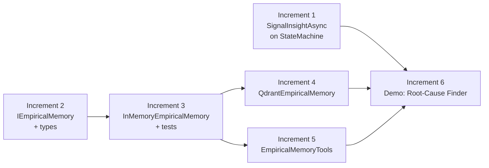
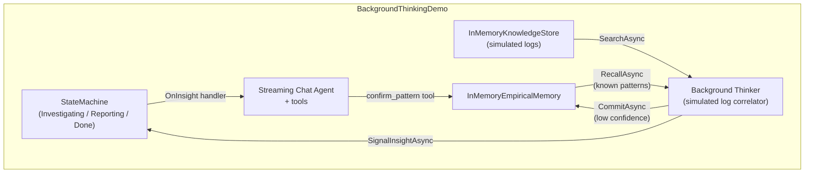

# ADR-007: Implementation Plan — Background Cognitive Processes

| Field         | Value                                                     |
|---------------|-----------------------------------------------------------|
| **Parent**    | ADR-007 (Background Cognitive Processes)                  |
| **Status**    | Draft                                                     |
| **Date**      | 2025-07-27                                                |

---

## Overview

This plan implements ADR-007 in six increments across three projects.
Each increment is a self-contained PR that compiles, passes tests, and
is independently useful. Later increments build on earlier ones but do
not require them to be merged simultaneously.

### Dependency graph



### Projects touched per increment

| Increment | `Ananke.StateMachine` | `Ananke.Orchestration` | `Ananke.Qdrant` | Tests | Demos |
|---|---|---|---|---|---|
| 1 | ✅ | | | `Ananke.StateMachine.Tests` | |
| 2 | | ✅ | | | |
| 3 | | ✅ | | `Ananke.Orchestration.Tests` | |
| 4 | | | ✅ | | |
| 5 | | ✅ | | `Ananke.Orchestration.Tests` | |
| 6 | ✅ | ✅ | ✅ | | New demo |

---

## Increment 1: `SignalInsightAsync` on `StateMachine<S, T>`

**Goal**: Background processes can push insights to the state machine.
Handlers receive the insight and the current state for routing decisions.

### Files to create

_None._

### Files to modify

**`Ananke.StateMachine/StateMachine.cs`**

Add after `_onInterrupt` (line ~88):

```csharp
// ── Insight handlers ─────────────────────────────────────────
private readonly List<Func<object, S, Task>> _insightHandlers = [];
```

Add after `OnInterrupt<TPayload>` (line ~167):

```csharp
/// <summary>
/// Registers a handler invoked when a background process signals an insight
/// via <see cref="SignalInsightAsync{TInsight}"/>. The handler receives the
/// insight and the current state, enabling state-aware routing (e.g. inline
/// delivery vs. buffering vs. offline notification).
/// <para>
/// Handlers run under the transition gate (<see cref="SemaphoreSlim"/>),
/// serialized with <see cref="FireAsync"/>. They must not block for long.
/// </para>
/// </summary>
public StateMachine<S, T> OnInsight<TInsight>(Func<TInsight, S, Task> handler)
{
    ArgumentNullException.ThrowIfNull(handler);
    _insightHandlers.Add(async (obj, state) =>
    {
        if (obj is TInsight typed)
            await handler(typed, state);
    });
    return this;
}

/// <summary>
/// Delivers an insight from any thread. Gate-serialized with
/// <see cref="FireAsync"/> — only one of them runs at a time.
/// Does NOT cause a state transition.
/// </summary>
public async Task SignalInsightAsync<TInsight>(TInsight insight)
{
    ArgumentNullException.ThrowIfNull(insight);
    await _gate.WaitAsync();
    try
    {
        foreach (var handler in _insightHandlers)
        {
            try
            {
                await handler(insight!, CurrentState);
            }
            catch (Exception)
            {
                // Log + continue — one handler failure must not
                // block other handlers or poison the gate.
            }
        }
    }
    finally
    {
        _gate.Release();
    }
}
```

### Files to create (tests)

**`tests/Ananke.StateMachine.Tests/InsightSignalTests.cs`**

| Test | Verifies |
|---|---|
| `SignalInsight_InvokesHandler_WithInsightAndCurrentState` | Handler receives correct insight object and current state |
| `SignalInsight_MultipleHandlers_AllInvoked` | All registered handlers fire |
| `SignalInsight_TypedHandler_IgnoresMismatchedType` | `OnInsight<string>` ignores an `int` insight |
| `SignalInsight_DoesNotChangeState` | `CurrentState` is unchanged after signal |
| `SignalInsight_SerializedWithFireAsync` | Concurrent `SignalInsightAsync` and `FireAsync` don't interleave (use `TaskCompletionSource` to verify) |
| `SignalInsight_HandlerException_DoesNotBlockOtherHandlers` | First handler throws; second still fires |
| `SignalInsight_HandlerException_DoesNotPoisonGate` | After handler throws, `FireAsync` still works |
| `SignalInsight_NoHandlers_Succeeds` | No-op when no handlers registered |

### Acceptance criteria

- [ ] `SignalInsightAsync<T>` compiles and is public on `StateMachine<S, T>`
- [ ] `OnInsight<T>` returns `StateMachine<S, T>` for fluent chaining
- [ ] All 8 tests pass
- [ ] Existing `SimpleStateMachineTests` still pass (no regressions)
- [ ] `dotnet build` succeeds for entire solution

### Estimated scope

~40 lines production code, ~120 lines test code.

---

## Increment 2: `IEmpiricalMemory` + types

**Goal**: Define the interface and all supporting record types in
`Ananke.Orchestration.Memory`.

### Files to create

**`Ananke.Orchestration/Memory/IEmpiricalMemory.cs`**

```csharp
namespace Ananke.Orchestration.Memory;

/// <summary>
/// Persistent store for empirical knowledge — observations, correlations,
/// and procedural strategies learned from agent-human collaboration or
/// background analysis. The third memory layer alongside
/// <see cref="Ananke.Orchestration.Knowledge.IKnowledgeStore"/> (semantic)
/// and <see cref="IConversationMemory"/> (episodic).
/// </summary>
public interface IEmpiricalMemory
{
    Task<EmpiricalEntry> CommitAsync(
        EmpiricalEntry entry, CancellationToken ct = default);

    Task<IReadOnlyList<EmpiricalMatch>> RecallAsync(
        string situation, RecallOptions? options = null, CancellationToken ct = default);

    Task ReinforceAsync(
        string entryId, Reinforcement reinforcement, CancellationToken ct = default);

    Task ContradictAsync(
        string entryId, string reason, CancellationToken ct = default);

    Task<EmpiricalEntry?> GetAsync(
        string entryId, CancellationToken ct = default);
}
```

**`Ananke.Orchestration/Memory/ExperienceTypes.cs`**

Contains:
- `EmpiricalKind` enum (`Pattern`, `Skill`, `Heuristic`)
- `EmpiricalEntry` sealed record (shared core + kind-specific fields)
- `EmpiricalMatch` sealed record (entry + composite score)
- `Reinforcement` sealed record
- `RecallOptions` sealed record (`TopK`, `Kind`, `MinConfidence`,
  `RequiredTags`, `ScoreThreshold`)

### Design notes

- `EmpiricalEntry` uses `required` init properties for mandatory fields
  and nullable properties for kind-specific fields (same pattern as
  `KnowledgeDocument` / `CatalogEntry`)
- `RecallOptions` follows `SearchOptions` conventions (TopK default 5,
  ScoreThreshold default 0)
- `EmpiricalEntry.Description` is the text embedded for vector search —
  application code constructs it from condition/effect or goal/applicability

### Acceptance criteria

- [ ] All types compile with no warnings
- [ ] `IEmpiricalMemory` has 5 methods matching the ADR spec
- [ ] No dependencies beyond `Ananke.Orchestration` existing references
- [ ] `dotnet build` succeeds

### Estimated scope

~120 lines across 2 files. No tests yet (interface + records only).

---

## Increment 3: `InMemoryEmpiricalMemory` + tests

**Goal**: Working in-memory implementation for testing and demos. Follows
the `InMemoryKnowledgeStore` / `InMemoryConversationMemory` pattern.

### Files to create

**`Ananke.Orchestration/Memory/InMemoryEmpiricalMemory.cs`**

Internals:
- `ConcurrentDictionary<string, StoredExperience>` for entries
- `StoredExperience` = `(EmpiricalEntry Entry, ReadOnlyMemory<float> Embedding)`
- Constructor takes `IEmbeddingModel` (same as `InMemoryKnowledgeStore`)
- `CommitAsync`: embed `Description` → search for semantic duplicate
  above configurable threshold (default 0.9) → merge or create
- `RecallAsync`: embed query → brute-force cosine similarity →
  filter by `RecallOptions` → client-side composite score
  (`vectorScore × confidence × recencyWeight`) → sort → take TopK
- `ReinforceAsync`: retrieve → update confidence, observation count,
  evidence, last observed → store back (no re-embedding)
- `ContradictAsync`: retrieve → reduce confidence by 0.3 (floor at 0),
  record reason → store back
- `GetAsync`: direct dictionary lookup

Composite scoring reuses `TimeDecay.ComputeWeight` from
`Ananke.Orchestration.Knowledge` with a default `TimeDecayOptions`
(`HalfLifeDays = 90, FloorWeight = 0.3f`) — same defaults as the
catalog-aware store.

### Files to create (tests)

**`tests/Ananke.Orchestration.Tests/InMemoryEmpiricalMemoryTests.cs`**

| Test | Verifies |
|---|---|
| **Commit** | |
| `Commit_NewEntry_StoresAndReturns` | Entry retrievable via `GetAsync` |
| `Commit_SameDescription_MergesIntoExisting` | Semantic dedup above threshold bumps observation count + confidence |
| `Commit_DifferentDescription_CreatesNew` | Below-threshold descriptions create separate entries |
| `Commit_DifferentKind_NeverMerges` | Pattern and skill with similar text stay separate |
| **Recall** | |
| `Recall_ReturnsSortedByCompositeScore` | High-confidence recent entry ranks above low-confidence old one |
| `Recall_FilterByKind_OnlyReturnsMatchingKind` | `Kind = Pattern` excludes skills |
| `Recall_FilterByMinConfidence_ExcludesLowConfidence` | Confidence 0.3 excluded by threshold 0.5 |
| `Recall_FilterByTags_RequiresAllTags` | Entry with tags `[a, b]` matches `RequiredTags = [a]` but not `[a, c]` |
| `Recall_TopK_LimitsResults` | Returns at most TopK entries |
| `Recall_EmptyStore_ReturnsEmpty` | No entries, no results |
| **Reinforce** | |
| `Reinforce_IncreasesConfidenceAndObservationCount` | Confidence goes up, count increments |
| `Reinforce_DoesNotReEmbed` | Vector stays identical after reinforce (compare embeddings) |
| `Reinforce_AppendsEvidence` | New evidence added to existing list |
| `Reinforce_UpdatesLastObserved` | Timestamp moves forward |
| `Reinforce_ConfidenceCapsAtOne` | Cannot exceed 1.0 |
| `Reinforce_NonexistentEntry_Throws` | `KeyNotFoundException` |
| **Contradict** | |
| `Contradict_ReducesConfidence` | Confidence decreases |
| `Contradict_ConfidenceFloorsAtZero` | Cannot go negative |
| `Contradict_NonexistentEntry_Throws` | `KeyNotFoundException` |
| **Get** | |
| `Get_ExistingEntry_ReturnsEntry` | Direct lookup works |
| `Get_NonexistentEntry_ReturnsNull` | Returns null, no throw |

### Acceptance criteria

- [ ] `InMemoryEmpiricalMemory` implements `IEmpiricalMemory`
- [ ] Uses `InMemoryEmbedder` for tests (same as knowledge store tests)
- [ ] All 21 tests pass
- [ ] Composite scoring uses `TimeDecay.ComputeWeight` from existing code
- [ ] `dotnet build` + `dotnet test` succeeds

### Estimated scope

~200 lines production code, ~350 lines test code.

---

## Increment 4: `QdrantEmpiricalMemory`

**Goal**: Qdrant-backed implementation using `SetPayloadAsync` for
efficient reinforcement.

### Files to create

**`Ananke.Qdrant/QdrantEmpiricalMemory.cs`**

Follows the established patterns from `QdrantKnowledgeStore` and
`QdrantKnowledgeCatalog`:

| Pattern | Source | Applied to |
|---|---|---|
| Lazy collection init + `SemaphoreSlim` | `QdrantKnowledgeStore` | Same |
| Deterministic UUIDv5 point IDs | `QdrantKnowledgeStore.ToUuidV5` | Reuse or extract to shared utility |
| Payload field constants | `QdrantKnowledgeCatalog` | New constants for empirical fields |
| Payload indexes on init | `QdrantKnowledgeCatalog` | Index: `kind`, `confidence`, `last_observed`, `source`, `tags` |

Key implementation details:

**Collection schema**:
```
Collection: configurable (default "empirical_memory")
Vector: embed(Description), Distance.Cosine
Indexed payload fields:
  kind:              Keyword
  confidence:        Float
  last_observed:     Integer (unix seconds)
  source:            Keyword
  tags:              Keyword
```

**`CommitAsync`**:
1. Embed `entry.Description`
2. Search same collection with filter `kind = entry.Kind`, limit 1,
   `scoreThreshold = _dedupThreshold` (configurable, default 0.9)
3. If match found above threshold → merge (use `SetPayloadAsync` to
   update confidence, observation count, evidence, last observed)
4. Else → `UpsertAsync` new point with full payload

**`RecallAsync`**:
1. Embed `situation`
2. Build Qdrant `Filter` from `RecallOptions`:
   - `Kind` → `MatchKeyword("kind", ...)`
   - `MinConfidence` → `Range("confidence", gte: ...)`
   - `RequiredTags` → multiple `MatchKeyword("tags", tag)` in `Must`
3. `SearchAsync` with filter
4. Client-side composite rescore:
   `vectorScore × confidence × TimeDecay.ComputeWeight(lastObserved)`
5. Sort by composite score, return

**`ReinforceAsync`** (**uses `SetPayloadAsync`** — first use in framework):
1. `RetrieveAsync` by point ID
2. Read current `confidence`, `observation_count`, `evidence`
3. Compute updated values
4. `SetPayloadAsync` — partial update, vector untouched

**`ContradictAsync`**: Same as reinforce but reduces confidence.

**`GetAsync`**: `RetrieveAsync` by point ID → map payload to `EmpiricalEntry`.

### Design notes

- `UUIDv5` generation is currently a private method in `QdrantKnowledgeStore`.
  If duplicating feels wrong, extract to a `QdrantIdHelper` internal static
  class. Keep it internal — this is an implementation detail.
- `SetPayloadAsync` is available in `Qdrant.Client` v1.17.0 (already
  referenced in `Ananke.Qdrant.csproj`).

### Acceptance criteria

- [ ] `QdrantEmpiricalMemory` implements `IEmpiricalMemory`
- [ ] Uses `SetPayloadAsync` for `ReinforceAsync` / `ContradictAsync`
- [ ] Collection auto-created on first use with correct indexes
- [ ] Semantic dedup threshold is configurable via constructor
- [ ] `dotnet build` succeeds
- [ ] Manual smoke test against local Qdrant (`docker compose up`)

### Estimated scope

~250 lines production code. No automated tests (requires Qdrant;
integration test can follow the existing pattern if an integration
test project exists).

---

## Increment 5: `EmpiricalMemoryTools`

**Goal**: Agent tools that let the LLM recall, commit, and reinforce
empirical knowledge during conversation.

### Files to create

**`Ananke.Orchestration/Memory/EmpiricalMemoryTools.cs`**

Factory following the `KnowledgeSearchTool` / `KnowledgeCatalogTools` pattern:

```csharp
public static class EmpiricalMemoryTools
{
    public static ToolKit Create(
        IEmpiricalMemory memory,
        string name = "experience",
        string? recallDescription = null,
        string? commitDescription = null,
        string? reinforceDescription = null)
    {
        // Returns ToolKit with 3 tools:
        // 1. recall_empirical(situation)
        // 2. commit_insight(description, kind)
        // 3. reinforce_empirical(entry_id)
    }
}
```

**Tool details**:

| Tool name | Parameters | Returns |
|---|---|---|
| `recall_empirical` | `situation` (string) | Formatted list of matching entries with scores |
| `commit_insight` | `description` (string), `kind` (string: "pattern"/"skill"/"heuristic") | Confirmation with entry ID (new or merged) |
| `reinforce_empirical` | `entry_id` (string) | Confirmation of reinforcement |

Output formatting follows `KnowledgeSearchTool.FormatResults` conventions —
structured text with entry metadata that the LLM can reference.

### Files to create (tests)

**`tests/Ananke.Orchestration.Tests/EmpiricalMemoryToolsTests.cs`**

| Test | Verifies |
|---|---|
| `Create_ReturnsToolKitWithThreeTools` | ToolKit has `recall_empirical`, `commit_insight`, `reinforce_empirical` |
| `RecallTool_CallsRecallAsync_ReturnsFormattedResults` | Tool delegates to `IEmpiricalMemory.RecallAsync` |
| `CommitTool_CallsCommitAsync_ReturnsEntryId` | Tool creates entry with correct kind |
| `CommitTool_InvalidKind_ReturnsError` | Invalid kind string returns `ToolResult.Error` |
| `ReinforceTool_CallsReinforceAsync` | Tool delegates to `ReinforceAsync` |
| `ReinforceTool_NonexistentEntry_ReturnsError` | Missing entry returns `ToolResult.Error` |

Tests use `InMemoryEmpiricalMemory` with `InMemoryEmbedder` — same
pattern as `KnowledgeSearchTool` tests.

### Acceptance criteria

- [x] `EmpiricalMemoryTools.Create` returns a `ToolKit` with 3 tools
- [x] Tools are mergeable into any existing `ToolKit` via `ToolKit.Merge`
- [x] All 6 tests pass
- [x] `dotnet build` + `dotnet test` succeeds

### Estimated scope

~80 lines production code, ~80 lines test code.

---

## Increment 6: Demo — Background Root-Cause Finder

**Goal**: End-to-end demo showing background thinking + learning + delivery
in a simplified log-analysis scenario.

### Location

`demos/BackgroundThinkingDemo/`

### Architecture



### Files to create

| File | Purpose |
|---|---|
| `Program.cs` | ASP.NET Core minimal API with SSE endpoint |
| `RootCauseMachine.cs` | State machine: `Investigating → Reporting → Done` + interrupt |
| `RootCauseSession.cs` | `ChatSession` subclass with `IEmpiricalMemory` |
| `BackgroundThinker.cs` | Simulated background process: periodically searches logs, commits low-confidence patterns, signals insights |
| `SimulatedLogs.cs` | Seeds `InMemoryKnowledgeStore` with fake log entries containing a hidden correlation |
| `data/system-prompt.md` | System prompt for the investigation agent |
| `README.md` | How to run, what to observe |

### Scenario flow

1. **Startup**: seed `InMemoryKnowledgeStore` with simulated log entries
   spanning 3 services. Hidden correlation: ServiceA GC pauses precede
   ServiceB timeout spikes by ~40 minutes.

2. **Background thinker** starts on app launch. Every 10 seconds:
   - Recalls known patterns from `IEmpiricalMemory`
   - Searches logs for conditions matching known patterns
   - Scans for new temporal correlations (simulated — checks for
     co-occurring keywords in time-windowed log entries)
   - If new correlation found → `CommitAsync` with confidence 0.3
   - If significant → `SignalInsightAsync`

3. **User chats** via SSE endpoint. Agent has tools:
   - `search_logs` (searches the simulated log store)
   - `recall_empirical` (from `EmpiricalMemoryTools`)
   - `commit_insight` (from `EmpiricalMemoryTools`)
   - `reinforce_empirical` (from `EmpiricalMemoryTools`)

4. **Insight delivery**: `OnInsight` handler checks state:
   - `Investigating` → inject into conversation as system message +
     emit SSE event
   - `Reporting` → buffer (print to console: "Insight queued")
   - No session → print to console: "Would send email"

5. **User confirms**: says "yes, that's the root cause" → agent calls
   `reinforce_empirical` → confidence increases.

6. **Next thinker cycle**: recalls the now-stronger pattern, confirms
   it matches new log entries, reinforces again.

### Acceptance criteria

- [ ] Demo compiles and runs with `dotnet run`
- [ ] Background thinker autonomously discovers the hidden correlation
- [ ] Insight appears in the SSE stream during active chat
- [ ] `reinforce_empirical` visibly increases confidence
- [ ] `recall_empirical` returns the learned pattern with updated score
- [ ] README explains the cognitive loop clearly

### Estimated scope

~300 lines across 6–7 files.

---

## Summary

| Increment | Scope | Lines (est.) | Depends on | Status |
|---|---|---|---|---|
| **1** | `SignalInsightAsync` + `OnInsight<T>` | ~160 | — | ✅ Done |
| **2** | `IEmpiricalMemory` + types | ~120 | — | ✅ Done |
| **3** | `InMemoryEmpiricalMemory` + tests | ~550 | 2 | ✅ Done |
| **4** | `QdrantEmpiricalMemory` | ~340 | 2, 3 | ✅ Done |
| **5** | `EmpiricalMemoryTools` + tests | ~280 | 2, 3 | ✅ Done |
| **6** | Demo: Connect 4 Empirical Learning | ~450 | 1, 3, 5 | ✅ Done |
| | **Total** | **~1,900** | | |

All increments implemented.
