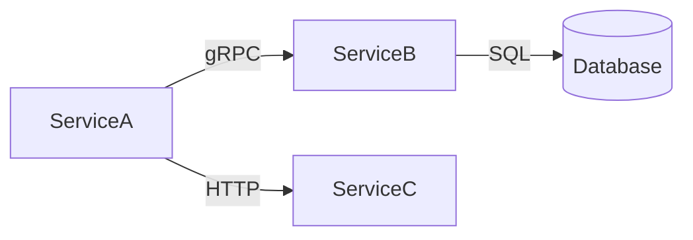

# ADR-010: Structured Knowledge Identity — Prediction Registration and Semantic Decomposition

| Field         | Value                                                              |
|---------------|--------------------------------------------------------------------|
| **Status**    | Proposed                                                           |
| **Date**      | 2025-07-28                                                         |
| **Authors**   | —                                                                  |
| **Deciders**  | Ananke maintainers                                                 |
| **Tags**      | empirical-memory, prediction, semantic-tags, knowledge-graph, recall |
| **Relates to**| ADR-008 (affective signals), ADR-009 (confirmation bias resistance) |

---

## Context

ADR-008 and ADR-009 established a prediction-error-driven learning model
for empirical memory. The implementation review surfaced two structural
limitations that the signal model alone cannot fix:

### Limitation 1: Implicit predictions conflate confidence with expectation

The current system uses `entry.Confidence` as the predicted outcome when
computing prediction error:

```csharp
float predicted = stored.Entry.Confidence;
float actual = reinforcement.Reward.Value;
float predictionError = MathF.Abs(predicted - actual);
```

This conflates two distinct questions:

| Question | Current proxy | What it actually needs |
|---|---|---|
| **Epistemic**: "How sure am I this pattern is true?" | `Confidence` | Same — derived from Variance |
| **Operational**: "Given the current situation, what outcome do I expect if I act on this pattern?" | Also `Confidence` | A **situational prediction** formed at recall time with context awareness |

A pattern can be confidently true in general (`Confidence = 0.9`) but
inapplicable to the current situation. Using confidence as the prediction
means the system is always surprised when a generally-true pattern fails
in a specific context — and never learns *when* it applies vs. doesn't.

### Limitation 2: Everything flows through one embedding

`Description` serves as:

1. The human-readable summary (for agent context and display)
2. The embedding source (for vector search and dedup)
3. The identity basis (for dedup similarity comparison)

This means semantic similarity in embedding space is the only dimension
available for dedup, recall, and exploration. But:

- **"GC pause → timeout"** and **"GC pause → memory spike"** are close in
  embedding space (shared "GC pause" text) but represent different causal
  chains that should not be deduped.
- **"GC pause → timeout"** and **"connection pool exhaustion → timeout"**
  share the same effect but have different causes — an agent investigating
  timeouts should see both, but embedding similarity may rank one far below
  the other depending on query phrasing.
- Dedup at 0.9 cosine threshold cannot distinguish "semantically similar
  but causally different" from "semantically similar and causally related."

### The opportunity: structural knowledge already exists

In many domains the system already has structured representations of the
operational environment — service dependency graphs, infrastructure
diagrams, API schemas. This structural information could decompose
empirical entries into dimensional tags that enable causal-aware dedup,
dimension-projected recall, and gap-aware exploration.

For example, a Mermaid service diagram:



provides physical constraints (ServiceA → ServiceB is a real dependency)
that could become structured tags on empirical entries:

```
Pattern: "GC pause in ServiceA causes timeout in ServiceB"
├── cause:gc-pause              (weight: 0.9)
├── cause-location:service-a    (weight: 0.9)
├── effect:timeout              (weight: 0.85)
├── effect-location:service-b   (weight: 0.85)
├── path:service-a→service-b    (weight: 0.7)
├── mechanism:thread-pool       (weight: 0.5)
└── domain:infrastructure       (weight: 0.2)
```

---

## Proposal

### Part 1: Prediction Registration

#### The mechanism

When an agent recalls an empirical entry and decides to act on it, the
system records an explicit prediction **before** the action:

```
Recall:     agent retrieves entry E for situation S
Register:   system records Prediction { entryId, situationalContext, predictedOutcome, timestamp }
Act:        agent uses the entry
Observe:    outcome O arrives
Resolve:    system computes surprise = f(prediction, outcome, context)
            → feeds into ReinforceAsync as Reward
```

The prediction is formed **at recall time with situational awareness** —
not derived from a static field on the entry. Two recalls of the same
entry in different situations produce different predictions and different
surprise signals.

#### What a prediction record needs

```csharp
/// <summary>
/// A registered prediction — formed when an entry is recalled and
/// acted upon, resolved when the outcome is observed.
/// </summary>
public sealed record Prediction
{
    /// <summary>Unique identifier for this prediction.</summary>
    public required string Id { get; init; }

    /// <summary>The empirical entry this prediction is based on.</summary>
    public required string EntryId { get; init; }

    /// <summary>The situation description at recall time.</summary>
    public required string SituationalContext { get; init; }

    /// <summary>
    /// The predicted outcome — formed by the agent or an automatic
    /// mechanism based on entry confidence and context match.
    /// </summary>
    public required float PredictedOutcome { get; init; }

    /// <summary>When the prediction was registered.</summary>
    public required DateTimeOffset Timestamp { get; init; }

    /// <summary>
    /// Maximum time to wait for an outcome before expiring.
    /// In a chat session: seconds. In incident analysis: hours.
    /// </summary>
    public required TimeSpan Ttl { get; init; }

    /// <summary>The observed outcome, set when resolved.</summary>
    public float? ActualOutcome { get; init; }

    /// <summary>When the prediction was resolved (or expired).</summary>
    public DateTimeOffset? ResolvedAt { get; init; }
}
```

#### Who forms the prediction

Three possible sources, increasing in richness:

| Source | Mechanism | Cost | Quality |
|---|---|---|---|
| **Automatic** | `entry.Confidence × contextSimilarity` | Cheap | Shallow — no causal reasoning |
| **Agent-formed** | LLM produces a prediction as structured output at recall time | 1 extra LLM call | Rich — situational awareness |
| **Hybrid** | Automatic default; agent can override when it has strong situational signal | Cheap default, expensive on demand | Best trade-off |

#### Prediction lifetime and resolution

- **Chat turn scope**: prediction registered at recall, resolved at end of
  tool execution or turn. TTL: seconds to minutes.
- **Session scope**: prediction registered at start of investigation,
  resolved when the incident is closed. TTL: hours.
- **Background scope**: prediction registered by offline learner during
  exploration, resolved when new evidence arrives. TTL: days.

Expired predictions are not errors — they represent situations where the
system acted on a belief but never got feedback. These should count as
mild negative signals (the pattern was applied but no confirming outcome
arrived).

#### Temporal credit assignment

If an agent recalls three entries and acts on all of them, each has its
own registered prediction. When the outcome arrives, surprise is computed
per-prediction, not per-entry globally. The entry whose prediction was
most wrong gets the strongest update. This naturally solves the credit
assignment problem for multi-entry actions.

### Part 2: Semantic Tag Decomposition

#### The structure

Alongside `Description` (human-readable, embedding source), each entry
carries a weighted tag dictionary:

```csharp
/// <summary>
/// Structured dimensional decomposition of this entry's content.
/// Keys are namespaced tags (e.g. "cause:gc-pause", "effect:timeout",
/// "location:service-a"). Values are relevance weights in [0.0, 1.0].
/// Used for causal-aware dedup, dimension-projected recall, and
/// gap-aware exploration. Produced by the LLM at commit time or
/// extracted from ingested structural data (service diagrams, schemas).
/// </summary>
public IReadOnlyDictionary<string, float>? SemanticTags { get; init; }
```

#### Tag namespaces

| Namespace | Meaning | Source |
|---|---|---|
| `cause:` | What triggers the pattern/heuristic | LLM extraction from Description |
| `effect:` | What the pattern predicts/produces | LLM extraction from Description |
| `location:` | Where in the system (service, component) | Ingested from service diagrams |
| `path:` | Causal chain between components | Derived from dependency graph |
| `mechanism:` | How the cause produces the effect | LLM extraction or `Mechanism` field |
| `domain:` | High-level category | LLM classification |
| `temporal:` | Time scale (seconds, minutes, hours) | LLM extraction or `Latency` field |
| `tool:` | Tools involved in applying a skill | From `Tools` field on Skills |

#### How tags improve each operation

**Dedup** — tag overlap as secondary signal:

```
Current:  cosine(embedding_A, embedding_B) ≥ 0.9 → merge
Proposed: cosine ≥ 0.9 AND sameKind AND tagOverlap(cause + effect) ≥ threshold → merge
```

Two entries with similar descriptions but different `cause:` or `effect:`
tags would not be merged even at high cosine similarity.

**Recall** — dimension-projected queries:

```
"Why is ServiceB timing out?"
  → high weight on effect:timeout + location:service-b
  → all cause:* dimensions surface (don't filter by cause)
  → this is a projection, not a nearest-neighbor search
```

This maps to how humans search memory: "I know the symptom, show me all
possible causes" — a query shaped by what you know, projected onto the
dimensions you don't.

**Exploration** — dimensional gap detection:

```
"I have 12 entries about cause:gc-pause but 0 about cause:connection-pool
 in location:service-b — that's a knowledge gap worth exploring."
```

The offline learner can identify underexplored tag regions and prioritize
them in the curiosity walk, even if no single entry has high prediction
error.

**Consolidation** — structural clustering:

Entries sharing tag subtrees (e.g. `cause:gc-pause` + `mechanism:thread-pool`
across multiple `effect:*` values) form natural knowledge documents:
"How GC pauses propagate through thread-pool starvation."

#### Ingesting structural data

The key insight: many tags don't need LLM extraction. They come from
structural data the system already has:

| Source | Tags produced |
|---|---|
| Mermaid/PlantUML service diagrams | `location:*`, `path:*` (dependency edges) |
| API schemas (OpenAPI) | `location:*` (endpoints), `mechanism:*` (protocols) |
| Infrastructure-as-code (Terraform, Bicep) | `location:*` (resources), `domain:*` |
| Incident management systems | `temporal:*` (incident timelines) |
| The `Condition`/`Effect`/`Mechanism` fields already on `EmpiricalEntry` | `cause:*`, `effect:*`, `mechanism:*` |

A `StructuralContext` service could ingest these at startup and make them
available as a tag vocabulary. When an entry is committed, the LLM's
extraction is constrained to this vocabulary — preventing hallucinated tags
and ensuring consistency with the physical topology.

---

## Analysis

### Strengths

1. **Prediction registration decouples epistemic confidence from operational
   expectation** — the system can learn *when* a pattern applies, not just
   *whether* it's true.

2. **Semantic tags give the system causal awareness** — dedup, recall, and
   exploration all operate on structural dimensions, not just semantic
   proximity.

3. **Physical constraints from diagrams ground the tag vocabulary** —
   prevents the tag space from drifting into hallucinated categories.

4. **Both features compose with the existing ADR-008/009 machinery** —
   predictions feed into the same `Reward` → prediction-error →
   Variance → Confidence pipeline. Tags are an additive overlay, not a
   replacement.

### Weaknesses and Risks

1. **Tag extraction quality depends on the LLM** — inconsistent tagging
   defeats the dedup and recall improvements. Mitigation: constrain
   extraction to a known vocabulary from structural data.

2. **Prediction registration adds latency** — registering, storing, and
   resolving predictions is overhead on every recall-act-observe cycle.
   Mitigation: make registration opt-in per tool invocation, not automatic.

3. **Tag vocabulary maintenance** — as the system evolves, the tag
   namespace grows. Stale tags (from decommissioned services) pollute
   the space. Mitigation: tag vocabulary inherits lifecycle from its
   source (diagram updated → tags updated).

4. **Partial outcome resolution** — a prediction might be partially
   confirmed ("the timeout happened but latency was lower than expected").
   Scalar reward doesn't capture this. Mitigation: defer to future work;
   scalar reward is sufficient for the first implementation.

5. **Cold start** — tag-based dedup and recall are only useful once entries
   have tags. Entries committed before this feature get no tags.
   Mitigation: backfill existing entries via an offline migration that
   extracts tags from existing `Description`/`Condition`/`Effect` fields.

### Feasibility Assessment

| Component | Difficulty | Dependencies |
|---|---|---|
| `Prediction` record and storage | Low | None — additive type |
| Prediction registration at recall time | Medium | Agent loop integration |
| Prediction resolution and reward computation | Medium | Outcome observation hook |
| `SemanticTags` field on `EmpiricalEntry` | Low | None — additive property |
| Tag extraction at commit time (LLM) | Medium | Structured output support |
| Tag vocabulary from Mermaid diagrams | Medium | Mermaid parser |
| Tag-aware dedup in `CommitAsync` | Medium | `SemanticTags` field |
| Dimension-projected recall | High | Modified recall scoring |
| Gap-aware exploration in offline learner | High | Tag vocabulary service |

---

## Decision

**Defer to next cycle.** This ADR captures the design direction and
analysis. Implementation depends on:

1. ADR-009 changes being validated in production (bias resistance must
   prove effective before adding more complexity to the learning loop)
2. A concrete domain with structural data available (service diagrams,
   API schemas) to ground the tag vocabulary
3. Agent loop support for prediction registration hooks

### Recommended implementation order

| Phase | Scope | Rationale |
|---|---|---|
| **P1** | `SemanticTags` field on `EmpiricalEntry` + Qdrant payload | Additive, zero behavior change. Tags can be populated manually or by early adopters. |
| **P2** | Tag extraction from existing fields (`Condition`/`Effect`/`Mechanism`/`Situation`) | Automatic backfill from structured data already on entries. No LLM needed. |
| **P3** | `Prediction` record + registration/resolution lifecycle | Core prediction mechanism. Agent loop integration required. |
| **P4** | Tag-aware dedup (causal overlap check) | First behavioral change — dedup becomes dimension-aware. |
| **P5** | Structural data ingestion (Mermaid → tag vocabulary) | Grounds the tag space in physical topology. |
| **P6** | Dimension-projected recall | Major recall improvement. Requires P4+P5. |
| **P7** | Gap-aware exploration | Offline learner uses tag coverage as a curiosity signal. |

---

## References

- ADR-008: Affective Signals for Empirical Memory — prediction-error
  reinforcement model that this ADR's prediction registration improves
- ADR-009: Confirmation Bias Resistance — the bias vectors that motivate
  moving away from a single-embedding identity model
- ADR-009 Future Work §3: "Coherence measured against knowledge store" —
  semantic tags enable this by providing dimensions for coherence
  comparison beyond embedding similarity
- Rescorla-Wagner: prediction-error-driven learning requires explicit
  predictions; using confidence as a proxy is a known simplification
  that limits learning to belief strength, not applicability boundaries
- Knowledge graphs / ontologies: the tag namespace approach is a
  lightweight analog to formal ontology, scoped to the operational
  domain via ingested structural data
