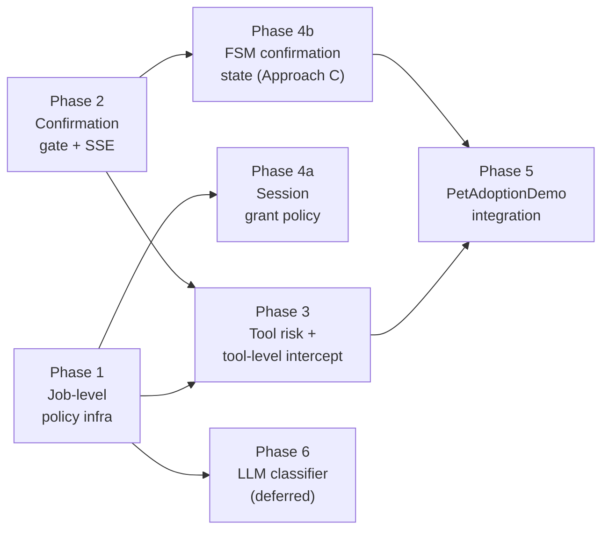

# ADR-017 / ADR-018: Implementation Plan — Dynamic Interrupt Policy & Bidirectional Agent-User Dialogue

| Field          | Value                                                               |
|----------------|---------------------------------------------------------------------|
| **Status**     | Proposed                                                            |
| **Date**       | 2025-07-29                                                          |
| **Relates to** | ADR-017 (dynamic interrupt policy), ADR-018 (bidirectional dialogue) |

---

## Phase Overview

```
Phase 1 ─ Job-level policy infrastructure     ┐
                                               │  Foundation for everything below.
Phase 2 ─ Confirmation gate + SSE contract    ─┤  Independent of Phase 1 (different
                                               │  surface). Both needed before Phase 3+.
Phase 3 ─ Tool risk + tool-level intercept    ─┤  Depends on Phase 1 + Phase 2.
                                               │
Phase 4a ─ Session grant policy               ─┤  Depends on Phase 1 only.
                                               │
Phase 4b ─ FSM confirmation state (Approach C)─┤  Depends on Phase 2 only.
           (preferred / cleanest design)       │
                                               │
Phase 5 ─ PetAdoptionDemo integration         ─┘  Depends on Phase 2 + 4b.
           (Approach A wired alongside C)          Validates full bidirectional loop.

Phase 6 ─ LLM classifier  (deferred)              ADR-017 Tier 4. After Phase 1–4 stable.
```

Each phase is an independently shippable unit. Phases 4a and 4b are parallel
tracks and do not block each other. Phase 5 is the integration proof.

All new contracts ship with an in-memory implementation suitable for unit testing.

---

## Dependency Graph



---

## Projects Touched per Phase

| Phase | `Ananke.Orchestration` | `Ananke.AspNetCore` | `Ananke.StateMachine` | Tests | Demo |
|---|---|---|---|---|---|
| 1 | ✅ | | | `Ananke.Orchestration.Tests` | |
| 2 | ✅ | ✅ | | `Ananke.Orchestration.Tests` | |
| 3 | ✅ | | | `Ananke.Orchestration.Tests` | |
| 4a | ✅ | | | `Ananke.Orchestration.Tests` | |
| 4b | | ✅ | | | `PetAdoptionDemo` |
| 5 | | | | `Ananke.Integration.Tests` | `PetAdoptionDemo` |
| 6 | ✅ | | | `Ananke.Orchestration.Tests` | |

---

## Phase 1 — Job-Level Policy Infrastructure

**Goal:** Replace the binary `InterruptMode` check in `WorkflowRunner` with a
pluggable policy slot. Backwards-compatible: no policy → unconditional interrupt
(current behaviour). ADR-017 Tier 1.

### New types — `Ananke.Orchestration\Interrupts\`

New vertical slice folder and namespace `Ananke.Orchestration.Interrupts`.

| File | Type | Description |
|---|---|---|
| `InterruptDecision.cs` | `enum InterruptDecision` | `Interrupt` \| `AutoApprove` |
| `InterruptContext.cs` | `sealed record InterruptContext<TState>` | `JobName`, `Mode`, `State`, `ConversationHistory`, `SessionGrants`, `Metadata` |
| `IInterruptPolicy.cs` | `interface IInterruptPolicy<TState>` | `Task<InterruptDecision> EvaluateAsync(InterruptContext<TState>, CancellationToken)` |
| `AlwaysInterruptPolicy.cs` | `sealed class AlwaysInterruptPolicy<TState>` | Always returns `Interrupt`. Default when no policy is set. |
| `NeverInterruptPolicy.cs` | `sealed class NeverInterruptPolicy<TState>` | Always returns `AutoApprove`. Full autonomy mode. |
| `SafePolicyWrapper.cs` | `sealed class SafePolicyWrapper<TState>` | Wraps any policy; catches all exceptions and returns `Interrupt` with a log entry. **Every policy registration should use this wrapper.** |
| `CompositeInterruptPolicy.cs` | `sealed class CompositeInterruptPolicy<TState>` | Runs policies in sequence; takes the most conservative result (`Interrupt` wins). |

### Modified types

| File | Change |
|---|---|
| `Jobs\JobDescriptor.cs` | Add `IInterruptPolicy<TState>? InterruptPolicy { get; init; }` |
| `Execution\WorkflowRunner.cs` | Replace unconditional interrupt check with policy evaluation. Both `Before` and `After` paths. |

### `WorkflowRunner` change — `Before` path

```csharp
if (descriptor.Interrupt == InterruptMode.Before && !skipFirstInterrupt)
{
    var policy = descriptor.InterruptPolicy is not null
        ? new SafePolicyWrapper<TState>(descriptor.InterruptPolicy, _logger)
        : (IInterruptPolicy<TState>)AlwaysInterruptPolicy<TState>.Instance;

    var context = new InterruptContext<TState>
    {
        JobName = currentJobName,
        Mode = InterruptMode.Before,
        State = execution.State,
        Metadata = execution.Metadata
    };

    if (await policy.EvaluateAsync(context, ct) == InterruptDecision.Interrupt)
    {
        execution.Status = ExecutionStatus.Interrupted;
        // ... existing checkpoint + return ...
    }
    // AutoApprove: fall through and execute the job
}
```

The `After` path receives an equivalent treatment.

### Workflow fluent API

Add a `WithInterruptPolicy` overload to the `Workflow<TState>` builder so
policies can be registered alongside the existing `InterruptBefore` /
`InterruptAfter` calls:

```csharp
.InterruptBefore("SendEmail", policy: new SessionGrantPolicy<TState>(memory))
.InterruptAfter("GenerateReport", policy: new NeverInterruptPolicy<TState>())
```

When a policy is supplied, it replaces the unconditional check. When no policy
is supplied, `AlwaysInterruptPolicy` is used automatically.

### Tests

| Test class | Coverage |
|---|---|
| `InterruptPolicyTests` | `AlwaysInterruptPolicy` always interrupts; `NeverInterruptPolicy` always auto-approves; `SafePolicyWrapper` catches exceptions and returns `Interrupt`; `CompositeInterruptPolicy` returns the most conservative result |
| `WorkflowRunnerInterruptPolicyTests` | Runner uses policy when set; runner uses `AlwaysInterruptPolicy` when not set; `AutoApprove` result causes job to execute without checkpointing |

---

## Phase 2 — Confirmation Gate + SSE Contract

**Goal:** Introduce the `IAgentConfirmationGate` primitive — the single shared
mechanism for agent-pull bidirectional dialogue. Wire it into `ChatSession` and
add the complementary `POST /api/confirm` endpoint. ADR-018 core.

### New types — `Ananke.Orchestration\Interrupts\`

| File | Type | Description |
|---|---|---|
| `IAgentConfirmationGate.cs` | `interface IAgentConfirmationGate` | `RequestAsync(question, options?, ct)` → `string`; `ReplyAsync(answer, ct)`; `bool IsPendingReply` |
| `AgentConfirmationGate.cs` | `sealed class AgentConfirmationGate` | `TaskCompletionSource<string>`-backed implementation. Thread-safe. Resets after each reply. |

### `AgentConfirmationGate` key behaviour

```csharp
public sealed class AgentConfirmationGate : IAgentConfirmationGate
{
    private TaskCompletionSource<string>? _pending;

    public bool IsPendingReply => _pending is not null;

    public async Task<string> RequestAsync(
        string question,
        IReadOnlyList<string>? options = null,
        CancellationToken ct = default)
    {
        if (_pending is not null)
            throw new InvalidOperationException(
                "A confirmation request is already pending. Only one may be active at a time.");

        _pending = new TaskCompletionSource<string>(TaskCreationOptions.RunContinuationsAsynchronously);
        using var reg = ct.Register(() => _pending.TrySetCanceled(ct));
        // Caller is responsible for emitting the SSE event before calling RequestAsync,
        // OR the tool/OnEnter handler emits it inline.
        try { return await _pending.Task; }
        finally { _pending = null; }
    }

    public Task ReplyAsync(string answer, CancellationToken ct = default)
    {
        _pending?.TrySetResult(answer);
        return Task.CompletedTask;
    }
}
```

### SSE event — `Ananke.Orchestration\Agents\ChatSessionEvent.cs`

Add to the existing discriminated union:

```csharp
/// <summary>
/// Agent is requesting confirmation from the user before proceeding.
/// The agent's execution is suspended until a reply is received.
/// </summary>
public sealed record ConfirmationRequestEvent(
    string Question,
    IReadOnlyList<string>? Options) : ChatSessionEvent;

/// <summary>
/// The pending confirmation was resolved (answered or cancelled).
/// Signals the client to dismiss the confirmation UI.
/// </summary>
public sealed record ConfirmationResolvedEvent(string Answer) : ChatSessionEvent;
```

`ChatSessionEventSseExtensions.cs` in `Ananke.AspNetCore` maps these to SSE
event names `confirm_request` and `confirm_resolved`.

### `ChatSession<TState, TAction>` — `Ananke.AspNetCore\Sessions\ChatSession.cs`

Add the gate as a lazy property, created once per session:

```csharp
/// <summary>
/// Session-scoped gate for agent-initiated confirmation requests.
/// Wire this into a <c>confirm_with_user</c> tool or into
/// <c>OnEnter(AwaitingConfirmation)</c> to enable bidirectional dialogue.
/// </summary>
public IAgentConfirmationGate ConfirmationGate { get; } = new AgentConfirmationGate();
```

### New endpoint — `Ananke.AspNetCore`

New extension `ChatSessionConfirmExtensions` with `MapConfirmEndpoint`:

```csharp
app.MapPost("/api/confirm", async (ConfirmRequest request) =>
{
    var session = sessions.Get(request.SessionId);
    if (session is null)
        return Results.NotFound(new { error = "Session not found." });

    if (!session.ConfirmationGate.IsPendingReply)
        return Results.Conflict(new { error = "No confirmation is pending for this session." });

    await session.ConfirmationGate.ReplyAsync(request.Answer);
    return Results.Ok(new { status = "confirmed", answer = request.Answer });
});
```

Model: `record ConfirmRequest(string SessionId, string Answer)`.

### Gate + interrupt interaction

When `POST /api/interrupt` fires while a `RequestAsync` is pending, the gate
must be cancelled. `InterruptPhase.Register` should call
`session.ConfirmationGate.CancelPending()` in its `OnInterrupt` handler — or
`ChatSession.BindResponse` resets the gate on each new SSE binding. The
simplest approach: gate is cancelled via the `CancellationToken` passed to
`RequestAsync`, which is the same `ct` bound to the SSE request's lifetime.

### Tests

| Test class | Coverage |
|---|---|
| `AgentConfirmationGateTests` | `RequestAsync` suspends until `ReplyAsync`; cancellation via `ct` unblocks with `OperationCanceledException`; double `RequestAsync` throws; `IsPendingReply` reflects state |

---

## Phase 3 — Tool Risk Annotation and Tool-Level Intercept

**Goal:** Give tools a `ToolRisk` level and add an `IToolInterruptPolicy` hook
inside `AgentJob`'s tool-call loop. ADR-017 Tier 3 / ADR-018 Approach B (the
automatic safety net).

### New types — `Ananke.Orchestration\Tools\`

| File | Type | Description |
|---|---|---|
| `ToolRisk.cs` | `enum ToolRisk` | `Safe` \| `Reversible` \| `Destructive` |

### New types — `Ananke.Orchestration\Interrupts\`

| File | Type | Description |
|---|---|---|
| `ToolInterruptContext.cs` | `sealed record ToolInterruptContext` | `ToolName`, `ArgumentsJson`, `Risk`, `ConversationHistory`, `SessionGrants` |
| `IToolInterruptPolicy.cs` | `interface IToolInterruptPolicy` | `Task<InterruptDecision> EvaluateAsync(ToolInterruptContext, CancellationToken)` |
| `ToolRiskPolicy.cs` | `sealed class ToolRiskPolicy` | `AutoApprove` for `Safe`/`Reversible`; `Interrupt` for `Destructive` |

### Modified types

**`Ananke.Orchestration\Tools\ToolDefinition.cs`** — add risk field:

```csharp
/// <summary>Risk level for interrupt-policy consumers. Defaults to <see cref="ToolRisk.Safe"/>.</summary>
public ToolRisk Risk { get; init; } = ToolRisk.Safe;
```

**`Ananke.Orchestration\Tools\ToolBuilder.cs`** — add fluent method:

```csharp
/// <summary>Marks this tool with the given risk level for use by <see cref="IToolInterruptPolicy"/>.</summary>
public ToolBuilder Risk(ToolRisk risk) { _risk = risk; return this; }
```

**`Ananke.Orchestration\Agents\AgentJob.cs`** — add field and tool-loop hook:

```csharp
private readonly IToolInterruptPolicy? _toolInterruptPolicy;
private readonly IAgentConfirmationGate? _confirmationGate;
```

Inside `ExecuteWithToolsAsync`, before each `executor.ExecuteAsync`:

```csharp
// ── Tool-level interrupt policy ───────────────────────────────────────────
if (_toolInterruptPolicy is not null)
{
    var toolContext = new ToolInterruptContext
    {
        ToolName     = call.FunctionName,
        ArgumentsJson = call.Arguments,
        Risk          = _toolExecutors!.TryGetValue(call.FunctionName, out var def)
                            ? def.Risk : ToolRisk.Safe
    };

    var toolDecision = await _toolInterruptPolicy.EvaluateAsync(toolContext, ct);
    if (toolDecision == InterruptDecision.Interrupt && _confirmationGate is not null)
    {
        var question = $"Proceed with `{call.FunctionName}`?";
        var answer = await _confirmationGate.RequestAsync(question, ["Yes", "No"], ct);
        if (!answer.StartsWith("Y", StringComparison.OrdinalIgnoreCase))
        {
            messages.Add(AgentMessage.ToolResult(call.Id,
                ToolResult.Ok("User declined. Do not proceed with this action.").Value));
            continue;
        }
    }
}
// ─────────────────────────────────────────────────────────────────────────

var toolResult = await executor.ExecuteAsync(args, ct);
```

### `AgentJob.Builder` additions

```csharp
/// <summary>Attaches a tool-level interrupt policy evaluated before each tool invocation.</summary>
public Builder WithToolInterruptPolicy(IToolInterruptPolicy policy) { ... }

/// <summary>
/// Attaches the session confirmation gate used when a tool-level policy
/// returns <see cref="InterruptDecision.Interrupt"/>.
/// </summary>
public Builder WithConfirmationGate(IAgentConfirmationGate gate) { ... }
```

`StreamingChatWorkflow.Builder` gets matching `WithToolInterruptPolicy` and
`WithConfirmationGate` overloads so the pattern composes with the existing
streaming chat API.

### Tests

| Test class | Coverage |
|---|---|
| `ToolRiskPolicyTests` | `Safe`/`Reversible` → `AutoApprove`; `Destructive` → `Interrupt` |
| `AgentJobToolInterruptTests` | Tool loop calls policy before execution; `AutoApprove` → tool executes; `Interrupt` + gate `"Yes"` → tool executes; `Interrupt` + gate `"No"` → tool skipped with decline message |

---

## Phase 4a — Session Grant Policy

**Goal:** `SessionGrantPolicy<TState>` inspects `ConversationHistory` for
explicit permission grants and returns `AutoApprove` when found. ADR-017 Tier 2.

### New types — `Ananke.Orchestration\Interrupts\`

| File | Type | Description |
|---|---|---|
| `SessionGrantPolicy.cs` | `sealed class SessionGrantPolicy<TState>` | Scans `ConversationHistory` for grant phrases; configurable phrase list |

### `SessionGrantPolicy` design

```csharp
public sealed class SessionGrantPolicy<TState>(
    IConversationMemory memory,
    string sessionId,
    IReadOnlyList<string>? grantPhrases = null) : IInterruptPolicy<TState>
{
    private static readonly IReadOnlyList<string> DefaultPhrases =
    [
        "go ahead", "just do it", "proceed without asking",
        "don't ask me again", "yes to all", "auto-approve"
    ];

    public async Task<InterruptDecision> EvaluateAsync(
        InterruptContext<TState> context, CancellationToken ct)
    {
        var history = await memory.GetMessagesAsync(sessionId, ct);
        var phrases = grantPhrases ?? DefaultPhrases;

        var hasGrant = history
            .Where(m => m.Role == AgentRole.User)
            .Any(m => phrases.Any(p =>
                m.Content?.Contains(p, StringComparison.OrdinalIgnoreCase) == true));

        return hasGrant ? InterruptDecision.AutoApprove : InterruptDecision.Interrupt;
    }
}
```

### Resolution of ADR-017 open question

The `IConversationMemory` is passed at construction time. The policy is
responsible for loading history itself. `WorkflowRunner` does not need a
memory reference — the open question from ADR-017 is resolved by construction-
time injection rather than context population.

This also means `InterruptContext<TState>.ConversationHistory` can be removed
or made optional — it was intended as the injection point but construction-time
injection is simpler and avoids inflating the context type.

### Tests

| Test class | Coverage |
|---|---|
| `SessionGrantPolicyTests` | Grant phrase present → `AutoApprove`; no grant phrase → `Interrupt`; custom phrase list respected; case-insensitive match; only user messages checked |

---

## Phase 4b — FSM Confirmation State (Approach C)

**Goal:** Add first-class `AwaitingConfirmation` pattern support as the
preferred approach for named, auditable confirmation steps. No new framework
primitives required — the existing state machine supports this pattern
directly. Provide a reusable helper so the boilerplate is not repeated in
every demo or application.

### Why Approach C is preferred for structured confirmation

| Property | Approach A (tool only) | Approach C (FSM state) |
|---|---|---|
| Confirmation intent visible in FSM | No | Yes — `CurrentState` shows `AwaitingConfirmation` |
| Resumable after restart | No | Yes (if state is checkpointed) |
| Audit trail in state history | No | Yes |
| Multiple phases can reuse the pattern | Repetitive tool wiring | Single state + shared phase handler |
| Developer ceremony | Low (just a tool) | Low-Medium (new state + transitions) |

For production systems or regulated workflows, Approach C's auditability is
the deciding factor. Approach A remains valid for ad-hoc or low-stakes
confirmations inside a single tool.

### Pattern: `ConfirmationPhase` helper — `Ananke.AspNetCore\Sessions\`

A static registration helper that mirrors the existing `InterruptPhase`
convention in the PetAdoptionDemo:

```csharp
/// <summary>
/// Wires confirmation handling onto a session's state machine.
/// The session's <see cref="ChatSession{TState, TAction}.ConfirmationGate"/>
/// is used to suspend execution and await the user's reply.
/// </summary>
public static class ConfirmationPhase
{
    /// <summary>
    /// Registers <c>OnEnter</c> for <paramref name="awaitingState"/> to emit a
    /// <see cref="ConfirmationRequestEvent"/> and suspend until the user responds.
    /// On reply, fires <paramref name="confirmAction"/> or <paramref name="rejectAction"/>.
    /// </summary>
    public static void Register<TState, TAction>(
        ChatSession<TState, TAction> session,
        TState awaitingState,
        TAction confirmAction,
        TAction rejectAction,
        Func<TState, (string Question, IReadOnlyList<string>? Options)> questionBuilder)
        where TState : Enum
        where TAction : Enum
    {
        session.Machine.OnEnter(awaitingState, async ct =>
        {
            var (question, options) = questionBuilder(session.Machine.CurrentState);

            await session.EmitAsync("confirm_request", new { question, options });

            string answer;
            try
            {
                answer = await session.ConfirmationGate.RequestAsync(question, options, ct);
            }
            catch (OperationCanceledException)
            {
                // Session disconnected or interrupted — abort silently.
                return;
            }

            await session.EmitAsync("confirm_resolved", new { answer });

            var isConfirmed = answer.StartsWith("Y", StringComparison.OrdinalIgnoreCase)
                || answer.Equals("Yes", StringComparison.OrdinalIgnoreCase);

            await session.Machine.FireAsync(isConfirmed ? confirmAction : rejectAction, answer);
        });
    }
}
```

### PetAdoptionDemo: state machine additions

**`Sessions\AdoptionMachine.cs`** — extend the enum and machine:

```
Existing:
Searching ──[StartPaperwork]──► Paperwork

New (Approach C):
Searching ──[RequestAdoptionConfirmation]──► AwaitingAdoptionConfirmation
                                          ──[Confirm]──► Paperwork
                                          ──[Reject]───► Searching
```

```csharp
internal enum AdoptionPhase
{
    Searching, Interrupted, Paperwork, Payment, Done,
    AwaitingAdoptionConfirmation   // NEW
}

internal enum AdoptionAction
{
    Start, StartPaperwork, StartPayment, Complete, Interrupt, Resume,
    RequestAdoptionConfirmation, Confirm, Reject   // NEW
}
```

**`Sessions\AdoptionMachine.cs`** — machine builder additions:

```csharp
.From(AdoptionPhase.Searching)
    .On(AdoptionAction.RequestAdoptionConfirmation)
    .To(AdoptionPhase.AwaitingAdoptionConfirmation)
.From(AdoptionPhase.AwaitingAdoptionConfirmation)
    .On(AdoptionAction.Confirm).To(AdoptionPhase.Paperwork)
.From(AdoptionPhase.AwaitingAdoptionConfirmation)
    .On(AdoptionAction.Reject).To(AdoptionPhase.Searching)
```

**New file `Phases\AdoptionConfirmationPhase.cs`** — registration:

```csharp
internal static class AdoptionConfirmationPhase
{
    internal static void Register(AdoptionSession session)
    {
        ConfirmationPhase.Register(
            session,
            awaitingState: AdoptionPhase.AwaitingAdoptionConfirmation,
            confirmAction: AdoptionAction.Confirm,
            rejectAction: AdoptionAction.Reject,
            questionBuilder: _ =>
            {
                var ctx = session.GetContext<AdoptionContext>();
                var fee = ctx.AdoptionFee.HasValue ? $" (fee: ${ctx.AdoptionFee:N0})" : "";
                return (
                    $"Shall I start the adoption application for **{ctx.PetName}**{fee}?",
                    new[] { "Yes, proceed", "No, keep looking" }
                );
            });
    }
}
```

### Modified `SearchPhase` — Approach C wiring

The `start_adoption` tool fires `RequestAdoptionConfirmation` instead of
`StartPaperwork` directly:

```csharp
// Approach C: request confirmation first; ConfirmationPhase drives the
// Paperwork transition after the user responds.
await session.Machine.FireAsync(
    AdoptionAction.RequestAdoptionConfirmation,
    new { petName, fee });
return ToolResult.Ok($"Confirmation requested for {petName}.");
```

`AdoptionContext.PetName` and `AdoptionContext.AdoptionFee` are populated in
the tool before firing, so `AdoptionConfirmationPhase` can build the question.

---

## Phase 5 — PetAdoptionDemo Integration and Approach A Side-by-Side

**Goal:** Wire the full bidirectional loop in the demo. Approach C (FSM state)
is the primary path. Approach A (tool) is demonstrated as an optional override,
showing developers both options in a single codebase.

### New endpoint — `Endpoints\ConfirmEndpoint.cs`

Mirrors `InterruptEndpoint.cs` exactly:

```csharp
internal static class ConfirmEndpoint
{
    internal static void MapConfirmEndpoint(
        this WebApplication app,
        InMemorySessionStore<AdoptionSession> sessions)
    {
        app.MapPost("/api/confirm", async (ConfirmRequest request) =>
        {
            var session = sessions.Get(request.SessionId);
            if (session is null)
                return Results.NotFound(new { error = "Session not found or completed." });

            if (!session.ConfirmationGate.IsPendingReply)
                return Results.Conflict(new { error = "No confirmation pending." });

            await session.ConfirmationGate.ReplyAsync(request.Answer);
            return Results.Ok(new { status = "confirmed", answer = request.Answer });
        })
        .WithName("Confirm")
        .WithDescription("Deliver a user confirmation reply to a pending agent confirmation request.");
    }
}
```

### `Program.cs` additions

```csharp
app.MapConfirmEndpoint(sessions);
```

### `Sessions\SessionFactory.cs`

Register `AdoptionConfirmationPhase.Register(session)` alongside the existing
phase registrations.

### Approach A as a feature flag

The demo includes `SearchPhase`'s `start_adoption` tool with an optional
Approach A path, selectable via an environment variable or builder configuration:

```csharp
// Approach A (tool-as-gate, opt-in via demo config):
// The confirm_with_user tool suspends the agent directly,
// bypassing the FSM AwaitingConfirmation state.
// Toggle ADOPTION_CONFIRM_APPROACH=A in appsettings to switch.
```

This lets developers compare both approaches without maintaining two branches.

### End-to-end SSE sequence (Approach C)

```
POST /api/chat ("I want to adopt Ziggy")
  SSE: delta  — "I found Ziggy, a 2-year-old husky mix..."
  [tool: start_adoption("Ziggy") → FireAsync(RequestAdoptionConfirmation)]
  SSE: confirm_request  — { question: "Shall I start the adoption for Ziggy ($150)?", options: [...] }
  [agent reasoning suspends — OnEnter(AwaitingConfirmation) awaits gate]

POST /api/confirm ("Yes, proceed")
  → gate.ReplyAsync("Yes, proceed")
  → OnEnter(AwaitingConfirmation) unblocks → FireAsync(Confirm)
  → OnEnter(Paperwork) runs
  SSE: confirm_resolved
  SSE: phase  — { phase: "paperwork" }
  SSE: delta  — "Great! Let's get the paperwork started..."
  SSE: done
```

### Integration tests — `Ananke.Integration.Tests`

| Test | What it covers |
|---|---|
| `BidirectionalDialogue_ConfirmationFlow` | Full gate → SSE → confirm → continue loop |
| `BidirectionalDialogue_RejectionFlow` | Gate reply "No" → machine returns to Searching |
| `BidirectionalDialogue_DisconnectCancels` | CT cancellation unblocks gate with `OperationCanceledException` |
| `BidirectionalDialogue_InterruptDuringGate` | Interrupt fires while gate is pending → gate cancelled → interrupt proceeds normally |

---

## Phase 6 — LLM Classifier (Deferred)

**Deferred until Phases 1–4 are stable and validated in the demo.**

### Placeholder

| File | Type | Description |
|---|---|---|
| `Interrupts\LlmInterruptPolicy.cs` | `sealed class LlmInterruptPolicy<TState>` | Backed by a fast `IAgentModel`; uses conversation history in `InterruptContext` to infer implied intent |

### Design notes (not implemented yet)

- Takes a fast, cheap `IAgentModel` at construction (e.g. flash/haiku class).
- System prompt: classify whether the user's most recent message implies
  permission to proceed autonomously for the job described in `InterruptContext`.
- Returns structured `{ decision: "interrupt" | "auto_approve", reasoning: "..." }`.
- Wrapped in `SafePolicyWrapper` — if the model call fails or times out,
  falls back to `Interrupt`.
- Latency budget: should complete in < 200ms for transparent UX. If the model
  is too slow, fall back to `SessionGrantPolicy`.
- Should be composed via `CompositeInterruptPolicy` as the last member after
  `SessionGrantPolicy` (phrase matching is cheaper and catches most cases).

---

## Approach Selector Reference

Developers choosing how to implement confirmation in their own agents:

| You want... | Use | Phase |
|---|---|---|
| Agent asks confirmation when it decides to | Approach A: `confirm_with_user` tool + `IAgentConfirmationGate` | 2 |
| Framework enforces confirmation for destructive tools | Approach B: `ToolRiskPolicy` + `IToolInterruptPolicy` | 3 |
| Confirmation as a visible, auditable business state | Approach C: `AwaitingConfirmation` FSM state + `ConfirmationPhase.Register` | 4b |
| User can grant permission once and skip future checkpoints | `SessionGrantPolicy` on job-level interrupt | 4a |
| Full AI-driven intent inference (advanced) | `LlmInterruptPolicy` | 6 (deferred) |

All approaches share the same `IAgentConfirmationGate` and `POST /api/confirm`
endpoint. They differ only in *where* the gate is called from.
