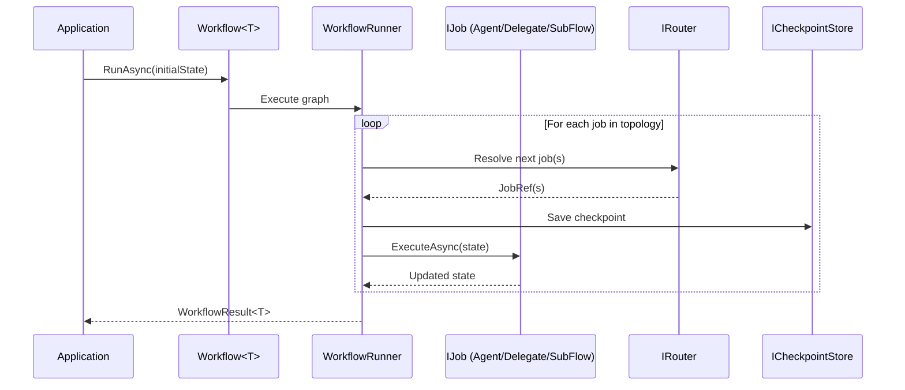
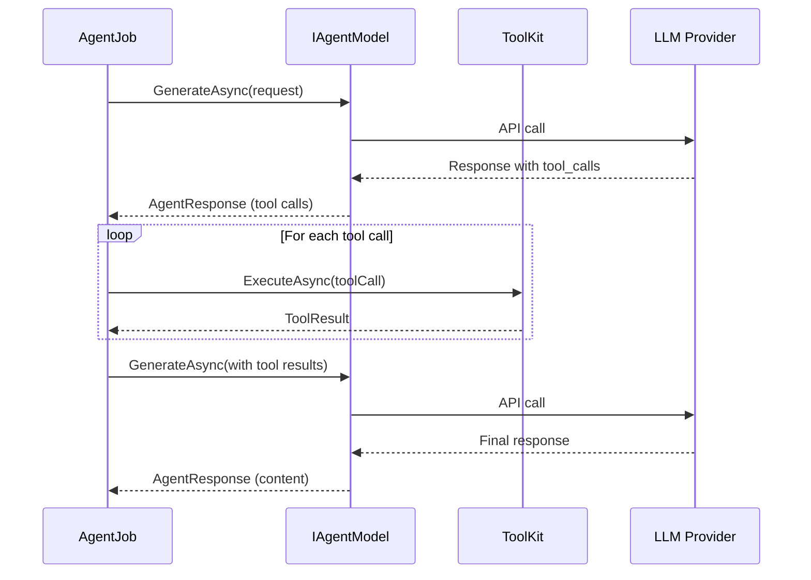
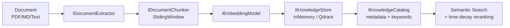
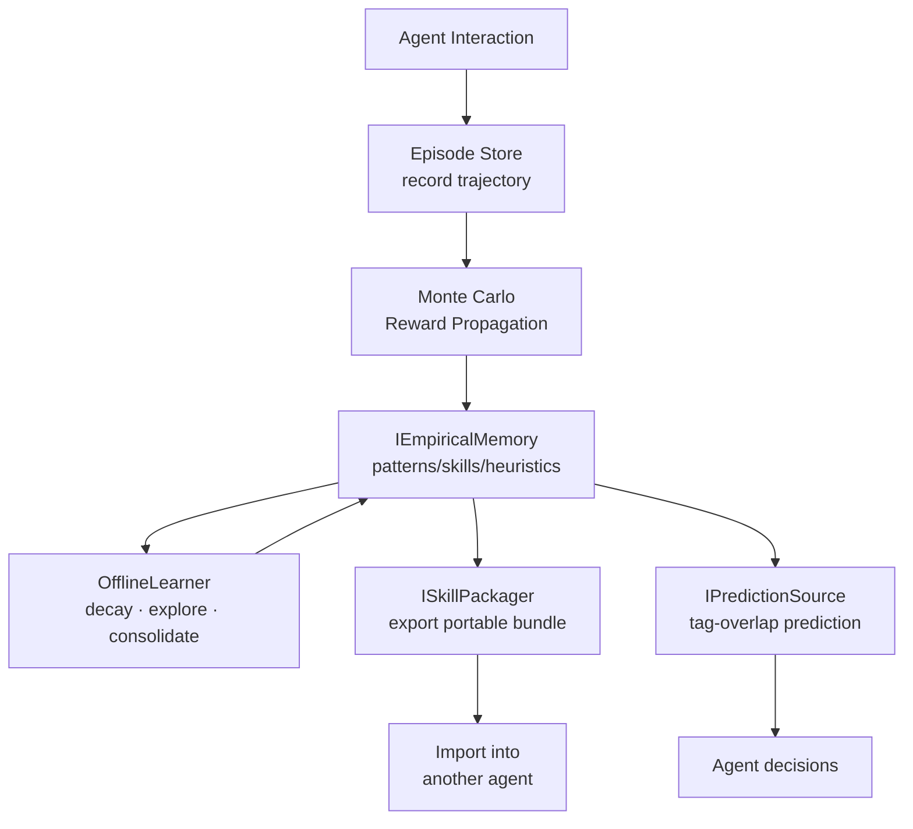
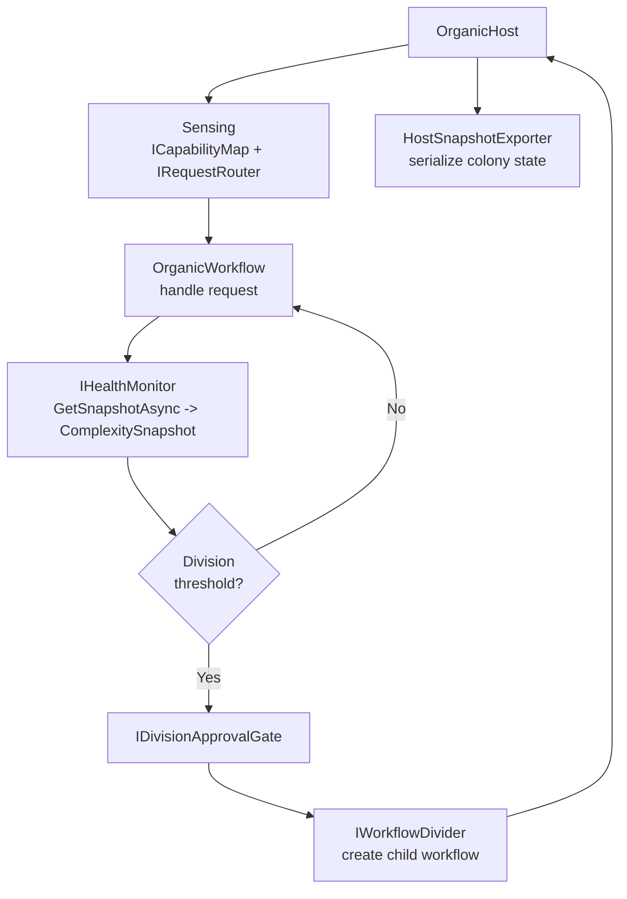

# Ananke — Solution Architecture

> **Purpose of this file:** Machine-readable architecture reference for LLM/AI assistants.
> When working on this codebase, read this file first for the dependency graph,
> project roles, and key abstractions. Per-project `ARCHITECTURE.md` files contain
> detailed type inventories and integration points.
>
> Routing by concept instead? Start at [`MAP.md`](../MAP.md) — it explains how this file
> relates to the root [`ARCHITECTURE.md`](../ARCHITECTURE.md) and links to the matching
> `docs/` guide and `architecture/*.md` companion for whatever you're working on.

## Identity

| Property | Value |
|----------|-------|
| Name | Ananke |
| Type | .NET library suite for AI agent orchestration |
| Runtime | .NET 10.0 (libraries), .NET Standard 2.0 (analyzers) |
| Solution | `src/Ananke.slnx` |
| License | Apache-2.0 |
| Version | Single source in `Directory.Build.props` → `<VersionPrefix>` |

## Layer Map

```
┌──────────────────────────────────────────────────────────────────────────┐
│                          CLI / TOOLING LAYER                            │
│  nnke  ·  nnke-platform  ·  Ananke.Tool.Shared                         │
│  nnke-platform-anthropic · nnke-platform-azure · nnke-platform-google  │
│  nnke-platform-all                                                      │
├──────────────────────────────────────────────────────────────────────────┤
│                         APPLICATION LAYER                               │
│  Ananke (meta-pkg)  ·  Ananke.Mesh (meta-pkg)                          │
│  Ananke.AspNetCore  ·  Ananke.Design  ·  Ananke.Roles                   │
│  Ananke.Platforms.Slack  ·  Ananke.Platforms.Discord                   │
├──────────────────────────────────────────────────────────────────────────┤
│                        FEDERATION LAYER                                 │
│  Ananke.Federation  ·  Ananke.Federation.Anthropic                      │
│  Ananke.Federation.Azure  ·  Ananke.Federation.Google                   │
│  Ananke.Federation.LocalEmulators                                       │
├──────────────────────────────────────────────────────────────────────────┤
│                         ORGANICS LAYER                                  │
│  Ananke.Organics  (Kernel, Division, Healing, Sensing, Lineage)         │
├──────────────────────────────────────────────────────────────────────────┤
│                       INTEGRATION LAYER                                 │
│  Ananke.MCP  ·  Ananke.A2A  ·  Ananke.Platforms                        │
│  Ananke.Skills  ·  Ananke.Documents                                     │
├──────────────────────────────────────────────────────────────────────────┤
│                      INTELLIGENCE LAYER                                 │
│  Ananke.Learning  ·  Ananke.Orchestration.OpenAI                        │
│  Ananke.Orchestration.Anthropic  ·  Ananke.Orchestration.Google         │
├──────────────────────────────────────────────────────────────────────────┤
│                          CORE LAYER                                     │
│  Ananke.Orchestration  ·  Ananke.StateMachine                           │
├──────────────────────────────────────────────────────────────────────────┤
│                      INFRASTRUCTURE LAYER                               │
│  Ananke.Redis  ·  Ananke.Qdrant  ·  Ananke.MQTT  ·  Ananke.OpenTelemetry│
│  Ananke.Graph.Abstractions  ·  Ananke.Graph.Memgraph                    │
├──────────────────────────────────────────────────────────────────────────┤
│                       FOUNDATION LAYER                                  │
│  Ananke.Abstractions  (zero dependencies)                               │
└──────────────────────────────────────────────────────────────────────────┘
```

## Dependency Graph (Mermaid)

```mermaid
graph TD
    subgraph Foundation
        ABS[Ananke.Abstractions]
    end

    subgraph Core
        OKN[Ananke.Orchestration.Knowledge]
        ORC[Ananke.Orchestration]
        SM[Ananke.StateMachine]
        ANZ[Ananke.Analyzers]
    end

    subgraph Intelligence
        LRN[Ananke.Learning]
        OAI[Ananke.Orchestration.OpenAI]
        ANT[Ananke.Orchestration.Anthropic]
        GOO[Ananke.Orchestration.Google]
    end

    subgraph Infrastructure
        RED[Ananke.Redis]
        QDR[Ananke.Qdrant]
        MQTT[Ananke.MQTT]
        OTEL[Ananke.OpenTelemetry]
        GAB[Ananke.Graph.Abstractions]
        GMG[Ananke.Graph.Memgraph]
    end

    subgraph Integration
        MCP[Ananke.MCP]
        A2A[Ananke.A2A]
        PLT[Ananke.Platforms]
        SKL[Ananke.Skills]
        DOC[Ananke.Documents]
    end

    subgraph Organics
        ORG[Ananke.Organics]
    end

    subgraph Federation
        FED[Ananke.Federation]
        FANT[Ananke.Federation.Anthropic]
        FAZR[Ananke.Federation.Azure]
        FGOO[Ananke.Federation.Google]
        FLE[Ananke.Federation.LocalEmulators]
    end

    subgraph Application
        META[Ananke - meta]
        MESH[Ananke.Mesh - meta]
        ASP[Ananke.AspNetCore]
        DSG[Ananke.Design]
        SLK[Ananke.Platforms.Slack]
        DIS[Ananke.Platforms.Discord]
        ROL[Ananke.Roles]
    end

    subgraph CLI
        TSH[Ananke.Tool.Shared]
        CLI1[nnke]
        CLI2[nnke-platform]
        CLI3[nnke-platform-anthropic]
        CLI4[nnke-platform-azure]
        CLI5[nnke-platform-google]
        CLI6[nnke-platform-all]
    end

    %% Foundation → Core
    OKN --> ABS
    ORC --> ABS
    ORC --> OKN
    ORC -.->|bundles at pack| ANZ
    SM --> ABS

    %% Foundation → LLM adapters
    OAI --> ABS
    ANT --> ABS
    GOO --> ABS

    %% Core → Intelligence
    LRN --> ORC

    %% Core → Infrastructure
    RED --> ABS
    RED --> ORC
    MQTT --> ABS
    OTEL --> ABS
    GAB --> ABS
    GMG --> ABS
    GMG --> GAB

    %% Core → Integration
    MCP --> ORC
    A2A --> ORC
    PLT --> ORC
    SKL --> ORC
    DOC --> OKN

    %% Intelligence + Integration → Organics
    ORG --> LRN
    ORG --> DSG

    %% Core → Design
    DSG --> ORC

    %% Organics → Federation
    FED --> ORG
    FED --> DSG
    FANT --> FED
    FANT --> ANT
    FAZR --> FED
    FAZR --> OAI
    FGOO --> FED
    FGOO --> GOO
    FLE --> FED

    %% Infrastructure (Qdrant depends on Organics)
    QDR --> OKN
    QDR --> LRN
    QDR --> ORG

    %% Integration → Application
    SLK --> PLT
    DIS --> PLT
    DIS --> ORC
    ASP --> ORC
    ASP --> SM
    ASP --> ORG

    %% Application → Roles
    ROL --> DSG
    ROL --> ORG
    ROL --> PLT
    ROL --> SLK

    %% Meta-packages
    META --> ORC
    META --> SM
    MESH --> ORC
    MESH --> LRN
    MESH --> ORG
    MESH --> DSG

    %% CLI
    TSH --> ORG
    CLI1 --> DSG
    CLI1 --> ORG
    CLI1 --> TSH
    CLI2 --> DSG
    CLI2 --> FED
    CLI2 --> ORC
    CLI2 --> TSH

    %% CLI platform adapter plugins
    CLI3 --> FANT
    CLI4 --> FAZR
    CLI5 --> FGOO
    CLI6 --> CLI3
    CLI6 --> CLI4
    CLI6 --> CLI5
```



## Project Inventory

### Foundation

| Project | NuGet ID | Role | Dependencies |
|---------|----------|------|-------------|
| `Ananke.Abstractions` | `Ananke.Abstractions` | Zero-dep contracts: `IBaseContext`, `IDistributedLock`, `IKeyValueDataAdapter`, `IChannelReader/Writer`, `IHandoffChannel`, `AgentMessage`, `ContentPart`, `ChannelConfig`, `IAgentModel`, `IStreamingAgentModel`, `AgentRequest`, `AgentResponse`, `AgentStreamChunk`, `TokenUsage`, `IEmbeddingModel` | None |

### Core

| Project | NuGet ID | Role | Dependencies |
|---------|----------|------|-------------|
| `Ananke.Orchestration` | `Ananke.Orchestration` | Workflow engine, tool system, streaming chat, agentic patterns, checkpointing, middleware | `Ananke.Abstractions`, `Ananke.Orchestration.Knowledge`, Polly |
| `Ananke.Orchestration.Knowledge` | `Ananke.Orchestration.Knowledge` | Knowledge pipeline — vector stores, document processing, chunking, embedding abstractions, knowledge catalog, document linking | `Ananke.Abstractions` |
| `Ananke.StateMachine` | `Ananke.StateMachine` | Distributed state machine with transition guards, middleware, fault/reset, channel-driven transitions | `Ananke.Abstractions` |
| `Ananke.Analyzers` | _(bundled in Orchestration)_ | Roslyn analyzer — validates `Job`/`Then`/`Decide` name references at compile time | .NET Standard 2.0, Microsoft.CodeAnalysis |

### Intelligence

| Project | NuGet ID | Role | Dependencies |
|---------|----------|------|-------------|
| `Ananke.Learning` | `Ananke.Learning` | Empirical memory, episodes, reward propagation, exploration strategies, skill packaging, entity-scoped memory, offline learning | `Ananke.Orchestration` |
| `Ananke.Organics` | `Ananke.Organics` | Organic workflow host: Kernel, Division (+ approval), Healing/pruning, Sensing/routing, Lineage, Snapshots | `Ananke.Learning`, `Ananke.Design` |
| `Ananke.Orchestration.OpenAI` | `Ananke.Orchestration.OpenAI` | `IStreamingAgentModel` via OpenAI ChatClient (also works with Ollama, LM Studio, vLLM, Azure OpenAI) | `Ananke.Abstractions`, OpenAI SDK |
| `Ananke.Orchestration.Anthropic` | `Ananke.Orchestration.Anthropic` | `IStreamingAgentModel` via Anthropic SDK | `Ananke.Abstractions`, Anthropic SDK |
| `Ananke.Orchestration.Google` | `Ananke.Orchestration.Google` | `IStreamingAgentModel` via Google GenAI SDK | `Ananke.Abstractions`, Google.GenAI |

### Infrastructure

| Project | NuGet ID | Role | Dependencies |
|---------|----------|------|-------------|
| `Ananke.Redis` | `Ananke.Redis` | `IDistributedLock` (RedLock), `IKeyValueDataAdapter`, `ICheckpointStore`, `IConversationMemory` via Redis | `Ananke.Abstractions`, `Ananke.Orchestration`, StackExchange.Redis, RedLock.net |
| `Ananke.Qdrant` | `Ananke.Qdrant` | `IKnowledgeStore`, `IEmpiricalMemory`, `IEpisodeStore`, `IKnowledgeCatalog` via Qdrant vector DB | `Ananke.Orchestration.Knowledge`, `Ananke.Learning`, `Ananke.Organics`, Qdrant.Client |
| `Ananke.MQTT` | `Ananke.MQTT` | `IChannelReader/Writer`, `IHandoffChannel` via MQTT (MQTTnet) | `Ananke.Abstractions`, MQTTnet, MessagePack |
| `Ananke.OpenTelemetry` | `Ananke.OpenTelemetry` | `IWorkflowTracer` via OpenTelemetry, OTLP export builder | `Ananke.Abstractions`, OpenTelemetry SDK |
| `Ananke.Graph.Abstractions` | `Ananke.Graph.Abstractions` | Shared connection configuration (`GraphConnectionOptions`) for `IKnowledgeGraph` backend implementations | `Ananke.Abstractions` |
| `Ananke.Graph.Memgraph` | `Ananke.Graph.Memgraph` | `IKnowledgeGraph` via Memgraph (Bolt protocol); `MemgraphKnowledgeGraph`, `MemgraphPageRankScorer` | `Ananke.Abstractions`, `Ananke.Graph.Abstractions`, Neo4j.Driver |

### Integration

| Project | NuGet ID | Role | Dependencies |
|---------|----------|------|-------------|
| `Ananke.MCP` | `Ananke.MCP` | Expose `ToolKit`/`Workflow` as MCP server tools; import MCP tools into `ToolKit` | `Ananke.Orchestration`, ModelContextProtocol SDK |
| `Ananke.A2A` | `Ananke.A2A` | Agent-to-Agent protocol — call remote A2A agents as `IAgentModel`; expose workflows as A2A endpoints | `Ananke.Orchestration`, A2A SDK |
| `Ananke.Platforms` | `Ananke.Platforms` | Conversational adapter contracts: `IMessagePlatformAdapter`, `IPlatformResponseSink`, `IPlatformMessageHandler`, `PlatformMessage`, `StreamingMessageBridge` | `Ananke.Orchestration` |
| `Ananke.Skills` | `Ananke.Skills` | External skill catalog — discover, score, install CLI tools as `ToolDefinition` entries | `Ananke.Orchestration` |
| `Ananke.Documents` | `Ananke.Documents` | `IDocumentExtractor` for PDF, Markdown, plain text | `Ananke.Orchestration`, PdfPig, Markdig |

### Application

| Project | NuGet ID | Role | Dependencies |
|---------|----------|------|-------------|
| `Ananke` | `Ananke` | Meta-package — bundles StateMachine + Orchestration in one step | `Ananke.Orchestration`, `Ananke.StateMachine` |
| `Ananke.Mesh` | `Ananke.Mesh` | Meta-package — full growth-aware mesh story: Orchestration + Learning + Organics + Design | `Ananke.Orchestration`, `Ananke.Learning`, `Ananke.Organics`, `Ananke.Design` |
| `Ananke.AspNetCore` | `Ananke.AspNetCore` | SSE streaming, `ChatSession`, state machine endpoint helpers, organic-colony inspection endpoints | `Ananke.Orchestration`, `Ananke.StateMachine`, `Ananke.Organics`, ASP.NET Core |
| `Ananke.Design` | `Ananke.Design` | YAML DSL → `Workflow` import, Mermaid diagram export | `Ananke.Orchestration` |
| `Ananke.Platforms.Slack` | `Ananke.Platforms.Slack` | Slack adapter via SlackNet (Socket Mode + Events API) | `Ananke.Platforms`, SlackNet |
| `Ananke.Platforms.Discord` | `Ananke.Platforms.Discord` | Discord adapter via Discord.Net (Gateway) — **Phase 2, skeleton** | `Ananke.Orchestration`, `Ananke.Platforms`, Discord.Net |
| `Ananke.Roles` | `Ananke.Roles` | Role/persona scaffolding — `AgentRole`, `ReviewPolicy`, `EscalationPolicy`, `StudioRouter`, `StudioHostBuilder`, Slack role routing (`SlackChannelMap`, `RoleAwareMessageHandler`, `SlackApprovalCallback`) | `Ananke.Design`, `Ananke.Organics`, `Ananke.Platforms`, `Ananke.Platforms.Slack` |

### Federation

| Project | NuGet ID | Role | Dependencies |
|---------|----------|------|-------------|
| `Ananke.Federation` | `Ananke.Federation` | Core deployer, registry, credential provider, validator, and monitor abstractions for multi-provider agent deployment | `Ananke.Organics`, `Ananke.Design` |
| `Ananke.Federation.Anthropic` | `Ananke.Federation.Anthropic` | Claude federation adapter — deploy/teardown Claude-backed agents | `Ananke.Federation`, `Ananke.Orchestration.Anthropic` |
| `Ananke.Federation.Azure` | `Ananke.Federation.Azure` | Azure OpenAI federation adapter | `Ananke.Federation`, `Ananke.Orchestration.OpenAI` |
| `Ananke.Federation.Google` | `Ananke.Federation.Google` | Google GenAI federation adapter | `Ananke.Federation`, `Ananke.Orchestration.Google` |
| `Ananke.Federation.LocalEmulators` | `Ananke.Federation.LocalEmulators` | Stub `IPlatformNativeExecutor` implementations (bash, code execution, web search/fetch, file search, memory, text editor) for exercising platform-native tool paths without cloud credentials | `Ananke.Federation` |

### CLI Tools

CLI packages use a **namespace exception** — see [CLI Namespace Exception](#cli-namespace-exception) below.

| Project | Tool ID | Role | Dependencies |
|---------|---------|------|-------------|
| `nnke` | `nnke` | `dotnet ananke` global tool — agent scaffold, design pipeline, organics commands | `Ananke.Design`, `Ananke.Organics`, `Ananke.Tool.Shared`, ModelContextProtocol, System.CommandLine |
| `nnke-platform` | `nnke-platform` | `dotnet ananke-platform` global tool — federation deploy/teardown/status commands | `Ananke.Design`, `Ananke.Federation`, `Ananke.Orchestration`, `Ananke.Tool.Shared`, System.CommandLine |

`Ananke.Tool.Shared` is a library (not a tool) of CLI primitives shared by both: `CliOptions`,
`JsonOutput`, `SnapshotLoader`. Depends only on `Ananke.Organics`.

Standalone executable adapter plugins — installed alongside `nnke-platform` to enable a specific `deploy --platform` target (probed and loaded via `AdapterManifest`, not referenced as libraries):

| Project | Role | Dependencies |
|---------|------|-------------|
| `nnke-platform-anthropic` | Enables `deploy --platform claude` — targets the Anthropic Beta Managed Agents API | `Ananke.Federation.Anthropic` |
| `nnke-platform-azure` | Enables `deploy --platform azure-ai` | `Ananke.Federation.Azure` |
| `nnke-platform-google` | Enables `deploy --platform vertex-ai` | `Ananke.Federation.Google` |
| `nnke-platform-all` | Convenience meta-installer — runs all three adapters' `AdapterInstaller.Install()` in one command | `nnke-platform-anthropic`, `nnke-platform-azure`, `nnke-platform-google` |

## Key Abstractions (Cross-Project)

### Agent Model Pipeline

```
IAgentModel / IStreamingAgentModel           src/Ananke.Abstractions/Agents/IAgentModel.cs
  ├── OpenAIChatAgentModel                   src/Ananke.Orchestration.OpenAI/OpenAIChatAgentModel.cs
  ├── AnthropicAgentModel                    src/Ananke.Orchestration.Anthropic/AnthropicAgentModel.cs
  ├── GeminiAgentModel                       src/Ananke.Orchestration.Google/GeminiAgentModel.cs
  ├── A2AAgentModel                          src/Ananke.A2A/Client/A2AAgentModel.cs
  ├── MiddlewareAgentModel                   src/Ananke.Orchestration/Agents/Middleware/MiddlewareAgentModel.cs
  ├── CachingAgentModel                      src/Ananke.Orchestration/Agents/Middleware/CachingAgentModel.cs
  └── ResilientAgentModel                    src/Ananke.Orchestration/Agents/Middleware/ResilientAgentModel.cs
```

### Workflow Engine

```
Workflow<TState>                             src/Ananke.Orchestration/Workflows/Workflow.cs
  ├── Job / AgentJob / HandoffJob / SubFlowJob
  │     src/Ananke.Orchestration/Jobs/DelegateJob.cs
  │     src/Ananke.Orchestration/Agents/AgentJob.cs
  │     src/Ananke.Orchestration/Jobs/HandoffJob.cs
  │     src/Ananke.Orchestration/Jobs/SubFlowJob.cs
  ├── Then / Decide / Chain / Fork / Join     (methods on Workflow<TState> above)
  ├── AgenticPattern (ReviewCritique, IterativeRefinement)
  │     src/Ananke.Orchestration/AgenticPattern.cs
  └── StreamingChatWorkflow                  src/Ananke.Orchestration/Agents/StreamingChatWorkflow.cs
                                              (pre-built streaming agent loop)
```

### State Machine Engine

```
StateMachine<S, T>                           src/Ananke.StateMachine/StateMachine.cs
  ├── TransitionBuilder (fluent guards + actions)
  │     src/Ananke.StateMachine/Builder/TransitionBuilder.cs
  ├── ITransitionMiddleware<C, S, T>
  │     src/Ananke.StateMachine/Middleware/ITransitionMiddleware.cs
  └── AbstractStateMachine<C, S, T, N>       src/Ananke.StateMachine/AbstractStateMachine.cs
                                              (persistent, distributed)
```

### Memory & Knowledge

```
IConversationMemory                          src/Ananke.Abstractions/Memory/IConversationMemory.cs
  ├── InMemoryConversationMemory             src/Ananke.Orchestration/Memory/InMemoryConversationMemory.cs
  └── RedisConversationMemory                src/Ananke.Redis/RedisConversationMemory.cs

IKnowledgeStore                              src/Ananke.Orchestration.Knowledge/IKnowledgeStore.cs
  ├── InMemoryKnowledgeStore                 src/Ananke.Orchestration.Knowledge/InMemoryKnowledgeStore.cs
  └── QdrantKnowledgeStore                   src/Ananke.Qdrant/QdrantKnowledgeStore.cs

IEmpiricalMemory                             src/Ananke.Learning/EmpiricalMemory/IEmpiricalMemory.cs
  ├── InMemoryEmpiricalMemory                src/Ananke.Learning/EmpiricalMemory/InMemoryEmpiricalMemory.cs
  └── QdrantEmpiricalMemory                  src/Ananke.Qdrant/QdrantEmpiricalMemory.cs
```

### Channel & Transport

```
IChannelReader<M> / IChannelWriter<A>        src/Ananke.Abstractions/Channels/IChannelReader.cs
                                              src/Ananke.Abstractions/Channels/IChannelWriter.cs
                                              (pub/sub)
  ├── InMemoryChannelReader/Writer           src/Ananke.Abstractions/Channels/InMemoryChannelReader.cs
  │                                          src/Ananke.Abstractions/Channels/InMemoryChannelWriter.cs
  └── MqttChannelReader/Writer               src/Ananke.MQTT/MqttChannelReader.cs
                                              src/Ananke.MQTT/MqttChannelWriter.cs

IHandoffChannel                              src/Ananke.Abstractions/Channels/IHandoffChannel.cs
                                              (request/response)
  ├── InMemoryHandoffChannel                 src/Ananke.Orchestration/Jobs/InMemoryHandoffChannel.cs
  └── MqttHandoffChannel                     src/Ananke.MQTT/MqttHandoffChannel.cs

IMessagePlatformAdapter                      src/Ananke.Platforms/IMessagePlatformAdapter.cs
                                              (conversational)
  ├── SlackAdapter                           src/Ananke.Platforms.Slack/SlackAdapter.cs
  └── DiscordAdapter                         src/Ananke.Platforms.Discord/DiscordAdapter.cs
                                              (Phase 2)
```

## Data Flow Diagrams

### Workflow Execution



### Agent Tool-Calling Loop



### Knowledge Ingestion Pipeline



### Empirical Learning Cycle



### Organic Colony Lifecycle



## Build & Test

```bash
# Build everything
dotnet build src/Ananke.slnx

# Run all tests
dotnet test src/Ananke.slnx

# Test a specific project
dotnet test src/tests/Ananke.Orchestration.Tests
```

- `TreatWarningsAsErrors` is on globally — zero warnings allowed
- Roslyn analyzer (`Ananke.Analyzers`) is bundled into `Ananke.Orchestration` NuGet package
- Central Package Management via `Directory.Packages.props`

## CLI Namespace Exception

The repository rule requires namespaces to match assembly + folder path. CLI tool packages are an explicit documented exception:

- `nnke` → namespace root `Ananke.Tool`
- `nnke-platform` → namespace root `Ananke.Tool.Platform`

Rationale: CLI entry-point projects are never referenced as libraries. The `Tool` namespace segment signals clearly that these types are not part of the public library API and avoids accidental name collisions if types were ever co-located with library types.

## Roslyn Analyzer Packaging Note

`Ananke.Analyzers` is a Roslyn analyzer (`IsRoslynComponent=true`, `IsPackable=false`). It is **not** a runtime dependency. The `<ProjectReference>` in `Ananke.Orchestration.csproj` exists solely so the analyzer is packed as an analyzer asset inside the `Ananke.Orchestration` NuGet package. Consumers of `Ananke.Orchestration` receive the analyzer automatically; they do not reference `Ananke.Analyzers` directly.

## Coding Conventions

- File-scoped namespaces matching assembly + folder path
- `sealed record` for immutable data; `required` for mandatory fields
- Primary constructors for DI
- `IReadOnlyList<T>` / `IReadOnlyDictionary<TK, TV>` in public APIs
- XML doc comments on all public APIs
- NUnit + Shouldly for tests
- See `.github/copilot-instructions.md` for full rules
