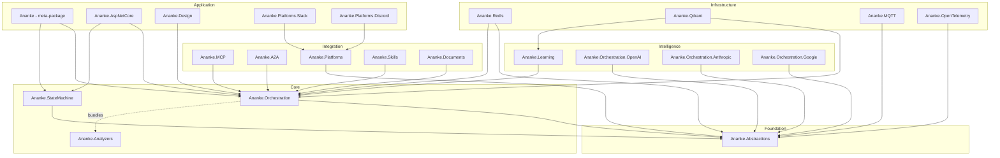

# Ananke — Solution Architecture

> **Purpose of this file:** Machine-readable architecture reference for LLM/AI assistants.
> When working on this codebase, read this file first for the dependency graph,
> project roles, and key abstractions. Per-project `ARCHITECTURE.md` files contain
> detailed type inventories and integration points.

## Identity

| Property | Value |
|----------|-------|
| Name | Ananke |
| Type | .NET library suite for AI agent orchestration |
| Runtime | .NET 10.0 (libraries), .NET Standard 2.0 (analyzers) |
| Solution | `src/Ananke.slnx` |
| License | Apache-2.0 |
| Version | Single source in `Directory.Build.props` → `<VersionPrefix>` |

## Layer Map

```
┌─────────────────────────────────────────────────────────────────────┐
│                        APPLICATION LAYER                           │
│  Ananke (meta-pkg)  ·  Ananke.AspNetCore  ·  Ananke.Design        │
│  Ananke.Platforms.Slack  ·  Ananke.Platforms.Discord  ·  demos/*     │
├─────────────────────────────────────────────────────────────────────┤
│                       INTEGRATION LAYER                            │
│  Ananke.MCP  ·  Ananke.A2A  ·  Ananke.Platforms       │
│  Ananke.Skills  ·  Ananke.Documents                                │
├─────────────────────────────────────────────────────────────────────┤
│                      INTELLIGENCE LAYER                            │
│  Ananke.Learning  ·  Ananke.Orchestration.OpenAI                   │
│  Ananke.Orchestration.Anthropic  ·  Ananke.Orchestration.Google    │
├─────────────────────────────────────────────────────────────────────┤
│                         CORE LAYER                                 │
│  Ananke.Orchestration  ·  Ananke.StateMachine                      │
├─────────────────────────────────────────────────────────────────────┤
│                     INFRASTRUCTURE LAYER                           │
│  Ananke.Redis  ·  Ananke.Qdrant  ·  Ananke.MQTT                   │
│  Ananke.OpenTelemetry                                              │
├─────────────────────────────────────────────────────────────────────┤
│                      FOUNDATION LAYER                              │
│  Ananke.Abstractions  (zero dependencies)                          │
└─────────────────────────────────────────────────────────────────────┘
```

## Dependency Graph (Mermaid)



## Project Inventory

### Foundation

| Project | NuGet ID | Role | Dependencies |
|---------|----------|------|-------------|
| `Ananke.Abstractions` | `Ananke.Abstractions` | Zero-dep contracts: `IBaseContext`, `IDistributedLock`, `IKeyValueDataAdapter`, `IChannelReader/Writer`, `IHandoffChannel`, `AgentMessage`, `ContentPart`, `ChannelConfig`, `IAgentModel`, `IStreamingAgentModel`, `AgentRequest`, `AgentResponse`, `AgentStreamChunk`, `TokenUsage`, `IEmbeddingModel` | None |

### Core

| Project | NuGet ID | Role | Dependencies |
|---------|----------|------|-------------|
| `Ananke.Orchestration` | `Ananke.Orchestration` | Workflow engine, tool system, streaming chat, agentic patterns, checkpointing, middleware | `Ananke.Abstractions`, `Ananke.Orchestration.Knowledge`, Polly |
| `Ananke.Orchestration.Knowledge` | `Ananke.Orchestration.Knowledge` | Knowledge pipeline — vector stores, document processing, chunking, embedding abstractions, knowledge catalog, document linking | `Ananke.Abstractions` |
| `Ananke.StateMachine` | `Ananke.StateMachine` | Distributed state machine with transition guards, middleware, fault/reset, channel-driven transitions | `Ananke.Abstractions` |
| `Ananke.Analyzers` | _(bundled in Orchestration)_ | Roslyn analyzer — validates `Job`/`Then`/`Decide` name references at compile time | .NET Standard 2.0, Microsoft.CodeAnalysis |

### Intelligence

| Project | NuGet ID | Role | Dependencies |
|---------|----------|------|-------------|
| `Ananke.Learning` | `Ananke.Learning` | Empirical memory, episodes, reward propagation, exploration strategies, skill packaging, entity-scoped memory, offline learning | `Ananke.Orchestration` |
| `Ananke.Orchestration.OpenAI` | `Ananke.Orchestration.OpenAI` | `IStreamingAgentModel` via OpenAI ChatClient (also works with Ollama, LM Studio, vLLM, Azure OpenAI) | `Ananke.Abstractions`, OpenAI SDK |
| `Ananke.Orchestration.Anthropic` | `Ananke.Orchestration.Anthropic` | `IStreamingAgentModel` via Anthropic SDK | `Ananke.Abstractions`, Anthropic SDK |
| `Ananke.Orchestration.Google` | `Ananke.Orchestration.Google` | `IStreamingAgentModel` via Google GenAI SDK | `Ananke.Abstractions`, Google.GenAI |

### Infrastructure

| Project | NuGet ID | Role | Dependencies |
|---------|----------|------|-------------|
| `Ananke.Redis` | `Ananke.Redis` | `IDistributedLock` (RedLock), `IKeyValueDataAdapter`, `ICheckpointStore`, `IConversationMemory` via Redis | `Ananke.Abstractions`, `Ananke.Orchestration`, StackExchange.Redis, RedLock.net |
| `Ananke.Qdrant` | `Ananke.Qdrant` | `IKnowledgeStore`, `IEmpiricalMemory`, `IEpisodeStore`, `IKnowledgeCatalog` via Qdrant vector DB | `Ananke.Orchestration`, `Ananke.Learning`, Qdrant.Client |
| `Ananke.MQTT` | `Ananke.MQTT` | `IChannelReader/Writer`, `IHandoffChannel` via MQTT (MQTTnet) | `Ananke.Abstractions`, MQTTnet, MessagePack |
| `Ananke.OpenTelemetry` | `Ananke.OpenTelemetry` | `IWorkflowTracer` via OpenTelemetry, OTLP export builder | `Ananke.Abstractions`, OpenTelemetry SDK |

### Integration

| Project | NuGet ID | Role | Dependencies |
|---------|----------|------|-------------|
| `Ananke.MCP` | `Ananke.MCP` | Expose `ToolKit`/`Workflow` as MCP server tools; import MCP tools into `ToolKit` | `Ananke.Orchestration`, ModelContextProtocol SDK |
| `Ananke.A2A` | `Ananke.A2A` | Agent-to-Agent protocol — call remote A2A agents as `IAgentModel`; expose workflows as A2A endpoints | `Ananke.Orchestration`, A2A SDK |
| `Ananke.Platforms` | `Ananke.Platforms` | Conversational adapter contracts: `IMessagePlatformAdapter`, `IPlatformResponseSink`, `IPlatformMessageHandler`, `PlatformMessage`, `StreamingMessageBridge` | `Ananke.Abstractions` |
| `Ananke.Skills` | `Ananke.Skills` | External skill catalog — discover, score, install CLI tools as `ToolDefinition` entries | `Ananke.Orchestration` |
| `Ananke.Documents` | `Ananke.Documents` | `IDocumentExtractor` for PDF, Markdown, plain text | `Ananke.Orchestration`, PdfPig, Markdig |

### Application

| Project | NuGet ID | Role | Dependencies |
|---------|----------|------|-------------|
| `Ananke` | `Ananke` | Meta-package — bundles StateMachine + Orchestration + Bridge layer | `Ananke.Orchestration`, `Ananke.StateMachine` |
| `Ananke.AspNetCore` | `Ananke.AspNetCore` | SSE streaming, `ChatSession`, state machine endpoint helpers | `Ananke.Orchestration`, `Ananke.StateMachine`, ASP.NET Core |
| `Ananke.Design` | `Ananke.Design` | YAML DSL → `Workflow` import, Mermaid diagram export | `Ananke.Orchestration` |
| `Ananke.Platforms.Slack` | `Ananke.Platforms.Slack` | Slack adapter via SlackNet (Socket Mode + Events API) | `Ananke.Platforms`, SlackNet |
| `Ananke.Platforms.Discord` | `Ananke.Platforms.Discord` | Discord adapter via Discord.Net (Gateway) — **Phase 2, skeleton** | `Ananke.Platforms`, Discord.Net |

## Key Abstractions (Cross-Project)

### Agent Model Pipeline

```
IAgentModel / IStreamingAgentModel           (Ananke.Abstractions)
  ├── OpenAIChatAgentModel                   (Ananke.Orchestration.OpenAI)
  ├── AnthropicAgentModel                    (Ananke.Orchestration.Anthropic)
  ├── GoogleAgentModel                       (Ananke.Orchestration.Google)
  ├── A2AAgentModel                          (Ananke.A2A)
  ├── MiddlewareAgentModel                   (Ananke.Orchestration — wraps with middleware)
  ├── CachingAgentModel                      (Ananke.Orchestration)
  └── ResilientAgentModel                    (Ananke.Orchestration — Polly retry)
```

### Workflow Engine

```
Workflow<TState>                             (Ananke.Orchestration)
  ├── Job / AgentJob / HandoffJob / SubFlowJob
  ├── Then / Decide / Chain / Fork / Join
  ├── AgenticPattern (ReviewCritique, IterativeRefinement)
  └── StreamingChatWorkflow                  (pre-built streaming agent loop)
```

### State Machine Engine

```
StateMachine<TState, TAction>                (Ananke.StateMachine)
  ├── TransitionBuilder (fluent guards + actions)
  ├── ITransitionMiddleware
  └── AbstractStateMachine<C, S, T, N>       (persistent, distributed)
```

### Memory & Knowledge

```
IConversationMemory                          (Ananke.Abstractions)
  ├── InMemoryConversationMemory             (Ananke.Orchestration)
  └── RedisConversationMemory                (Ananke.Redis)

IKnowledgeStore                              (Ananke.Orchestration)
  ├── InMemoryKnowledgeStore                 (Ananke.Orchestration)
  └── QdrantKnowledgeStore                   (Ananke.Qdrant)

IEmpiricalMemory                             (Ananke.Learning)
  ├── InMemoryEmpiricalMemory                (Ananke.Learning)
  └── QdrantEmpiricalMemory                  (Ananke.Qdrant)
```

### Channel & Transport

```
IChannelReader<M> / IChannelWriter<A>        (Ananke.Abstractions — pub/sub)
  ├── InMemoryChannelReader/Writer           (Ananke.Abstractions)
  └── MqttChannelReader/Writer               (Ananke.MQTT)

IHandoffChannel                              (Ananke.Abstractions — request/response)
  ├── InMemoryHandoffChannel                 (Ananke.Orchestration)
  └── MqttHandoffChannel                     (Ananke.MQTT)

IMessagePlatformAdapter                      (Ananke.Platforms — conversational)
  ├── SlackAdapter                           (Ananke.Platforms.Slack)
  └── DiscordAdapter                         (Ananke.Platforms.Discord — Phase 2)
```

## Build & Test

```bash
# Build everything
dotnet build src/Ananke.slnx

# Run all tests
dotnet test src/Ananke.slnx

# Test a specific project
dotnet test src/tests/Ananke.Orchestration.Tests
```

- `TreatWarningsAsErrors` is on globally — zero warnings allowed
- Roslyn analyzer (`Ananke.Analyzers`) is bundled into `Ananke.Orchestration` NuGet package
- Central Package Management via `Directory.Packages.props`

## Coding Conventions

- File-scoped namespaces matching assembly + folder path
- `sealed record` for immutable data; `required` for mandatory fields
- Primary constructors for DI
- `IReadOnlyList<T>` / `IReadOnlyDictionary<TK, TV>` in public APIs
- XML doc comments on all public APIs
- NUnit + Shouldly for tests
- See `.github/copilot-instructions.md` for full rules
