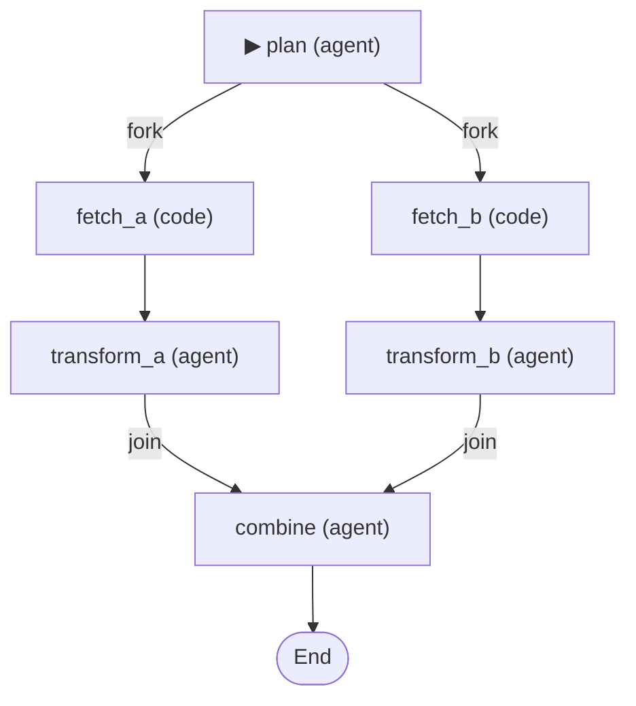

# DesignPipelineDemo

Declarative ETL pipeline that loads its graph topology, model config, and system prompts from a YAML manifest — then binds job implementations in code and runs the workflow.

## What it demonstrates

| Capability | How |
|---|---|
| **YAML-driven topology** | `etl-pipeline.ananke.yml` declares connections using the Ananke DSL |
| **Model aliases** | YAML `models:` section names models; API keys come from config, not YAML |
| **Agent jobs from config** | `type: agent` jobs are auto-built with system prompts from YAML |
| **Code jobs from C#** | `type: code` jobs are bound as lambdas in `Program.cs` |
| **Fork / Join** | Parallel branches with a merge function |
| **Secrets separation** | `secrets.json` for local dev, environment variables for CI/CD |
| **Mermaid export** | Prints the workflow graph as a Mermaid diagram after execution |

## Pipeline topology



## Project structure

```
DesignPipelineDemo/
├── Program.cs                    — Orchestration: load manifest, resolve models, bind jobs, run
├── etl-pipeline.ananke.yml       — Declarative manifest (topology + models + system prompts)
├── secrets.json                  — Local API keys (gitignored)
├── DesignPipelineDemo.csproj     — Project references + NuGet packages
└── README.md                     — This file
```

## Running locally

### 1. Configure secrets

Edit `secrets.json` with your API keys:

```json
{
  "OpenAI": {
    "ApiKey": "sk-proj-your-key-here",
    "Model": "gpt-4.1-mini"
  }
}
```

### 2. Run

```bash
cd src
dotnet run --project demos/DesignPipelineDemo
```

### Expected output

```
━━━ Ananke.Design — YAML + Agents → Workflow ━━━

  Workflow: etl-pipeline
  Models:  planner, analyst
  Jobs:    plan, fetch_a, fetch_b, transform_a, transform_b, combine
  Agent:   plan, transform_a, transform_b, combine
  Code:    fetch_a, fetch_b

  ✓ Model 'planner' resolved
  ✓ Model 'analyst' resolved

  Discovered: plan, fetch_a, fetch_b, transform_a, transform_b, combine
  Unbound:    plan, fetch_a, fetch_b, transform_a, transform_b, combine

  ✓ Bound agent job 'plan' → planner
  ✓ Bound agent job 'transform_a' → analyst
  ✓ Bound agent job 'transform_b' → analyst
  ✓ Bound agent job 'combine' → planner

  Running workflow...

  [fetch_a] Fetching dataset A...
  [fetch_b] Fetching dataset B...

  Status: Completed
  Output: ...
```

## Running in GitHub Actions

No code changes required. The `ModelResolver` reads from `IConfiguration`, which merges `secrets.json` (optional) with environment variables (higher priority).

### Workflow example

```yaml
name: Run ETL Pipeline

on:
  workflow_dispatch:

jobs:
  run:
    runs-on: ubuntu-latest
    steps:
      - uses: actions/checkout@v4
      - uses: actions/setup-dotnet@v4
        with:
          dotnet-version: '10.0.x'

      - name: Run pipeline
        run: dotnet run --project src/demos/DesignPipelineDemo
        env:
          OpenAI__ApiKey: ${{ secrets.OPENAI_API_KEY }}
          OpenAI__Model: "gpt-4.1-mini"
```

### Environment variable mapping

GitHub Actions secrets become `IConfiguration` keys via the `__` (double underscore) convention:

| Environment variable | Maps to config key | Used by |
|---|---|---|
| `OpenAI__ApiKey` | `OpenAI:ApiKey` | `ModelResolver` |
| `OpenAI__Model` | `OpenAI:Model` | Overrides YAML `model:` field |
| `Anthropic__ApiKey` | `Anthropic:ApiKey` | `ModelResolver` |
| `Anthropic__Model` | `Anthropic:Model` | Overrides YAML `model:` field |

### Config resolution order

| Priority | Source | When |
|---|---|---|
| 1 (lowest) | YAML `model:` field | Always (default) |
| 2 | `secrets.json` | Local dev |
| 3 (highest) | Environment variables | CI/CD, Docker, K8s |

## YAML manifest format

The `.ananke.yml` manifest has four sections:

### `name`

Workflow name passed to `WorkflowScaffold.Parse()`.

### `models`

Named model aliases. Each declares a `provider` and `model` name. API keys are never in the YAML — they come from `secrets.json` or environment variables at runtime.

```yaml
models:
  planner:
    provider: openai
    model: gpt-4.1-mini
  analyst:
    provider: anthropic
    model: claude-sonnet-4-20250514
```

### `jobs`

Job declarations. `type: agent` jobs include `model` (alias), `system_prompt`, and optional `max_tool_rounds`. `type: code` jobs are bound in C# via `scaffold.Bind()`.

```yaml
jobs:
  plan:
    type: agent
    model: planner
    system_prompt: |
      You are a planning agent...
    max_tool_rounds: 1

  fetch:
    type: code
```

### `connections`

Topology DSL — same syntax as `WorkflowScaffold.Parse()`. See [docs/workflow-dsl.md](../../docs/workflow-dsl.md).

```yaml
connections:
  - plan -> fork(fetch_a, fetch_b)
  - fetch_a -> transform_a
  - join(transform_a, transform_b) -> combine
  - combine -> End
```

## Tools — code, not YAML

Tools are executable functions — they **always live in code**. The YAML manifest controls the tool-calling loop depth via `max_tool_rounds`, but the tool definitions and implementations are bound programmatically.

### Why tools stay in code

A `ToolKit` contains `Func<>` delegates — actual executable logic. YAML can't express that. Declaring tool *schemas* in YAML while writing implementations in code would add a string-matching indirection layer for no benefit.

### What belongs where

| YAML (declarative) | Code (imperative) |
|---|---|
| System prompt (what the agent hears) | Tool implementations (what the agent can do) |
| Model alias (which provider) | ToolKit construction (`AddTool(...)`) |
| `max_tool_rounds` (loop depth) | Which tools attach to which jobs |

### This demo's tools

The `plan` agent job gets a `data-tools` kit with two tools:

```csharp
var dataTools = new ToolKit("data-tools")
    .AddTool(
        "list_datasets",
        "Lists available dataset names in the data warehouse",
        () => "revenue_q4_2024, csat_survey_2024, churn_monthly, nps_scores")
    .AddTool(
        "describe_dataset",
        "Returns schema and row count for a dataset",
        (name) => name switch
        {
            "revenue_q4_2024"  => "columns: date, region, amount | rows: 12,400",
            "csat_survey_2024" => "columns: date, score, channel | rows: 8,200",
            _ => $"Unknown dataset: {name}"
        },
        "name", "The dataset name to describe");
```

Tools are attached per-job during the binding loop:

```csharp
foreach (var (jobName, jobDef) in manifest.Jobs.Where(j => j.Value.Type == "agent"))
{
    var builder = AgentJobFactory.Create<PipelineState, AgentTextResponse>(jobName, model)
        .WithSystemPrompt(jobDef.SystemPrompt!)
        .WithPrompt(state => BuildPromptForJob(jobName, state))
        .MapResult((state, response) => ApplyResult(jobName, state, response.Text ?? ""))
        .WithMaxToolRounds(jobDef.MaxToolRounds);

    // Attach tools to specific jobs — tools are code, not YAML
    if (jobName == "plan")
        builder.WithTools(dataTools);

    scaffold.Bind(jobName, builder.Build());
}
```

The `plan` agent can call `list_datasets` and `describe_dataset` during its planning phase. The YAML `max_tool_rounds: 1` limits it to one round of tool calls before producing its final response.

## Library types used

| Type | Package | Role |
|---|---|---|
| `WorkflowManifest` | `Ananke.Design` | Parses `.ananke.yml` files |
| `WorkflowScaffold` | `Ananke.Design` | Topology DSL → bind → `Workflow<T>` |
| `ModelResolver` | `Ananke.Design` | Provider registry → `IAgentModel` instances |
| `AgentTextResponse` | `Ananke.Design` | Default response type for text-only agents |
| `AgentJobFactory` | `Ananke.Orchestration` | Builds `AgentJob<TState, TResponse>` |
| `ToolKit` | `Ananke.Orchestration` | Named collection of tool definitions |
| `OpenAIChatAgentModel.Create` | `Ananke.Orchestration.OpenAI` | `(apiKey, model) → IAgentModel` |
| `AnthropicAgentModel.Create` | `Ananke.Orchestration.Anthropic` | `(apiKey, model) → IAgentModel` |
