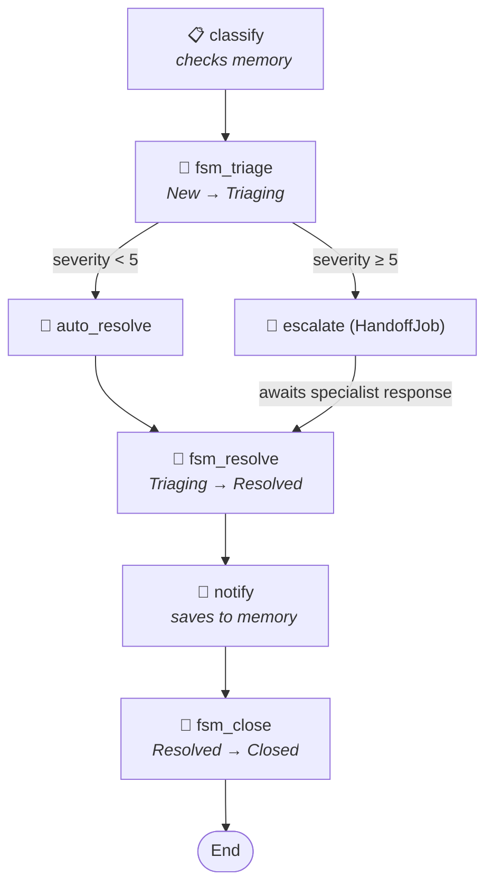

# DistributedServicesDemo

A support-ticket triage workflow that shows five Ananke features working together in one pipeline:

1. **Workflow orchestration** — `Workflow<T>` graph-as-code builder
2. **Agent-to-agent handoff** — `Handoff.To<>()` over MQTT or in-memory
3. **Conversation memory** — `IConversationMemory` (Redis or in-memory)
4. **State machine lifecycle** — `AbstractStateMachine` tracks ticket status
5. **Bridge convenience layer** — `.StateMachineJob()` wires FSM transitions into the workflow with full type inference

## What it demonstrates

| Capability | How |
|---|---|
| **Workflow orchestration** | `Workflow<TicketState>` defines jobs and routing as code |
| **Agent-to-agent handoff** | `Handoff.To<>()` creates a job that publishes a request and awaits a correlated response |
| **Conversation memory** | `IConversationMemory` stores per-customer interaction history across workflow runs |
| **State machine lifecycle** | `TicketLifecycleMachine` enforces `New → Triaging → Resolved → Closed` |
| **Bridge `.StateMachineJob()`** | Extension method that wraps `StateMachineTriggerJob` — compiler infers all 5 generic type parameters |
| **InMemory transport** | `InMemoryHandoffChannel` + `InMemoryConversationMemory` — zero config, single process |
| **MQTT transport** | `MqttHandoffChannel` — two processes, real message broker |
| **Redis memory** | `RedisConversationMemory` — persistent, distributed, TTL-based expiry |
| **Dual-mode binary** | Single executable, behaviour driven by `appsettings.json` + `--specialist` flag |
| **Workflow streaming** | `StreamAsync` emits `JobStarted`/`JobCompleted`/`WorkflowCompleted` events live |
| **Conditional routing** | `Workflow.Decide` routes low-severity tickets to auto-resolve, high-severity to handoff |

## Workflow topology

The workflow has two kinds of jobs — **business jobs** (classify, escalate, auto_resolve, notify) and **FSM bridge jobs** (fsm_triage, fsm_resolve, fsm_close) that keep the state machine in sync:



> **IMPORTANT:** The `fsm_*` jobs don't contain business logic — they call
> `stateMachine.TransitionAsync()` to advance the ticket's lifecycle state. The `.StateMachineJob()`
> extension method creates these jobs automatically; you just provide the FSM instance and
> a lambda that picks the transition to fire.

## FSM lifecycle

Each ticket has independent FSM state, keyed by its ticket ID:

```
TK-001:  New ──[BeginTriage]──► Triaging ──[Resolve]──► Resolved ──[Close]──► Closed
TK-002:  New ──[BeginTriage]──► Triaging ──[Resolve]──► Resolved ──[Close]──► Closed
TK-003:  New ──[BeginTriage]──► Triaging ──[Resolve]──► Resolved ──[Close]──► Closed
```

The `.StateMachineJob()` Bridge extension is a convenience wrapper around `StateMachineTriggerJob`.
Without it you'd need to spell out all 5 generic type parameters:

```csharp
// ❌ Without the convenience layer — 5 explicit type arguments
workflow.Job("fsm_triage", new StateMachineTriggerJob<
    TicketState,                  // workflow state
    TicketLifecycleContext,       // FSM context
    LifecycleState,               // FSM state enum
    LifecycleAction,              // FSM transition enum
    LifecycleNotification         // FSM notification enum
>("fsm_triage", lifecycle, s => ..., _ => ..., (s, r) => ...));

// ✅ With .StateMachineJob() — compiler infers everything
workflow.StateMachineJob("fsm_triage", lifecycle,
    FsmContext,
    _ => LifecycleAction.BeginTriage,
    (s, r) => s with { FsmState = r.CurrentState.ToString() });
```

## Memory flow

Tickets carry a `CustomerId`. The workflow uses `IConversationMemory` keyed by customer:

1. **classify** — loads prior interactions for the customer. If history exists, logs the count.
2. **notify** — after resolution, saves the ticket + resolution as `AgentMessage` pairs.

When TK-001 (CUST-42) and TK-003 (CUST-42) run sequentially, TK-003's classify step finds TK-001's prior resolution:

```
┌─ Ticket TK-003 (customer CUST-42): "Dashboard loading is extremely slow"
│
│  ▶ classify
│  ✓ classify (312ms)  → severity 6, escalate, 🧠 1 prior
```

## Project structure

```
DistributedServicesDemo/
├── Program.cs                    — Entry point, workflow wiring, stream consumer
├── TicketTypes.cs                — TicketState, TicketHandoff, SpecialistResult records
├── TicketLifecycleMachine.cs     — FSM enums, context, and state machine class
├── appsettings.json              — MQTT + Redis connection config (empty = in-memory)
├── docker-compose.yml            — Mosquitto MQTT + Redis for local testing
├── mosquitto/
│   └── config/
│       └── mosquitto.conf        — Minimal broker config (no auth, local dev only)
└── README.md                     — This file
```

## Modes

### Mode 1 — In-Memory (default, no dependencies)

When `Mqtt:Host` and `Redis:Host` are empty in `appsettings.json`, everything runs in a single
process with no external services. Handoff uses `InMemoryHandoffChannel.RegisterHandler`,
memory uses `InMemoryConversationMemory`.

```bash
cd src
dotnet run --project demos/DistributedServicesDemo
```

### Mode 2 — MQTT + Redis (Docker, two processes)

When `Mqtt:Host` and/or `Redis:Host` are set, the demo uses real infrastructure.
MQTT enables cross-process handoff; Redis enables persistent conversation memory.

#### Step 1 — Start infrastructure (Docker)

```bash
cd src/demos/DistributedServicesDemo
docker compose up -d
```

This starts:
- [Eclipse Mosquitto 2](https://mosquitto.org/) on `localhost:1883` (MQTT broker, anonymous access)
- [Redis 7](https://redis.io/) on `localhost:6379` (conversation memory store)

To check logs:

```bash
docker compose logs -f mqtt
docker compose logs -f redis
```

To stop:

```bash
docker compose down
```

#### Step 2 — Configure the connection

Edit `appsettings.json` and set the hosts:

```json
{
  "Mqtt": {
    "Host": "localhost",
    "Port": 1883,
    "Namespace": "handoff"
  },
  "Redis": {
    "Host": "localhost",
    "Port": 6379
  }
}
```

#### Step 3 — Start the specialist service (Terminal 1)

```bash
cd src
dotnet run --project demos/DistributedServicesDemo -- --specialist
```

The specialist connects to the broker and listens for incoming ticket handoffs:

```
━━━ Ananke — Specialist Service ━━━
  Connecting to MQTT broker at localhost:1883...
  ✓ Connected to MQTT broker
  Listening for handoff requests on 'specialist-queue'...
  Press Ctrl+C to stop.
```

#### Step 4 — Run the triage workflow (Terminal 2)

```bash
cd src
dotnet run --project demos/DistributedServicesDemo
```

```
━━━ Ananke — Triage Workflow ━━━
  Handoff: MQTT (localhost:1883)
  Memory:  Redis (localhost:6379)
  ✓ Connected to Redis
  ✓ Connected to MQTT broker
  FSM:     Ticket lifecycle (New → Triaging → Resolved → Closed)
  ⚠ Make sure the specialist is running: dotnet run -- --specialist

┌─ Ticket TK-001 (customer CUST-42): "Production database is down since 3am"
│
│  ▶ classify
│  ✓ classify (318ms)  → severity 9, escalate
│  ▶ fsm_triage                                    ← Bridge: New → Triaging
│  ✓ fsm_triage (1ms)  → Triaging
│  ▶ escalate                                      ← publishes to MQTT, blocks until specialist replies
│  ✓ escalate (823ms)  → CRITICAL: Immediate escalation applied — ...
│  ▶ fsm_resolve                                   ← Bridge: Triaging → Resolved
│  ✓ fsm_resolve (0ms)  → Resolved
│  ▶ notify
│  ✓ notify (107ms)  → 🧠 saved to memory
│  ▶ fsm_close                                     ← Bridge: Resolved → Closed
│  ✓ fsm_close (0ms)  → Closed
│
│  Resolution:    CRITICAL: Immediate escalation applied — ...
│  Handled by:    specialist-agent-1 (MQTT/localhost)
│  Prior tickets: 0
│  Notified:      True
│  FSM state:     Closed
└─ Done

┌─ Ticket TK-003 (customer CUST-42): "Dashboard loading is extremely slow"
│
│  ▶ classify
│  ✓ classify (312ms)  → severity 6, escalate, 🧠 1 prior   ← memory recall!
│  ...
│  Prior tickets: 1                                          ← carried in state
│  FSM state:     Closed
└─ Done
```

While the triage workflow is blocked on `escalate`, Terminal 1 shows:

```
  🔧 Received ticket TK-001: "Production database is down since 3am" (severity 9)
  ✅ Resolved: CRITICAL: Immediate escalation applied — ...
```

## Infrastructure matrix

You can mix and match — each dimension is independent:

| | `Host` empty | `Host` set |
|---|---|---|
| **Handoff** | `InMemoryHandoffChannel` (single process) | `MqttHandoffChannel` (cross-process) |
| **Memory** | `InMemoryConversationMemory` (ephemeral) | `RedisConversationMemory` (persistent, TTL) |

## MQTT topic pattern

The `MqttHandoffChannel` uses the following topic convention:

```
{namespace}/{topic}/request/{executionId}/{jobName}   ← triage → specialist
{namespace}/{topic}/reply/{executionId}/{jobName}     ← specialist → triage
```

For the default config (`namespace: handoff`, `topic: specialist-queue`):

```
handoff/specialist-queue/request/a1b2c3.../escalate
handoff/specialist-queue/reply/a1b2c3.../escalate
```

The specialist subscribes to `handoff/specialist-queue/request/#` (multi-level wildcard).
Each triage workflow subscribes to its specific reply topic before publishing, then unsubscribes after receiving the response.

## Extending to production

| Concern | Recommendation |
|---|---|
| **Authentication** | Add `username`/`password` to `appsettings.json` and configure Mosquitto with a password file |
| **TLS** | Mount certs into the container and switch to port `8883` in `mosquitto.conf` |
| **Multiple specialists** | Run several specialist processes — each picks up a different request (MQTT QoS 2 prevents double-delivery) |
| **LLM classification** | Replace the keyword-based `classify` job with `AgentJob` for real intent detection |
| **Checkpointing** | Add `.UseCheckpointing(store)` to resume workflows that time out waiting for specialist replies |
| **Redis auth** | Add a password to the Redis container and pass it in the connection string |
| **Memory TTL** | `RedisConversationMemory` accepts a `ttl` parameter; Redis auto-expires keys |
| **FSM guards** | Add `.When(() => condition)` to FSM transitions to enforce business rules (e.g. must have resolution before Close) |
| **FSM → Workflow** | Use `.OnEnterRunWorkflow()` on the FSM builder to start a workflow when a state is entered (Pattern A) |
| **Completion trigger** | Use `machine.RunWorkflowAsync()` to run a workflow and fire an FSM transition based on the result (Pattern C) |
