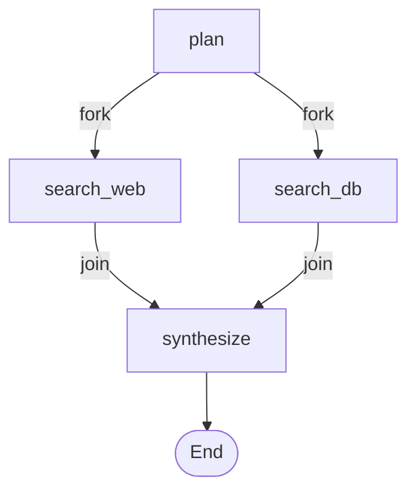
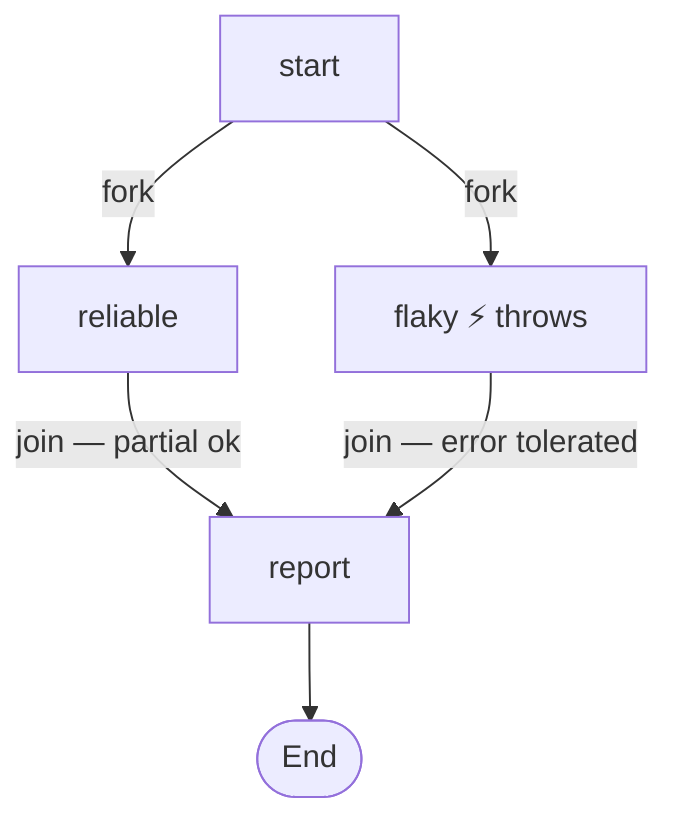
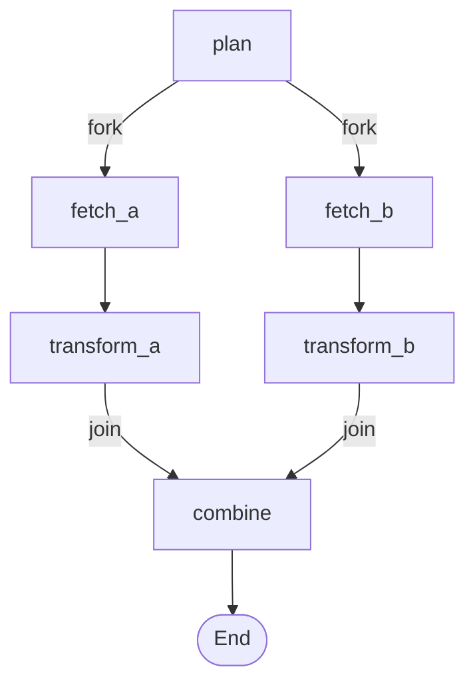
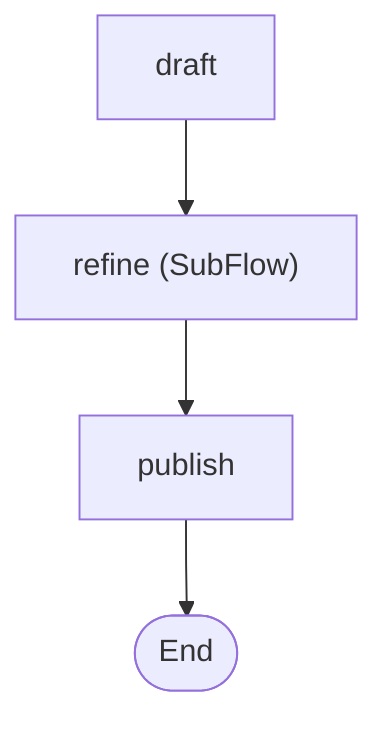
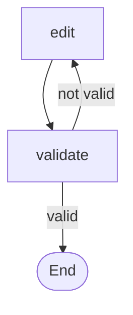
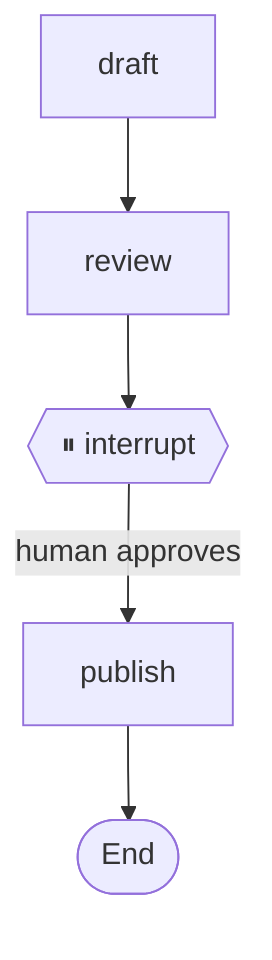
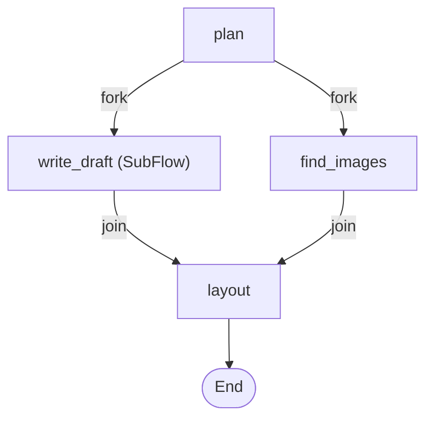
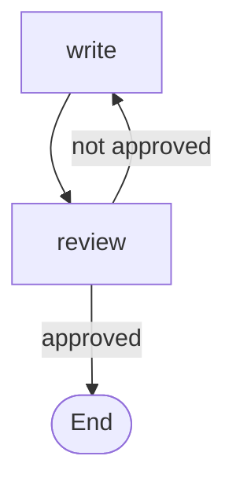
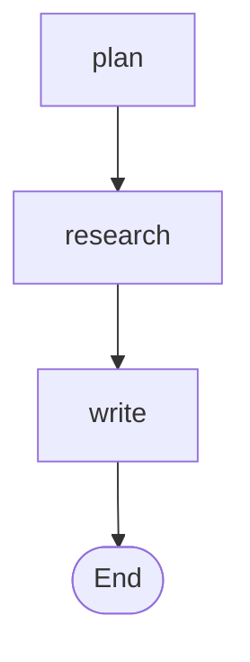

# ExtendedFlowDemo

Seven self-contained scenarios that cover the full range of Ananke's workflow composition and
control-flow patterns. No LLM calls, no API keys, no infrastructure — everything runs immediately
with `dotnet run`.

---

## Quick Start

```bash
cd src
dotnet run --project demos/ExtendedFlowDemo
```

All seven examples execute sequentially and print their Mermaid diagram after each run.

---

## What it demonstrates

| # | Example | Pattern | Key API |
|---|---------|---------|---------|
| 1 | [Parallel Research](#1-parallel-research) | Fork / join — `FailFast` (default) | `Workflow.Fork`, `.Join` |
| 2 | [BestEffort Ingest](#2-besteffort-ingest) | Fork / join — partial failure tolerated | `ForkMode.BestEffort` |
| 3 | [Multi-Step Branches](#3-multi-step-branches) | Each branch has its own job chain before the join | `.Then` inside branches |
| 4 | [Nested SubFlow](#4-nested-subflow) | Sub-workflow with an internal edit ↔ validate loop | `.SubFlow`, `Workflow.Decide` |
| 5 | [Interrupt / Approval](#5-interrupt--approval) | Pause for human input, resume with injected state | `.InterruptBefore`, `.ResumeAsync` |
| 6 | [Fork + SubFlow](#6-fork--subflow) | Parallel branches where one branch is a nested workflow | `Fork` + `SubFlow` combined |
| 7 | [Workflow Streaming](#7-workflow-streaming) | Consume live orchestration events as they happen | `StreamAsync`, event discriminated union |

---

## Examples

### 1 · Parallel Research

**File:** `Examples/ParallelResearchExample.cs`

Forks into two parallel search jobs that run concurrently, then joins their results before
synthesising a summary. Uses the default `FailFast` error policy: if either branch throws,
the whole workflow faults immediately.



**Key concepts:**
- `Workflow.Fork("search_web", "search_db")` — launches both jobs in parallel
- `.Join([...], "synthesize", mergeFn)` — waits for all branches, merges their states into one
- Default `ForkMode.FailFast` — first branch error cancels the others

---

### 2 · BestEffort Ingest

**File:** `Examples/BestEffortIngestExample.cs`

Same fork / join topology as example 1, but one branch (`flaky`) deliberately throws
`HttpRequestException`. With `ForkMode.BestEffort` the workflow continues on partial success —
the `report` job runs with whatever data was collected.



**Key concepts:**
- `Workflow.Fork(ForkMode.BestEffort, "reliable", "flaky")` — failed branches are skipped, not fatal
- The merge function receives only the branches that succeeded
- `WorkflowExecution.Status` stays `Completed` even though one branch faulted

---

### 3 · Multi-Step Branches

**File:** `Examples/MultiStepBranchesExample.cs`

Two independent branches each contain two sequential jobs (`fetch` → `transform`) before
converging. Shows that fork branches are not limited to a single job.



**Key concepts:**
- `.Then("fetch_a", "transform_a")` inside a fork branch — ordinary chaining applies within branches
- `.Join(["transform_a", "transform_b"], ...)` — the join waits for the last job in each branch, not the first

---

### 4 · Nested SubFlow

**File:** `Examples/NestedSubFlowExample.cs`

A document pipeline that embeds a separate `edit-loop` workflow as a single step. The inner
workflow loops (`edit → validate → edit → …`) until the draft passes validation, then hands
control back to the outer workflow.



Inner `edit-loop` SubFlow:



**Key concepts:**
- `.SubFlow("refine", editLoop, parentToChild, childToParent)` — maps parent state → child state on entry and merges result back on exit
- `Workflow.Decide<T>(s => ...)` — conditional routing: the string returned is the next job name, or `Workflow.End`
- `.Chain("draft", "refine", "publish")` — shorthand for a sequence of `.Then` calls

---

### 5 · Interrupt / Approval

**File:** `Examples/InterruptApprovalExample.cs`

Demonstrates human-in-the-loop. The workflow runs `draft → review`, then pauses before
`publish`. The execution is checkpointed. A human (or an external system) inspects the draft,
injects an approval signal into the state, and the workflow resumes exactly where it left off.



**Key concepts:**
- `.InterruptBefore("publish")` — pauses execution and saves a checkpoint before the named job
- `.UseCheckpointing(store)` — pluggable store; demo uses `InMemoryCheckpointStore`
- `workflow.ResumeAsync(executionId, state => state with { Approved = true })` — resumes from the checkpoint with mutated state
- `WorkflowExecution.Status` is `Interrupted` after the first run and `Completed` after resume

---

### 6 · Fork + SubFlow

**File:** `Examples/ForkWithSubFlowExample.cs`

Combines fork and sub-workflow: the outer workflow forks into `write_draft` (itself a
`write → review` loop sub-workflow) and `find_images` (a simple job) running in parallel.
Both converge into `layout`.



Inner `write-loop` SubFlow:



**Key concepts:**
- A `SubFlow` job participates in a `Fork` the same way a regular job does
- The parent's join merge function receives the sub-workflow's final output via the `childToParent` mapper
- `ForkMode.FailFast` is the default — if the sub-workflow faults, the whole fork faults

---

### 7 · Workflow Streaming

**File:** `Examples/WorkflowStreamingExample.cs`

Instead of `RunAsync` (which blocks until completion), uses `StreamAsync` to consume a live
stream of orchestration events — useful for progress UIs, logging sidecars, and audit trails.



**Key concepts:**
- `workflow.StreamAsync(initialState)` returns `IAsyncEnumerable<WorkflowEvent<T>>`
- Events: `JobStarted<T>`, `JobCompleted<T>`, `StateUpdated<T>`, `WorkflowCompleted<T>`, `WorkflowFaulted<T>`
- Pattern-match on the event type to react selectively — no polling, no callbacks
- `DistributedServicesDemo` uses the same pattern for its ticket pipeline output

---

## Project structure

```
ExtendedFlowDemo/
├── Program.cs                          — Runs all examples in sequence
├── ConsoleLogger.cs                    — Shared helper: prints status, job history, Mermaid diagram
├── Examples/
│   ├── ParallelResearchExample.cs      — 1 · Fork/Join FailFast
│   ├── BestEffortIngestExample.cs      — 2 · Fork/Join BestEffort
│   ├── MultiStepBranchesExample.cs     — 3 · Multi-step branches
│   ├── NestedSubFlowExample.cs         — 4 · SubFlow with internal loop
│   ├── InterruptApprovalExample.cs     — 5 · Human-in-the-loop checkpoint
│   ├── ForkWithSubFlowExample.cs       — 6 · Fork containing a SubFlow branch
│   └── WorkflowStreamingExample.cs     — 7 · StreamAsync event consumption
└── ExtendedFlowDemo.csproj
```

## Secrets required

None — all examples use simulated delays and static data.
