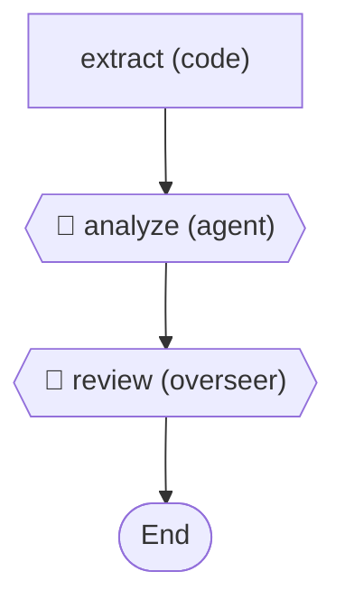
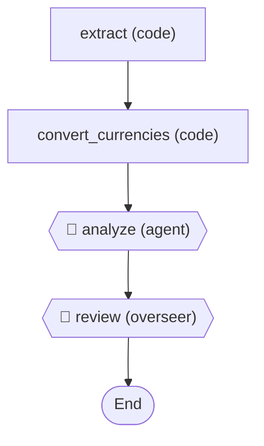

# SelfImprovingWorkflowDemo

An Ananke workflow that **diagnoses its own missing capability** and demonstrates
how the fixed version resolves the gap — no API keys required.

## What it demonstrates

| Capability | How |
|---|---|
| **Self-diagnosis** | An overseer agent uses introspection tools to inspect the workflow manifest and detect a missing currency conversion step |
| **Documentation as tools** | `search_docs` and `suggest_fix` tools simulate `nnke docs --search` and `nnke explain` (ADR-U004) |
| **Manifest-driven rebuild** | Two YAML manifests (v1 and v2) show the before/after topology — the fix is a manifest + code binding change |
| **YAML + DSL topology** | Both manifests use the Ananke DSL for connections (`extract -> analyze -> review -> End`) |
| **Code jobs for deterministic work** | Currency conversion is a code job, not an agent call — cheaper, deterministic, reliable |
| **Simulated models** | `SimulatedModel` returns scripted responses, so the demo runs offline |

## The scenario

A travel expense analyzer workflow processes reports containing foreign currencies
(GBP, EUR, JPY). The workflow must normalize all amounts to USD.

### Run 1 — Incomplete workflow (`expense-analyzer.ananke.yml`)



The `analyze` agent receives raw multi-currency data but has no conversion tool.
It reports it cannot normalize the amounts. The `review` overseer agent uses
introspection tools to:

1. **`inspect_workflow`** — discovers the manifest mentions USD but has no conversion job
2. **`search_docs`** — finds that currency conversion should be a code job
3. **`suggest_fix`** — recommends adding `convert_currencies` between `extract` and `analyze`

### Run 2 — Fixed workflow (`expense-analyzer-v2.ananke.yml`)



The `convert_currencies` code job normalizes all amounts to USD before the
analysis agent sees them. The analysis succeeds, and the overseer confirms
the workflow is now correct.

## Running

```bash
cd src
dotnet run --project demos/SelfImprovingWorkflowDemo
```

No API keys needed — all models are simulated.
